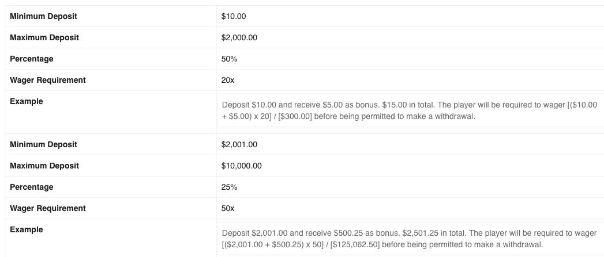
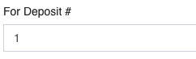

= NG Wishlist
Riaan Schoeman <riaan.schoeman@wonderlabz.com>
1.0, December 3, 2021: NG Wishlist
:sectnums:
:toc: left
:toclevels: 4
:toc-title: NG Wishlist
:icons: font
:url-quickref: https://docs.asciidoctor.org/asciidoc/latest/syntax-quick-reference/

//:stylesheet: css/asciidoctor.css
//:stylesheet: css/material-blue.css

//This is done tto keep formatting aligned with gitlab
****
[verse,,]
____
link:../readme.adoc[Home]
____
****

== Deposit Bonus
* Example flows link:bonus-flows.adoc[here]
* _Bonus amount determined by bonus code_
** one bonus can be configured with mutliple percentages for ranges of deposit amounts.

* _Bonus applied at % of deposit/bet amount_
** See above image

* _Option to filter bonus by tier/ reg date/ first deposit date_
** We *do not* have tier/reg date (apart from bonus active dates)
** We have option to specify deposit number
*** 1 - first deposit
*** 5 - fifth deposit

* _Filter to apply bonuses to 1st/2nd/3rd/Xth deposit/ next deposit_
** See above
** We *do not* have 'next deposit' option

* _Ability to add a filter by offer type, so there is no need to manually exclude users from another promotion.
  E.g. option to exclude other types of welcome offer within the promo setup_
** We *do not* have this.
** Could add a 'disqualifying bonuses' option under restrictions to list other bonuses. So if one of those bonuses have been taken up, then player is not eligible for this bonus?

* _Ability to mass exclude/include users from receiving deposit bonuses (for potential abuse)_
** mass bonus functionality