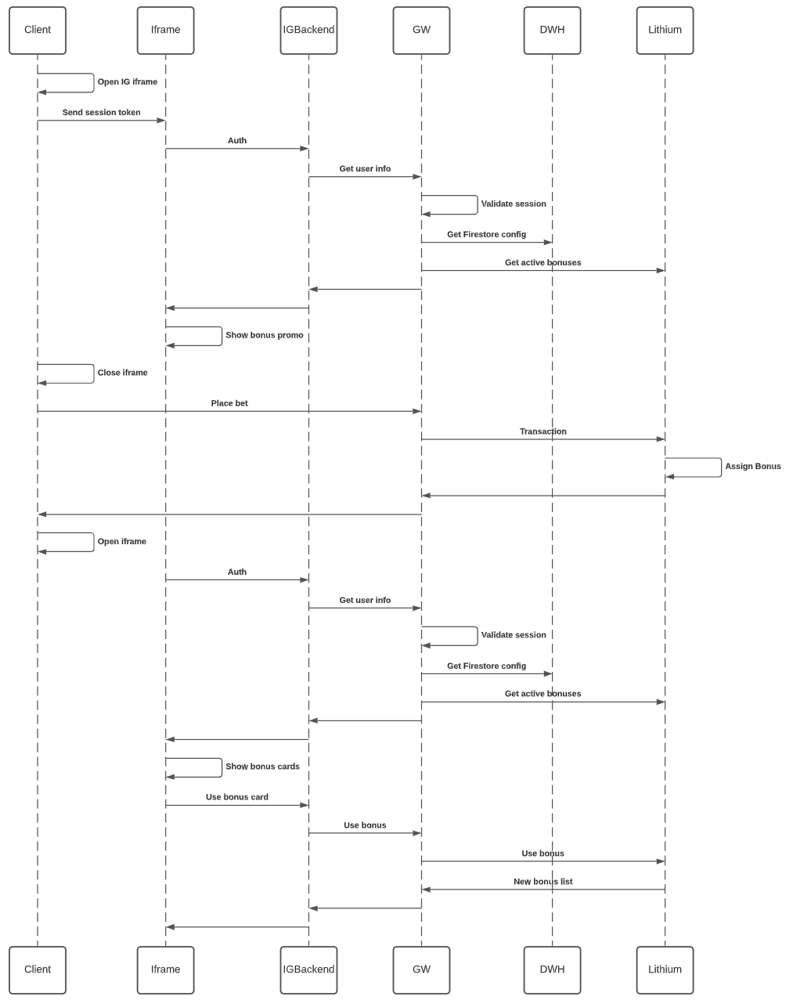
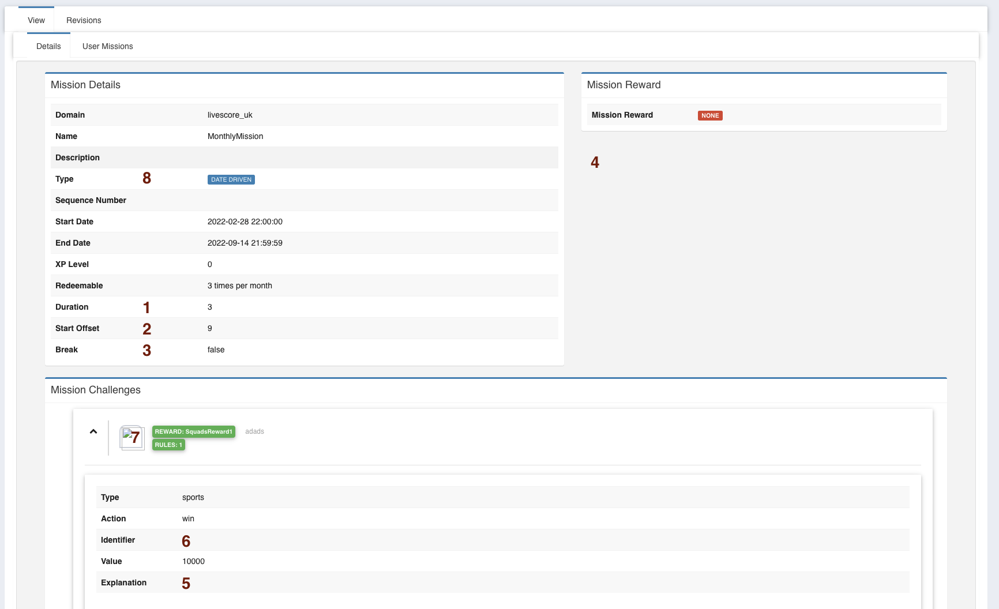
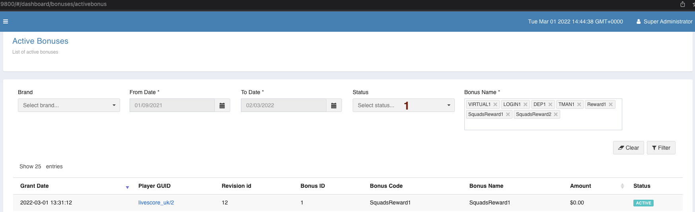
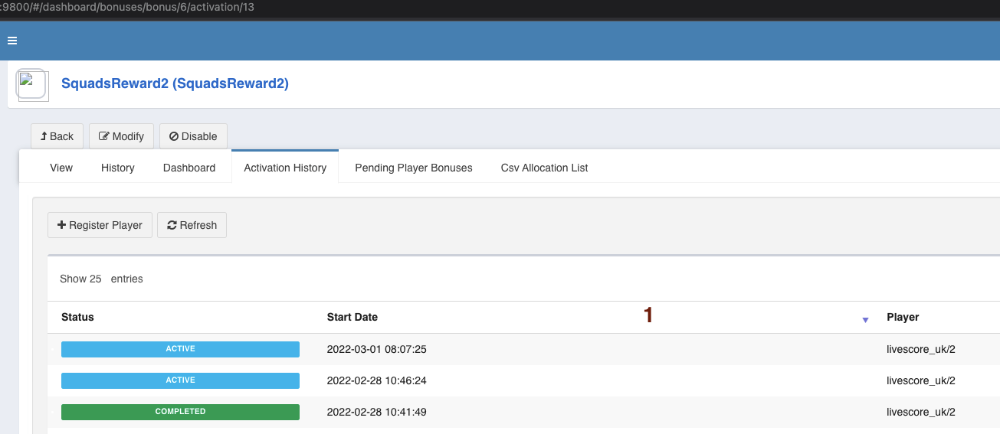
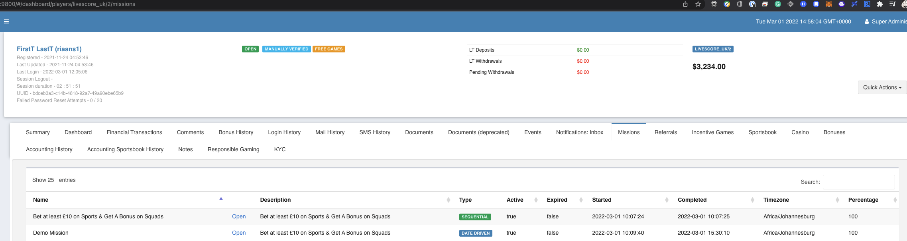

= Squads Promo
Riaan Schoeman <riaan.schoeman@wonderlabz.com>
1.0, Feb 9, 2022: Squads Promo
:sectnums:
:toc: left
:toclevels: 4
:toc-title: squads
//:source-highlighter: pygments
//:pygments-style: emacs
:icons: font
:url-quickref: https://docs.asciidoctor.org/asciidoc/latest/syntax-quick-reference/

:lbo-sourcedir: ../../ui-network-admin/src/main/resources
//ui-network-admin/src/main/resources/static/scripts/controllers/dashboard/bonuses/bonus/edit/addexternalbonusgame.js
:promotions-sourcedir: ../../service-promotions/service-promotions/src/main/java
:promotions-client-sourcedir: ../../service-promotions/client-service-promo/src/main/java
:casino-sourcedir: ../../service-casino/service-casino/src/main/java

[sidebar]
****
link:readme.adoc[Back]
****

== Description
=== Tickets
* https://playsafe.atlassian.net/browse/LSPLAT-3779
* https://jira.livescore.com/browse/PLAT-4495

=== Business

The current Squads product is not driving enough conversions from Free To Play to Real Money bets.
To encourage Squad customers to start placing bets with LS, we are looking to introduce an option for customers to use two new bonus cards.

The first Bonus Card (Decision Time) will be available to customers to use on the final round of picks (Friday). If customer opts to use the bonus card, they will be given two players to choose from for their final Squads Player.

The second Bonus Card (New Signing) will be available to customers to use in any round. If the customer opts to use this bonus card, they will be able to replace a player already revealed with another player.

Customers can acquire these bonus cards by placing a qualifying bet.

This epic will capture the requirements for implementing the Bonus Card triggers that will reward customers with the appropriate bonus cards.

*Please note:*  [.line-through]#IG have everything they need on their side to progress this new feature, other than the trigger mechanism that will believe should be built within Lithium.# - After last conversation with IG, was determined that expiration is needed on lithium side, expiration mechanism has already been added to lithium side.

== Spike - Sportsbook Data Retrieval
****
link:sportsbook-data-retrieval.adoc[Continued on another document] - Will be used in next task/sprint.
****

== From Pavel / GW

== Lithium / Architecture
=== Explanation
* For this task we will be starting to build towards the comp-engine. The first part to this is to rework svc-promotions, which currently reads and interprets all CompletedTransactionEvents sent from svc-accounting-provider-internal. This will be used to identify SPORTS transactions (bet/win)
* There are various other services that send events to svc-promotion, the diagram below (Figure 2) describes the basic flow : (Some not valid any more/will be expanded upon in an upcoming task, events from svc-accounting-pr-internal is our focus point to complete this task. (For incoming sports/casino/virtuals data))

---
=== svc-promotions/svc-promo
include::../../service-promo/docs/plantuml/historic-flow.puml[Basic Flow]

* svc-promotions needs to be renamed/reworked to represent promo's
** rename svc-promotions to svc-promo
*** any references to 'promotion' should now be refactored to 'promo'
** Basic future construction of services: (In this TA/task, we will not touch anything except for svc-promo)

include::plantuml/promo-engine.puml[Basic Flow]

* Two new types have been defined:
** `TYPE_SPORTS` - All sportsbook related data.
** `TYPE_VIRTUALS` - All virtuals related data.

[source,java,linenums,indent=0]
----
include::{promotions-client-sourcedir}/lithium/service/promotions/client/objects/Type.java[lines=18..19]
----

* Two new actions have been defined: (replacing existing `ACTION_BET`)
** an `ACTION_BET_ONCEOFF` will always replace the last value with the received value, this will keep on happening until the rule has been completed.
** an `ACTION_BET_ACCUMULATOR` will add to the last value with the received value, this will keep on happening until the rule has been completed.
** `lithium.service.promotions.client.objects.Action:`
+
[source,java,linenums,indent=0]
----
include::{promotions-client-sourcedir}/lithium/service/promotions/client/objects/Action.java[lines=29..30]
----
+
* Current promotion types available (below) (TODO: remove this):
+
[source,java,linenums,indent=0]
----
include::{promotions-sourcedir}/lithium/service/promotions/services/MissionService.java[lines=74..75]
----
* promos/promotions, needs to be expanded to run multiple concurrently, repeatability needs to be configurable, we will be using the same structure as on rewards/bonus
** On promotion revision, add the following fields:
//*** `private Integer durationGranularity;` - granularity for how long a promotion can run, ie. daily/weekly/monthly/yearly
*** `private Integer granularityStartOffset` - Offset the start of the period by this amount.
+
*e.g.1:* If daily promotion, this is not applicable.
+
*e.g.2:* If weekly promotion, this offset will determine the day of the week to start. (Mon/Wed/Sat)
+
*e.g.3:* If monthly promotion, this offset will determine the day of the month to start.(1st/15th/20th)
*** `private Integer duration;` - duration amount for promotion, default 1.
+
*e.g.* if it's a daily promotion, promotion duration could be set to 2 days, meaning promotion could be completed over two day period.
*** `private Integer maxRedeemable;` - amount of times to be redeemed per granularity.
+
*e.g.* Taken example above, daily promotion, duration 2, with max redeemable 2.
+
Mission could be completed over 2 day period, or 2 promotions per day can be completed.
*** `private Integer maxRedeemableGranularity;` - granularity for promotion.
+
ie. daily/weekly/monthly/yearly

**** implementing maxRedeemable example : `lithium.service.casino.service.CasinoBonusService.checkMaxRedeemableValid`
*** `private Boolean granularityBreak;` - only applicable if sequence # provided. This field will determine if the next promotion in the sequence can be participated in for the granularity. ie. if sequence 1 & 2 defined for granularity daily, then if granularityBreak is false, then both sequence 1 & 2 can be completed in same day, if granularityBreak is true, then sequence 1 will be completed on day 1, and the next sequence number can only be completed on any day after the preceding sequence.

*** `private List<UserCategory> whitelistTags;` - Tags that will be allowed to take up this promo. If this field is filled in, only players that have this tag will be allowed to participate.
+
To be retrieved and checked in the `setup` method: `lithium.service.promotions.services.MissionStatsService.setup`
+
[source,java,linenums,indent=0]
----
include::{promotions-sourcedir}/lithium/service/promotions/services/MissionStatsService.java[lines=327..327]
----

*** `private List<UserCategory> blacklistTags;` - Tags that will *not* be allowed to take up this promo. If this field is filled in, players that have this tag should be skipped.

//[.line-through]#*** `private List<Promotion> excludedMissions;` - List of promotions that would be blocked if this promotion has been started. Before writing of the user_mission record, check if this list is populated, if it is, check if player has a#

** How the flow currently works:
*** Sequential, always searches for SEQ first. If found, and haven't completed a promotion for the day, then enter this promotion.
*** Date Driven, always searched after SEQ. If found, and haven't completed a promotion for the day, then enter this promotion.
** How this should change:
*** Flow:
+
.promo-engine-activity
[plantuml,puml,svg,align="right"]
----
include::plantuml/promo-engine-activity.puml[]
----

*** The numbers above are commented in code to make it easier to develop the code.
e.g.:
+
[source,java,linenums,indent=0,highlight='1,8,12,15']
----
include::{promotions-sourcedir}/lithium/service/promotions/services/UserMissionService.java[lines=85..100]
----
*** Basic incoming flow for events:
+
include::plantuml/promo-engine-class.puml[Promo Class Diagram]
*** Mission types to be removed.
**** Start/end date and sequence number is optional.
**** If no start/end date supplied, it runs indefinitely.
**** If no sequence specified, there will be no special order, and any eligible promotion can be entered.
*** Examples below:
+
====
if a promotion is created with no start/end date, but has a sequence number, granularityBreak = true
====
**** if maxRedeemableGranularity: `GRANULARITY_DAY` | maxRedeemable: 1 - promotion will run using sequence number, can only be claimed/participated in once a day ie. sequence 1 on day 1, sequence 2 on day 2, etc. (one of these promos per day, in sequence)
**** if maxRedeemableGranularity: `GRANULARITY_DAY` | maxRedeemable: 3 - promotion will run using sequence number, can be claimed/participated in three times a day ie. sequence 1 on day 1, if requirements for promotions is fulfilled, this promotion can be claimed three times in same day. If promotion completed three times, then next sequence number can be completed on the following day.
**** if maxRedeemableGranularity: `GRANULARITY_WEEK` | maxRedeemable: 1 - promotion will run using sequence number, can only be claimed/participated in once a week, ie. sequence 1 in 1st week, sequence 2 in second week, etc. (one of these promos per week, in sequence)
**** if maxRedeemableGranularity: `GRANULARITY_WEEK` | maxRedeemable: 3 - promotion will run using sequence number, can be claimed/participated in three times a week ie. sequence 1 in week 1, if requirements for promotions is fulfilled, this promotion can be claimed three times in the same week. If promotion completed three times, then next sequence number can only be completed in the following week.
**** if maxRedeemableGranularity: `GRANULARITY_MONTH` | maxRedeemable: 1 - promotion will run using sequence number, can only be claimed/participated in once a month, ie. sequence 1 in 1st month, sequence 2 in second month, etc. (one of these promos per month, in sequence)
*** Example 2:
+
====
if a promotion is created with no start/end date, but has a sequence number, granularityBreak = false
====
**** if maxRedeemableGranularity: `GRANULARITY_DAY` | maxRedeemable: 1 - promotion will run using sequence number, can only be claimed/participated in once a day. If a next sequence for the granularity is defined, then that sequence may be completed after this sequence. ie. Sequence 1 on day 1 and sequence 2 on day 1, and sequence 3 on day 1.
**** if maxRedeemableGranularity: `GRANULARITY_DAY` | maxRedeemable: 3 - promotion will run using sequence number, can be claimed/participated in three times a day ie. sequence 1 on day 1, if requirements for promotions is fulfilled, this promotion can be claimed three times in same day. If promotion is completed three times, then next sequence number can be completed in the *same* day.
*** Example 3:
+
====
if a promotion is created with start/end date, but has no sequence number, granularityBreak = null
====
**** if maxRedeemableGranularity: `GRANULARITY_DAY` | maxRedeemable: 1 - promotion can only be claimed/participated in once a day. If player has finished the promotion for the day, player may only participate again the following day.
**** if maxRedeemableGranularity: `GRANULARITY_DAY` | maxRedeemable: 3 - promotion can be claimed/participated in three times a day. If player has finished all three promotions for the day, player may only participate again the following day.
**** if maxRedeemableGranularity: `GRANULARITY_WEEK` | maxRedeemable: 1 - promotion can only be claimed/participated in once a week. If player has finished the promotion for the week, player may only participate again the following week.
**** if maxRedeemableGranularity: `GRANULARITY_WEEK` | maxRedeemable: 3 - promotion can only be claimed/participated in three times in a week. If player has finished the promotion three times in the week, player may only participate again the following week.
**** if maxRedeemableGranularity: `GRANULARITY_MONTH` | maxRedeemable: 1 - promotion can only be claimed/participated in once a month. If player has finished the promotion for the month, player may only participate again the following month.
**** if maxRedeemableGranularity: `GRANULARITY_MONTH` | maxRedeemable: 3 - promotion can only be claimed/participated in three times in a month. If player has finished the promotion three times in the month, player may only participate again the following month.

** Do a search for all current promotions for the domain where start date is before today or null, and end date is after today or null
*** for each promotion found:
**** check if record exists in `user_mission` table for that promotion revision for that period and user.
//+
//If records found, and it's equal to maxRedeemable, player may *not* participate in promotion.
//+
//If not found, it's first time player is participating in the promotion, create new record, and continue.
//+
//If records found, check if it's less than maxRedeemable, player may participate in promotion. Find the non-completed promotion, if all are completed, create new record, and continue.
+
Follow the flow in the diagram above.
+
Once the user_mission records have been identified

***** go through the challenges for the promotion, and save/update UserMissionChallenge record.
***** go through the rules for each challenge, and save/update UserMissionChallengeRule record.
***** check if stat should be registered. if so, register the stat.
***** do the calculations for the rule/challenge/promotion percentages.

** Ingress for completed transactions start here: `lithium.service.promotions.services.TransactionCompletedEventService.processCompletedTransaction`
+
[source,java,linenums,indent=0]
----
include::{promotions-sourcedir}/lithium/service/promotions/services/TransactionCompletedEventService.java[lines=39..40]
----

** An additional check using the fields added above would need to be performed here to evaluate if the player qualifies to partake in this promo.

---
=== svc-casino
* Currently, bonus/promo functionality lives inside svc-casino. A task was started/underway to port this to svc-bonus (Which will eventually be renamed to svc-rewards)
* To be able to award a bonus (reward) on a promotion (promo) defined above, the bonus needs to be of type "Trigger" and trigger type "Reward". And must be marked as "visible to public". (This will all be simplified in a later task, this task is focused on getting squads promo out asap.)
* `/static/scripts/controllers/dashboard/bonuses/bonus/edit/addexternalbonusgame.js:`
+
[source,java,linenumsscript,indent=0]
----
include::{lbo-sourcedir}/static/scripts/controllers/dashboard/bonuses/bonus/edit/addexternalbonusgame.js[lines=25..28]
----

* [.line-through]#Two possible flows to still be decided on: (tbd before development starts!) (Second flow shown in 5 below):#

==== Flow
* The flow as per Pavel's diagram would be to only award the bonus to the player, not do anything, and only list when queried, and have another endpoint to mark bonus as 'redeemed/completed'.
** Bonus needs to be saved to player account with `completed` false (`player_bonus_history`) (See lines 5-6 below)
+
[source,java,linenumsscript,indent=0,highlight='5-6']
----
include::{casino-sourcedir}/lithium/service/casino/service/CasinoBonusService.java[lines=918..923]
----
+
*** a call from svc-promo is made when a bonus is awarded to a player. (see diagram below)
+
include::plantuml/promo-to-rewards-flow.puml[current flow]
** New endpoint to view 'active' bonus, should only look for these bonuses (parameterized)
+
[cols="h,5a"]
|===
| URL
| /frontend/bonus/find/active ?

(There is currently a version of this endpoint in lithium.service.casino.api.frontend.controllers.FrontendBonusController, but this endpoint only caters for 'cashbonus', so we want to add another endpoint here.)

| Method
| GET

| Request
| String provider (optional) - "svc-reward-pr-ext-ig" (to be provided to GW to use)

Long campaignId (optional) - This will be used together with provider to lookup record in `BonusExternalGameConfig`, which will be used to lookup records in `PlayerBonusHistory`

LithiumTokenUtil tokenUtil (required) - only bonuses applicable to this player.

| Response Body
| include::plantuml/ActiveBonusResponse.json.adoc[]

.Example of query to use to test
[source,sql,linenums,indent=0,highlight='9,10']
----
    SELECT pbh.id, br.bonus_code, br.bonus_name, begc.provider, begc.campaign_id, pbh.started_date
    FROM player_bonus_history pbh
    LEFT OUTER JOIN player_bonus pb on pbh.player_bonus_id = pb.id
    LEFT OUTER JOIN bonus_revision br on br.id = pbh.bonus_id
    -- inner JOIN bonus b on b.current_id = pbh.bonus_id
    LEFT OUTER JOIN bonus_external_game_config begc on begc.bonus_revision_id = pbh.bonus_id
    WHERE pb.player_guid = 'livescore_uk/2'
    AND begc.provider = 'svc-reward-pr-ext-ig'
    AND pbh.completed IS FALSE
    AND pbh.expired  IS FALSE
    AND pbh.cancelled IS FALSE
----

|===

** Separate endpoint to mark bonus completed. (Removes it from query above)
+
[cols="h,5a"]
|===
| URL
| /frontend/bonus/complete

| Method
| POST

| Request
| @PathVariable("playerBonusHistoryId") Long playerBonusHistoryId

LithiumTokenUtil tokenUtil
|===
** Review existing endpoints around bonuses, these might be available already.

---
=== LBO

include::plantuml/lbo-screen-promo.puml[LBO Screens]
* LBO screens need to be updated to reflect the change from promotions to promo:
** Menu structure has already been adapted to reflect above diagram.
** Promo Edit Screen:
+

+
*** 1 - Needs to be represented better.
*** 2 - When granularity in weekly, this will represent a weekday, when monthly, this will represent day of the month.
*** 3 - Only displayed if sequence number is filled in.
*** 4 - Add example window/block to explain the bonus.
*** 5 - This explanation is broken for the new type/action that was added.
*** 6 - Only display if filled in, or display "N/A".
*** 7 - Hide if not filled in.
*** 8 - Needs to be removed.
** View screens suffer from same defects above.
** Active bonus screen:
+

+
*** 1 - Status filter for 'ACTIVE' not working.
** Bonus Activation History screen:
+

+
*** 1 - Add `Completed Date`.
*** Make the player guid clickable to take you to the player summary page..
** Player Summary screen:
+

+
*** Update Missions to Promo
*** Change the table to be the same as the 'Player History' above.

---
---
---
---

== Proposed Alternate Flow (Only here for reference, not to be implemented in this TA)
include::plantuml/squads-promo-flow.puml[]
==== Flow
* The first being when the bonus is triggered, a call to IG will be implemented here:
** `lithium.service.casino.service.CasinoBonusService#triggerExternalBonusGame`

[source,java,linenums,indent=0]
----
include::{casino-sourcedir}/lithium/service/casino/service/CasinoBonusService.java[lines=902..905]
----

** We are defining the call that IG will be implementing:
*** We will be doing a POST to a url of their choosing
*** An `apiKey` and `apiSecret` needs to be defined (stored where ???)
*** Add as header the `apiKey` : `headers.add("LIT-APIKEY", apiKey);`
*** Add as header the signature : `headers.add("LIT-SIGNATURE", generateSignature());`
**** Using the secretKey and the payload below, do a sha256 to calculate the signature.
*** Add as header the payload : `headers.add("LIT-PAYLOAD", generatePayload());`
**** Base64 encode the json request object defined below.
**** Request object:
***** nonce (`Long.toString(new Date().getTime())`)
***** rewardCode (code of the bonus/reward)
***** campaignId (lookup on `bonus_external_game_config`)
***** playerGuid
**** Response object:
***** boolean: success

