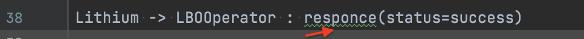
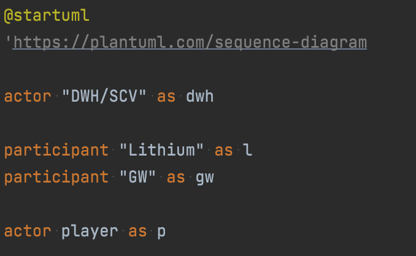
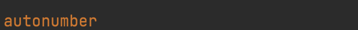
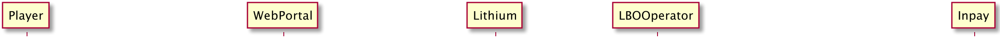
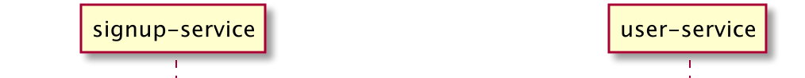

= Lithium Documentation Howto
Riaan Schoeman <riaan.schoeman@wonderlabz.com>
1.0, November 30, 2021: Lithium Documentation
:doctype: book
:sectnums:
:toc: left
:toclevels: 4
:toc-title: Lithium Documentation
:icons: font
:url-quickref: https://docs.asciidoctor.org/asciidoc/latest/syntax-quick-reference/

//This is done to keep formatting aligned with gitlab
****
[verse,,]
____
link:../readme.adoc[Home]
____
****

This document will describe how to document anything within lithium.

== Basic Structure

* a link:../readme.adoc[readme.adoc] exists in the root folder of lithium, and contains a lot of information about lithium, but further documentation will be added as features are developed inside of lithium. Service specific documentation will be done inside the docs folder in the service, e.g.
[,ruby]
----
app-lithium-full/service-avatar/docs/*
----
*  anything that is not related to a specific service, and has more to do with a framework/concept will be documented in the docs folder in the root. e.g.
[,ruby]
----
app-lithium-full/docs/comps-engine/*
----
* diagrams to be placed inside an 'plantuml' folder inside the relevant docs folder. e.g.
[,ruby]
----
- app-lithium-full/docs/comps-engine/plantuml/*
- app-lithium-full/service-avatar/docs/plantuml/*
----
* assets (all other artefacts that is not a plantUML) to be placed inside an 'assets' folder inside the relevant docs folder. e.g.
[,ruby]
----
- app-lithium-full/docs/comps-engine/assets/*
- app-lithium-full/service-avatar/docs/assets/*
----

== Documentation File Naming Convention

* Documents/Images/Assets/Diagrams should all follow lowercase kebab notation. E.g.
[,ruby]
----
- my-amazing-diagram.puml
- my-fantastic-image.png
- magical-portable-document.pdf
----

== Documentation Spelling and Grammar

* Documents should be checked for spelling and grammar errors. The Intellij provides assistance by underling incorrect spelling and grammar. This should be checked before submission of the documentation.

== Documentation Aliases, Numbering and Transitions

* Aliases for the actors and participants should be used and declared at the top of the diagram.

* Diagrams should always contain numbering of the state transitions and process steps. Add this near the top of the document, below the Aliases.

* When dealing with high level diagrams (externally shared), just refer to Lithium as a container participant.

* When dealing with process flows and process specific sequence diagrams, refer to the specific modules that is used within Lithium and their interactions in the flows.

[,ruby]
----
TODO: Add specifications for the way transition descriptions and titles should be handled. This item is still open to debate.
----

== Documentation Types

* Documentation will be done using asciidoc (adoc), with diagrams done using plantuml (puml).
* To reference a diagram inside of a adoc :
[,ruby]
----
- include::plantuml/save-bonus-flow.puml[]
----
* The puml needs to have the following format:
[,puml]
----
 .title to be displayed on adoc where this diagram will be included
 [plantuml]
 ----

 @startuml
    <plantuml content here>
 @enduml
 ----
----
* If your documentation contains multiple pages, it would be good to have a breadcrumb/menu structure in place so people can navigate between your pages.
** a table of contents (toc) is advised for longer pages to be able to navigate within the page, but gitlab does not adhere to aligning the toc left..
** To insert a menu structure in your pages:
[,puml]
----
 //This is done to keep formatting aligned with gitlab
 ****
 [verse,,]
 ____
 link:../readme.adoc[Home]
 ____
 ****
----
* Here is a link to a Technical Analysis (TA) template, lovingly created to assist you on your documenting journey. link:./templates/technical-analysis-ta-template.adoc[ta-template.adoc]
