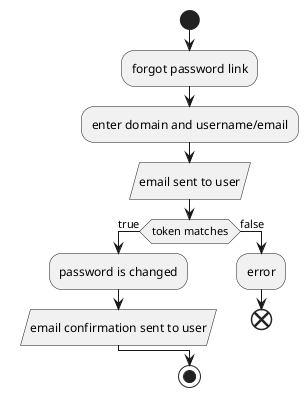

# Forgot Password

This process is only intended for Lithium back office users and not players. If you are looking for the player process then please check with the front end development team.

1. User clicks on forgot password link
2. User must enter "Domain" and "Username/Email" in the dialog that appears
   * Email is sent to the user containing a unique token
3. User must enter "Token", "New Password" and "Confirm Password" in the dialog that appears
   * Token is checked
4. If token matches than password is changed
   * Email confirmation sent to user
5. If token does not match then an error is generated

