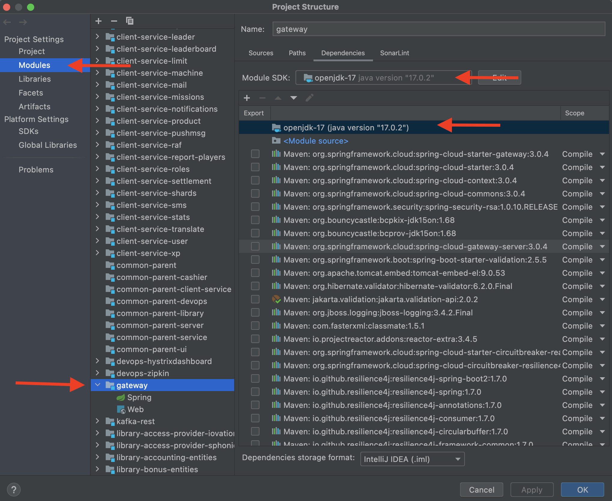
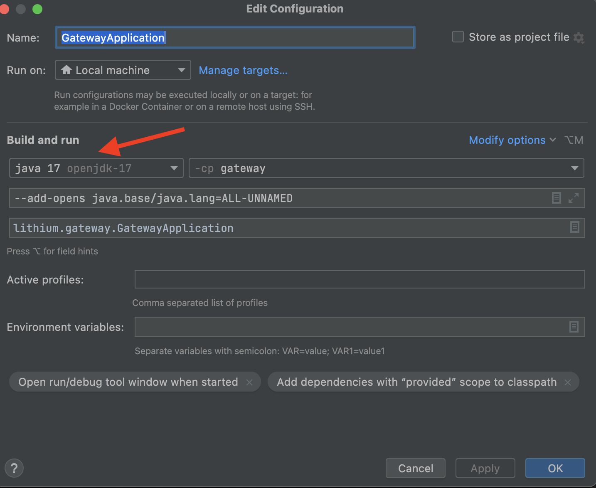

= Gateway
Riaan Schoeman <riaan.schoeman@wonderlabz.com>
1.0, March 7, 2022: Gateway
:sectnums:
:toc: left
:toclevels: 4
:toc-title: Gateway
:icons: font
:url-quickref: https://docs.asciidoctor.org/asciidoc/latest/syntax-quick-reference/

:library-common-sourcedir: ../../library-common
:svr-oauth2-sourcedir: ../../server-oauth2

//:stylesheet: css/asciidoctor.css
//:stylesheet: css/material-blue.css

//This is done to keep formatting aligned with gitlab
****
[verse,,]
____
link:../../readme.adoc[Home]
____
****

== Description

* This is a replacement gateway service. This version will replace the first version that exists inside this code base, and will eventually replace gateway-node.
* Runs with >= openjdk 17
* Uses sleuth for correlation tracking of the requests it receives/sends. (Commented out, because we'd need to do an impact assessment on lithium before releasing it into the wild.)
** library-common:
+
[source,xml,linenumsscript,indent=0,highlight='2-3']
----
include::{library-common-sourcedir}/pom.xml[lines=69..72]
----
** server-oauth2:
+
[source,xml,linenumsscript,indent=0,highlight='2-3']
----
include::{svr-oauth2-sourcedir}/pom.xml[lines=57..60]
----

* Will soon contain the OpenAPI documentation for other services. (Already contains commented out pieces.)
** Imports `springdoc-openapi-webflux-`, because it uses non-blocking Netty as an embedded server and is based on reactive Spring WebFlux.
** Other services will be importing `springdoc-openapi-webmvc-core`

== Setup

* Make sure you have openjdk 17 installed on your machine, keeping in mind that the current lithium stack runs on java 8, so this module will run separately on java 17
* Select `gateway` project from the 'Project' window in IntelliJ, and then press `command`+ `down arrow` (Open Module Settings)
* Change gateway to use the installed openjdk 17:
+

+
* In the `Services` window, right click on `GatewayApplication` and select `Edit Configuration`, and make sure that it is also pointing to openjdk 17
+
