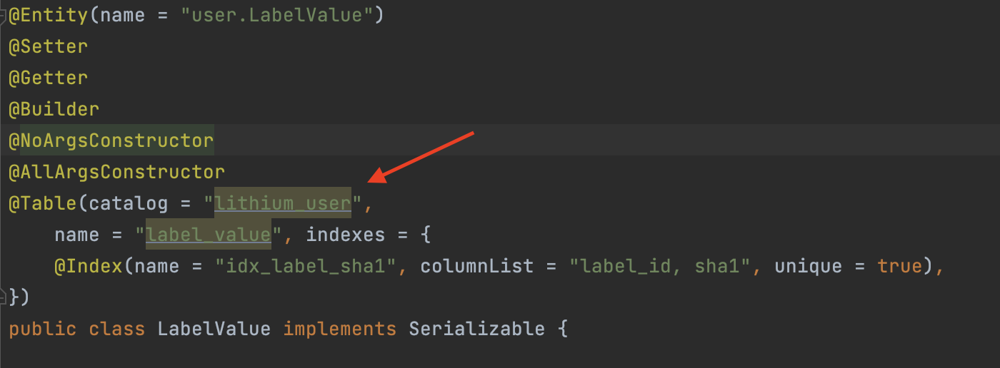

= The Full Lithium App Stack
:doctype: book
:sectnums:
:toc: left
:toclevels: 4
:toc-title: Lithium
:icons: font
:url-quickref: https://docs.asciidoctor.org/asciidoc/latest/syntax-quick-reference/

== Naming conventions

|===
| Implementation Area | Convention | Example

| Frontend-facing API endpoints | Starts with /frontend | \{gateway}/\{service-module-name}*/frontend*/find/something
| Backoffice-facing API endpoints (UNA) | Starts with /backoffice | \{gateway}/\{service-module-name}*/backoffice*/find/something
| System-only endpoints | Starts with /system | \{gateway}/\{service-module-name}*/system*/find/something
| External/3rd Party endpoints | Starts with /external | \{gateway}/\{service-module-name}*/external*/find/something
| Rabbit (AMQP) | Queue/Group/Exchange names are written in lowercase Latin letters and separated by hyphen a (-). +
Namespace segmentation are written as a dot (.) | rabbit-group-example.queue-example +
rabbit-queue-with-a-long-name-example +
rabbit-exchange-name-example
| Rest path naming | No camelcase, use dash for name separators | \{gateway}/\{service-module-name}/system/*find-by-name*/something
| Rest endpoint versioning | Versioning should not be at the root. +
Versioning should exist as a distinguishing characteristic for a specific endpoint, so a preferred place in the path naming would be at the end of the url or as close to the end where the versioning of the change can be made relevant to the change scope. | \{gateway}/\{service-module-name}/backoffice/some-namespace/some-relevant-feature-identifier/*v1*/some-mutative-action *OR*
\{gateway}/\{service-module-name}/backoffice/some-namespace/some-relevant-feature-identifier/some-mutative-action/*v1*
| Flyway script naming | V + Version number + double underscore, no name specifier | \{module-root}/src/main/resources/db/migration/*V42__.sql*
| Translation script naming | {Module name}.{2 char iso lang}.{change reference} + -- When you version your translation file, you may append {-vX} to your \{change-reference}, where X is your version number.
+ -- *Never change existing files once they have been part of an MR.* | {module-root/src/main/resources/i18n/ui-network-admin.en.lsplat-105.json + {module-root/src/main/resources/i18n/ui-network-admin.en.lsplat-105-v2.json
| Git commit message naming | Jira ticket number required at start of commit message | LC-100 - The problem is fixed in this commit
| Git merge request (MR) naming | Jira ticket number required at start of MR name | LC-100 - A change feature that needs to be merged
| application.yml config settings naming | No camelcase, use dash for name separators, package name as prefix | lithium.service.games.execute-function-every-ms : 200
| Cache key naming | No camelcase, use dash for name separators, package name as prefix | lithium.service.games.data.magical-repositories.find-by-game-id
| Custom HTTP error code exceptions | Don't use common HTTP error codes (marked with star) https://www.restapitutorial.com/httpstatuscodes.html | lithium.service.accounting.exceptions.Status412AccountingDomainNotFoundException
| CSS | Class names are written in lowercase Latin letters and separated by hyphen a (-) | example-class
|===

== Hazelcast

The default configuration of all services will look for a 127.0.0.1:5701 hazelcast node in order to obtain the rest of the hazelcast nodes to connect to.
The services will no longer host Hazelcast as a service, so you will need to either start up server-hazelcast first, or run a cluster via docker: https://gitlab.com/playsafe/docker/hazelcast-docker-compose

Search for hazelcast-local.xml for the default dev configuration.
On the cluster, this is configured via application.yml service via service-config to override it to hazelcast-cluster.xml

== Deployment

If you now put into your merge request description, anywhere, a message containing [all] (brackets included), the merge commit create a set of jobs for all services, with manual build and deploy buttons in the pipeline.
If however you put a message such as this: [service-accounting] [service-casino] You will get a pipeline for those services only, that will start executing automatically.
The approver will need to ensure that he or she enables the option to include the merge request description into the merge commit, or edit the merge commit message directly on the merge request approval page to include the services needed.

If for any reason, the release manager needs to make a deployment manually of all services again, simply start a manual pipeline, with a variable CI_COMMIT_MESSAGE with the value [all]

'''

== Encryption:

* In server-oauth2/src/main/resources there is a bash script _(generateKeyPair.sh)_ that will generate a new public/private key in a format that can be used in lithium.
* This bash script will generate three files :
 ** private_key.pem
 ** public_key.pem  <-- Should be copied into :
  *** [server-oauth2] lithium.token.jwt.public-key-content
  *** [library-service] security.oauth2.resource.jwt.keyValue
 ** private_key_pkcs8.pem <-- Should be copied into :
  *** [server-oauth2] lithium.token.jwt.private-key-content

== Documentation

* lithium documentation link:docs/readme-lithium-docs-howto.adoc[howto]
* https://docs.gitlab.com/ee/user/asciidoc.html[Gitlab AsciiDoc]
* https://asciidoctor.org/[asciidoctor]
* https://plantuml.com/[plantuml]

* Dependency Graph
** `<pluginGroups><pluginGroup>com.github.ferstl</pluginGroup></pluginGroups>`  -  _make sure you have this in your settings.xml for maven_
** `mvn depgraph:aggregate`  -  _run this to update the dependency graph, dependency-graph.dot and dependency-graph.png will be generated in the docs directory in the root folder.
https://github.com/ferstl/depgraph-maven-plugin[learn more]_

== Lithium Service / Feature Documentation

=== link:service-casino/docs/readme.adoc[service-casino]
=== link:docs/bonus-framework/readme.adoc[Bonus Framework] (deprecated)
=== link:docs/comps-engine/readme.adoc[Comps Framework]
=== link:docs/restrictions/readme.adoc[Restrictions]
=== link:ui-network-admin/docs/readme.adoc[Backoffice]
== Database and Query Guidelines
=== Database Schemas
|===
| Project | Schema

| service-user-provider-internal
| lithium-service-user-provider-internal

| service-domain
| lithium-service-domain

| service-user
| lithium-service-user
|===

* Case-insensitive string comparisons (https://dev.mysql.com/doc/refman/8.0/en/case-sensitivity.html)
 ** Nonbinary string comparisons are case-insensitive by default.
This means that if you search with col_name LIKE 'a%', you get all column values that start with A or a.
 ** The point above requires case-insensitive collation be used.
Recommendation is utf8_general_ci.
* Avoid creating JPA entities with catalog names. In certain, very specific instances of cross-database joins, they are used. They will however need to be refactored in future with the implementation of Planetscale (Vitess)

'''
=== Query Restrictions
* Query results should always be limited to a maximum of 20 000 records to avoid memory floods in the deployed service container instances.
* In cases where the expected result size will grow to exceed the size limitations, Paging should be used to fetch the results from the database with a relevant bounding to avoid a large count operation for fetching the total number of pages. +
Eg. Limit a paged query for fetching transactions by forcing a date limit and a matching message on the Backoffice page to indicate a forced bounding based on date when encountering large resultsets.
* When paging is used, special attention should be paid to the storage of the page results. Any storage to cache or local instance memory storage should be monitored to avoid large data sets being kept in memory. Take into consideration that there will be large volumes in cases where users or transactions are present.

'''
=== Flyway Guidelines
* Avoid using DROP TABLE in the scripts. There are risks when manually executing and for local development when schema versions might be executed multiple times.
* Avoid type enumeration inserts, insert should be done in code after startup of service, not in the script.
* Evaluate the script for long-running updates to existing tables. Check data on Staging to get an idea of size on Production.
* Refer to the <<Naming conventions>> section for script naming guidelines.
== Email Template Data :

* email \=> verification.status.change
* {blank}
+
[cols=3*]
|===
| email body \=> %user.firstName%
| %user.lastName%
| %user.verificationStatus%
|===

* sms \=> sms.verification.status.change

'''

== External documentation

* Must read angular explanation on scopes: https://docs.angularjs.org/guide/scope
* Datatables https://datatables.net/
* Angular Datatables https://l-lin.github.io/angular-datatables
* sbadmin Angular Administrative Theme http://startbootstrap.com/template-overviews/sb-admin-2/ http://startangular.com/product/sb-admin-angular-theme/
* Angular ui https://angular-ui.github.io/bootstrap/
* Bootstrap CSS http://getbootstrap.com/css/
* http://jettro.github.io/c3-angular-directive
* http://c3js.org/
* Full Spring Boot application settings: https://docs.spring.io/spring-boot/docs/1.4.1.RELEASE/reference/html/common-application-properties.html

'''

=== Must reads:

* https://docs.angularjs.org/guide/ie

== Todo's

https://github.com/VanRoy/spring-cloud-dashboard https://spring.io/blog/2014/12/02/latest-jackson-integration-improvements-in-spring (for cleaning up my huge json responses)

== Sonarqube Code Quality Server

To access the sonarqube servers daily code analysis of app-lithium full, you can do so through:

http://sonarqube.playsafesa.com username: playsafe password: Gauteng123

== File Structure

* Classes, Enums, Interfaces, Annotations should all reside in their own file. Only in exceptional circumstances should inner classes be used and only by prior arrangement with the group architects

== Links to External Docs

=== Spring Cloud Netflix

The spring cloud netflix implementation is quite old, and documentation is difficult to find.

* Local copy link:docs/spring-cloud-netflix-1.2.1.RELEASE.pdf[docs/spring-cloud-netflix-1.2.1.RELEASE.pdf]
* Online copy https://cloud.spring.io/spring-cloud-static/spring-cloud-netflix/1.2.1.RELEASE

== Lithium Feature Configuration

=== ui-network-admin (UNA)

* Default auth client will be created with :
 ** user (clientId) : default/una (replacing: acme)
 ** password (clientSecret) : uNa@h4sANEWp4sswd (replacing: acmesecret)
* This auth client will be used for all logins into ui-network-admin for any domain.
* How to remove excessive login block for default admin (run on db instance): + `UPDATE lithium_user.user u JOIN lithium_user.domain d ON u.domain_id = d.id SET u.excessive_failed_login_block = 0 WHERE username like 'admin' AND d.name like 'default'`
+
===== Server-Oauth2
* `lithium.token.jwt.access-token-validity-seconds` - Defaults to 2678400 seconds (31 Days) if not specified.
* `lithium.token.jwt.refresh-token-validity-seconds` - Defaults to 2592000 seconds (30 Days) if not specified.

=== Service domain

Domain settings are key:value properties configured in service domain.

* minUserAge : 18 (Minimum user age allowed for signup)
* terms_and_conditions_version : 2 (The current terms and conditions version for the domain)

=== Translations:

Translations are loaded to the system by making use of a json file that contains Object nodes and Value nodes.
Each value node is assigned to a translation key which is basically all object nodes from the root node, up until the value node.

See example for more clarification on how to define a translation key / value below:

 {
     "UI_NETWORK_ADMIN": {
         "PAGE": {
             "TITLE": {
                 "TEXT": "This is the value node assigned to the combined object nodes (namespaces) that makes up the translation key = 'UI_NETWORK_ADMIN.PAGE.TITLE.TEXT'"
            }
         }
     }
 }

Whenever we are adding new translation to the system, we are required to add a new translation file with the following unique file format:

* \{application-name}.\{locale2},\{change-reference}.json
* *_ui-network-admin.en.lsplat-105.json_*

It is recommended to always create a new version of the translation file whenever a change has already been deployed to development, and which requires you to create a new MR to have your changes loaded in the translations db;
for versioning of the same change-reference/jira-ticket-number:

* \{application-name}.\{locale2},\{change-reference}{-vX}.json (where X is the version number of the same change-reference that has been applied.
* *_ui-network-admin.en.lsplat-105-v2.json_*

Whenever you would like to rerun your existing translation files.
You would need to ensure that the service has been restarted first before you run the rerun translation endpoints.
This is simply because the api is only able to view files that has been placed on its classpath.
i.e.
when we build our code, and restart the service, all the files are placed on the classpath.

Two endpoints exist that you may use to rerun translations that are already present in the classpath:

* This endpoint will delete only the changeReference for the application that you running it on, ui-network-admin in this case since we are running the endpoint directly on port 9800.

 localhost:9800/registertranslations/rerun?changeReference=lsplat-1230&locale2=en

* This endpoint will delete all the change-references from the DB for the application on which it is executed.

 localhost:9800/registertranslations/rerun/all

We should never edit translation files that has already been deployed to dev with a MR, as we would lose version control if we do so.
The only exception to this rule is for the error dictionary, where we need to remove a translation key from the system and not have it displayed in the Brand Configuration \-> Error Dictionary sub tabs.

=== Service user

User settings are configuration available by modification of the relevant application.yml

==== Milliseconds interval for login failures to be counted

* lithium.services.user.login-block-failure.interval-ms: 600000

==== Number of times login failure is allowed before blocking
* lithium.services.user.login-block-failure.threshold: 5

=== Document service

A microservice that stores binary documents per user.

==== Available domain settings

* uploaded_document_mail_dwh - property to enable DWH email notifications about new verification documents uploaded

=== Service geo

The geo override can be used for country, admin1, admin2 and city to replace the name field of a specific populated key in the relevant table.

* {blank}
+
[cols=3*]
|===
| lithium.service.geo.override-geo-data: { "admin1
| NG.11": "Abuja", "admin1
| NG.56" : "Nasarawa" }
|===

=== Service cashier

==== Domain name used for cashier job retry by system (default: system)

* lithium.service.cashier.jobs.system-domain-name

==== Username used for cashier job retry by system (default: system)
* lithium.service.cashier.jobs.system-username

==== Cron schedule for failed withdrawal job retry 10 min (default: 0 */10 * * * * )
* lithium.service.cashier.jobs.processing.retry.cron

==== Cron schedule for stuck in APPROVED state withdrawal job retry 1 hour (default: 0 0 */1 * * * )
* lithium.service.cashier.jobs.processing.approved.state.stuck.retry.cron

==== Access rules will block and reject transactions if criteria is invalid (default: false)
* lithium.service.cashier.machine-apply-access-rule-block

==== Allow multiple withdrawals to be submitted. (default: false)

==== There is a risk if the initiator for withdrawal submits duplicate transaction references.
* lithium.service.cashier.allow-multiple-withdrawals

=== Service limit

==== Player exclusion comms (email, sms, notification) templates

* player.exclusion.added.permanent
* player.exclusion.added.soft
* player.exclusion.removed

=== Service casino

==== Transaction detail lookup request timeout

* lithium.service.casino.tran.detail.lookup.timeout (default: 10000) in ms

==== Available domain settings

* bonusTokenDefaultMinimumOdds - Minimum odds for bonus token eg.
1.234
* bonusTokenDefaultMinimumTokenValue - Minimum amount cents bonus tokens can have eg.
12
* bonusTokenDefaultMaximumTokenValue - Maximum amount cents bonus tokens can have eg.
9999
* bonusTokenDefaultExpiryDurationDaysValue - Default days the bonus token will be valid after assignment eg.
10

== HOWTOs
=== How to get a custom lithium rest template

===== The template has raw data logging when you enable debug level logging on lithium.rest

* Add annotation @EnableRestTemplate
* Create RestTemplate using @Qualifier("lithium.rest") RestTemplateBuilder builder

=== How to allow for a graceful shutdown of spring application

Boot up your app using LithiumShutdownSpringApplication.run(class, args)

* lithium.application.shutdown.wait-seconds: 60 (grace period for shutdown)

=== How to see the exact queries going to MySQL

To see all queries going to Mysql, it is best to log it on the Mysql server side:

 set global general_log_file='/tmp/mysql.log';
 set global general_log = on;
 set global log_output = 'file';

That way, on the server, you can tail it using:

 tail -f /tmp/mysql.log

=== How to dump out Java Flight Recorder information from Pod

First get your java process id:

 bash-5.0# jcmd
 1894 sun.tools.jcmd.JCmd
 6 service-user.jar                      <-------- this is the jar file/java application

Then issue a JFR recording start, duration and output file location:

....
bash-5.0# jcmd 6 JFR.start duration=300s filename=/tmp/svc-user-flight.jfr
6:
Started recording 1. The result will be written to:

/tmp/svc-user-flight.jfr
....

Exit the pod and copy the file back to your CLI:

 [root@Kim-Linux-Desktop ~]# kubectl -n lithium cp svc-user-bbcc5947-b6x4m:/tmp/svc-user-flight.jfr svc-user-flight.jfr
 tar: removing leading '/' from member names
 [root@Kim-Linux-Desktop ~]#

Copy the file from there to wherever you need it, gzipping it up saves time.

=== How to get a Java Heap Dump from a pod

First get your java process id:

 bash-5.0# jcmd
 1894 sun.tools.jcmd.JCmd
 6 service-user.jar                      <-------- this is the jar file/java application

Then issue a heapdump and output file location:

 bash-5.0# jcmd 6 GC.heap_dump /tmp/svc-user.hprof
 6:
 Heap dump file created

Exit the pod and copy the file back to your CLI:

 [root@Kim-Linux-Desktop ~]# kubectl -n lithium cp svc-user-bbcc5947-b6x4m:/tmp/svc-user.hprof svc-user.hprof
 tar: removing leading '/' from member names
 [root@Kim-Linux-Desktop ~]#

Copy the file from there to wherever you need it, gzipping it up saves time.

=== How to start prometheus + grafana locally

1. Add metric configuration for corresponding application.yml (or in common config file #library-service/src/main/resources/lithium/service/application.yml#, it will affect to all services). Also, you can define it in service-config source(disabled by default) .
* The main parameter which creates endpoint for scraping metrics by prometheus (/prometheus) is

 management.metrics.export.prometheus.enabled: true

 management.metrics.export.logging.enabled: true metrics will be exported to console if enabled
 management.metrics.export.loggin.step: 1m

2. Get and run prometheus and grafana a cluster via docker

* Via console calls

 docker run -d --name grafana-server -p 3000:3000 grafana/grafana

 docker run -d --name prometheus -p 9090:9090 -v {local_path}/prometheus.yml:/etc/prometheus/prometheus.yml prom/prometheus

Example of local prometheus configuration for scraping metrics from service-domain and service-cashier:

.prometheus.yml
[source,yaml]
----
global:
    scrape_interval: 10s # How frequently to scrape targets by default
scrape_configs:
    - job_name: 'spring_micrometer'         # The job name is assigned to scraped metrics by default.
      metrics_path: '/prometheus'  # The HTTP resource path on which to fetch metrics from targets.
      scrape_interval: 5s                   # How frequently to scrape targets from this job.
      static_configs:                       # A static_config allows specifying a list of targets and a common label set for them
        - targets: ['10.5.106.207:9300','10.5.106.207:9102','10.5.106.207:9791']
----

[start=3]
3. Configure grafana data source
* Open http://localhost:3000
* Logging with admin:admin
* Add your first data source->Prometheus->HTTP Url: http://{ip}:9090->Save & test. Please make sure to use correct IP in case prometheus/grafana started on the same/different VM
* Add Dashboard: "+"->Import-> set "https://grafana.com/grafana/dashboards/4701" or "https://grafana.com/grafana/dashboards/5373" in "Import via grafana.com" field->Load
* Add Panel configure corresponding Query by selecting corresponding metric in series
* You can import saved dashboards from #devops-grafana/dashboards/*.json#. Dashboards->Browse->Import

Note: for installation on Windows make sure that wsl 2 is installed and working properly. You may use Docker Desktop as an option. Docker Toolbox and Oracle VirtualBox should be uninstalled in that case.

