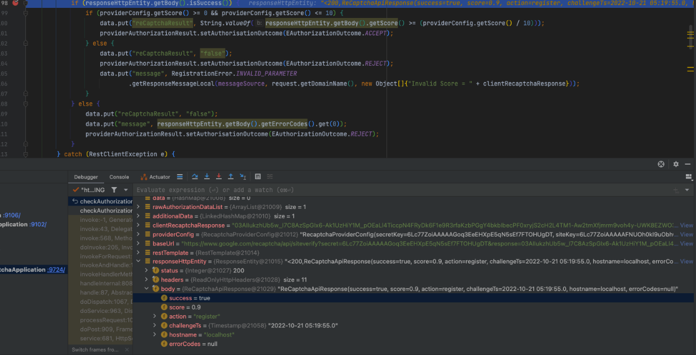

= reCaptcha
Irwin Herridge <irwin.herridge@wonderlabz.com>
1.0, October 20, 2022: TA1
:sectnums:
:toc: left
:toclevels: 4
:toc-title: Table of Contents
:icons: font
:url-quickref: https://docs.asciidoctor.org/asciidoc/latest/syntax-quick-reference/
:table-caption!:

//This is done to keep formatting aligned with gitlab
****
[verse,,]
____
link:../../readme.adoc[Home]
____
****

== Preface

The purpose of this document is to provide insights into the current as-is state of the reCaptcha implementation.

== Epics

* https://livescoregroup.atlassian.net/browse/PLAT-5500[reCaptcha v2] Not Implemented
* https://livescoregroup.atlassian.net/browse/PLAT-3148[reCaptcha v3] Implemented

== TA's

=== LSPLAT-530 - PLAT-1244 ⁃ Integrate Google's reCAPTCHA

TIP: Only reCAPTCHA v3 has been implemented as part of this ticket

https://playsafe.atlassian.net/browse/LSPLAT-530
https://jira.livescore.com/browse/PLAT-1244

https://playsafe.atlassian.net/wiki/spaces/LITHIUM/pages/2313355274/ACCEPTED+LSPLAT-530+-+PLAT-1244+BE+Integrate+Google+s+reCaptcha[Intal TA]
- Takeaway from this TA was that initially the recaptcha was going to be built as a user provider service.

https://playsafe.atlassian.net/wiki/spaces/LITHIUM/pages/2534342697/ACCEPTED+LSPLAT-530+PLAT-1244+BE+Integrate+Google+s+reCaptcha[TA addendum]
- We have revised where the reCaptcha logic will sit, and we will now need to move our checks to a new reCaptcha Access Provider service and have reCaptcha checks done as part of a pre-signup access rule; the provider would then make use of the provider properties to adjust the reCaptcha score

== How to enable reCaptcha on a domain

. Add svc-access-provider-google-recaptcha as an Access provider type.
. Create a new Access Control Ruleset with an external provider making use of the access provider setting created in step 1.
. Add the new ACR as a pre-signup access rule on the relevant domain in question.
. Add reCaptcha string as part of the register/v3 or register/v4 endpoint's PlayerBasic.additionalData.reCaptcha

[source, json]
----
{
    "email": "{{email}}",
    "password": "{{password}}",
    "firstName": "{{$randomFirstName}}",
    "lastName": "{{$randomLastName}}",
    "dobDay": "{{dobDay}}",
    "dobMonth": "{{dobMonth}}",
    "dobYear": "{{dobYear}}",
    "additionalData": {
        "reCaptcha": "{{reCaptcha}}"
    }
}
----

=== Implementation Overview

.Using reCaptcha as part of the account creation flow
[plantuml]
----
@startuml

participant GW as gw
participant "svc-user" as user
queue "register-success" as autoregister
participant "svc-access" as access
participant "svc-access-provider-google-recaptcha" as recaptchaprovider
participant "Google" as google

autonumber

FE -> svc

gw -> user++: register new player using register/v4 API

  group pre-registration
      user -> user: validation
      user -> access++: execute pre-signup access rules
      group#lightgreen reCaptcha ACR configured
        access -> recaptchaprovider++: do-recaptcha-acr
        recaptchaprovider -> google++: verify recaptcha
        google --> recaptchaprovider--: google recaptcha response
        alt google recaptcha response success=false
          recaptchaprovider --> access: ACR.outcome=REJECT
        else google recaptcha response success=true
          recaptchaprovider --> access--: ACR.outcome=ACCEPT
        else google recaptcha timeout
          recaptchaprovider --> access--: ACR.outcome=TIMEOUT
        end
      end group
      access --> user--: Return ACR.outcome response
      alt ACR.outcome=REJECT
        user --> gw: Status 460 with configured ACR reject message response
      else ACR.outcome=TIMEOUT (depending on whether a TIMEOUT is mapped to an outcome.REJECT)
        user --> gw: Status 460 with configured ACR timeout message response
      end
  end group

  user -> user: creates new user

  group post-registration
    user -> user: execute post-signup access rules
    alt ecosystem
      user -> autoregister: media account creation
    end
  end group
  group implicit login after successful registeration
    user -> user: validation
    user -> user: execute pre-login access rules
    user -> user: user auth
    user -> user: execute post-login access rules
    user --> gw--: response AccessTokenResponse
  end group

@enduml
----

TIP: The sequence diagram above has been reduced to only show the ACR execution points during the login (implicit login) and account creation flows. For normal login, the same flow as used in implicit login would be used internally.

=== Supported ACR flows

[cols="h, a"]
|===

|Pre-Login Access Rules
|No

|Post-Login Access Rules
|No

|Pre-Signup Access Rules
|Yes

|Post-Signup Access Rules
|No
|===

==== reCaptcha v2

WARNING: Not implemented: see https://livescoregroup.atlassian.net/browse/PLAT-5500[EPIC: reCaptcha v2]

==== reCaptcha v3

* When registering a player with a reCaptcha string that was provided from the frontend, Lithium will pass the reCaptcha access control rule when Google has provided a `success` back, and our domains Access Provider settings has a configured score between 0 and 10.

IMPORTANT: Note that we do not evaluate whether the score returned is greater than or equal to our configured score, but this is something that we can do in the future, depending on business requirements.

== Testing on your local

. https://www.google.com/recaptcha/admin/create[Register a new site] and set your domain to "localhost"

[start=2]
. Add your site key into the recaptcha-demo.html Line 12 and 14

[source,java,linenums,indent=0,highlight=12..20]
----
include::recaptcha-demo.html[lines=1..20]
----