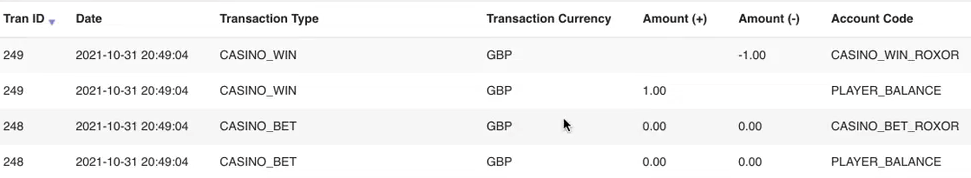
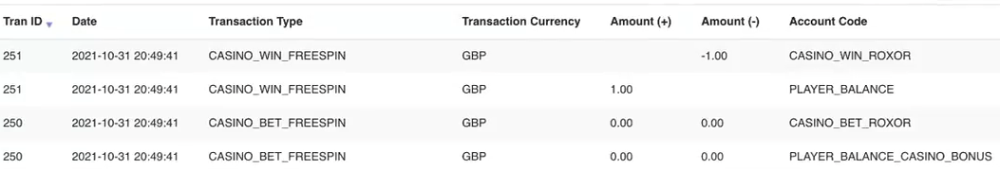
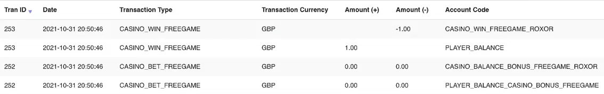
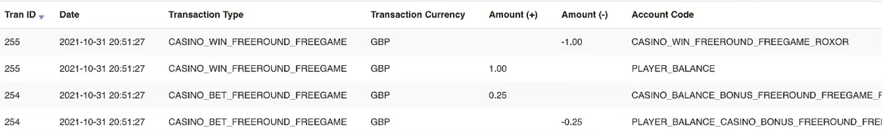

= Redemption Flow Examples (Roxor)
:icons: font

[sidebar]
link:readme.adoc[Home]

.V1
****
NOTE: use_v2_bonus_tran_types_in_v1 == false  (documented link:domain-seettings.adoc[here])
****

===== bet/win
[source,json]
----
{"operationType":"TRANSFER","amount":{"currency":"GBP","amount":185},"type":"DEBIT","transferId":"044d9414-50011"},
{"operationType":"TRANSFER","amount":{"currency":"GBP","amount":185},"type":"CREDIT","transferId":"044d9414-5001"}
----
.normal bet/win scenario

===== bet/win (DFG)
[source,json]
----
{"operationType":"FREE_PLAY","amount":{"currency":"GBP","amount":285},"transferId":"044d9414",
    "source": {
        "sourceId": "play-dfg-game",
        "sourceType": "DFG"
    }
},
{"operationType":"TRANSFER","amount":{"currency":"GBP","amount":185},"type":"CREDIT","transferId":"044d9414"}
----
.normal freespin bet/win scenario

---
.V2
****
NOTE: use_v2_bonus_tran_types_in_v1 == true  (documented link:domain-seettings.adoc[here])
****

===== bet/win (freespins)
[source,json]
----
{"operationType":"TRANSFER","amount":{"currency":"GBP","amount":185},"type":"DEBIT","transferId":"044d9414-50011"},
{"operationType":"TRANSFER","amount":{"currency":"GBP","amount":185},"type":"CREDIT","transferId":"044d9414-5001"}
----
.normal freespin bet/win scenario

===== bet/win (DFG)
[source,json]
----
{"operationType":"FREE_PLAY","amount":{"currency":"GBP","amount":285},"transferId":"044d9414",
    "source": {
        "sourceId": "play-dfg-game",
        "sourceType": "DFG"
    }
},
{"operationType":"TRANSFER","amount":{"currency":"GBP","amount":185},"type":"CREDIT","transferId":"044d9414"}
----
.normal freespin bet/win scenario

