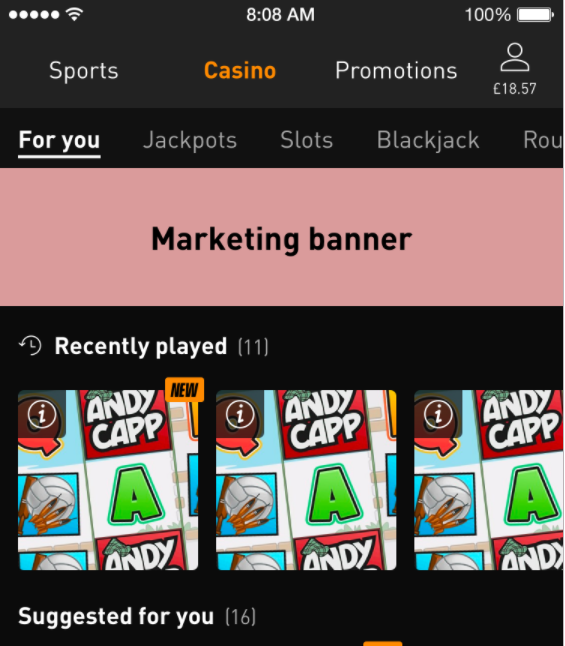
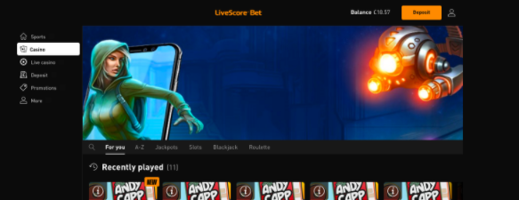
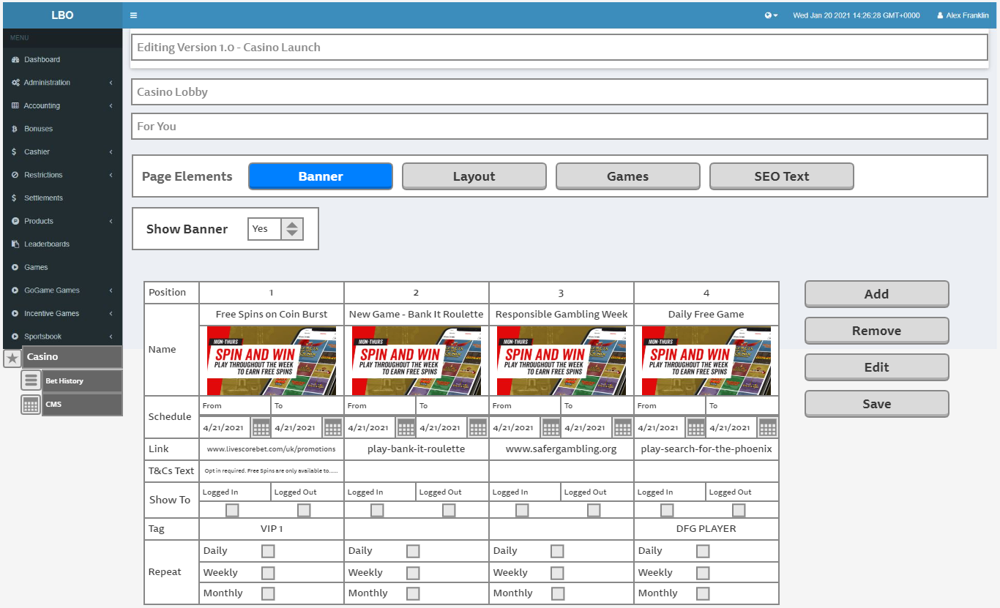

= Prototype - [Lithium Casino] Marketing Banner Management in Casino CMS
Mahlori Ngobeni <mahlori.ngobeni@wonderlabz.com>
1.0, June 30, 2022:: TA - LSPLAT-137 PLAT-467 ⁃ Prototype - [Lithium Casino] Marketing Banner Management in Casino CMS
:toc: left
:toclevels: 4
:toc-title: LSPLAT-137 PLAT-467
:icons: font
:url-quickref: https://docs.asciidoctor.org/asciidoc/latest/syntax-quick-reference/
== Information
=== Tickets
* https://jira.livescore.com/browse/PLAT-467
* https://playsafe.atlassian.net/browse/LSPLAT-137

=== Dependencies
* N/A

=== MR
* https://gitlab.com/playsafe/lithium/app-lithium-full/-/merge_requests/5160
* This MR contains the branch that should be used to complete this task

WARNING: You might need to install graphviz to render the component models on IntelliJ on plantUML if not viewed on GitLab- see https://playsafe.atlassian.net/wiki/spaces/LITHIUM/pages/1674936347/How+To+Setup+Lithium+Local+Development#Noteworthy-Extensions.1[IntelliJ: PlantUML diagramming tool]

== Description (From Ticket)
=== Business Need

Marketing banners are used to promote offers, new games and other on-site messages that the casino wants to show to players. Banners

== Acceptance Criteria

Once a user has selected a Sub Navigation page to manage, they are presented with a 'Page Elements' menu with options to configure Banner, Layout, Games, SEO Text per page.

To configure the marketing banner for a specific page, a user selects 'Banner'.

==== A dropdown menu is then shown where a user can select to either show the marketing banner on that page or not.
* User selects Yes - a screen is presented below where the user can configure the banners
* User selects No - no banner is shown in the casino lobby for that page but any previous configurations are still shown on the CMS page

==== Configuring Banners:
If no banners are configured then no marketing banner is shown on the casino lobby for that page

==== Position
* When a user first configures a banner for a page, one empty column is shown
* When a new banner is added, another column is added at the end of the grid (see Add button use case below)
* Banner position can be changed by drag and drop
* Banner position numbers are changed accordingly

==== Name
* All banner images are named and stored on the CDN
* When a user starts typing the name of the banner into the 'Name' field, matching images are shown in a dropdown menu to select from
* Once an image has been selected, it is shown underneath the banner name

==== Schedule
* User can select the time and date that a banner will start appearing on the page from
* User can select the time and date that a banner will finish appearing on the page until
* If a user leaves the 'To' field empty then the banner will remain on site until it is manually removed by the user (see Remove button use case below)

==== Link
* User can input a link here which can either be:
* a link to a dedicated promotions page for the offer
* a link to the promotions page
* a game launch (by entering the game ID)
* a Sports event
* an external page
* an internal page (Sports homepage/Live Casino Lobby etc)
** If the user does not enter a link then the banner does not link anywhere

==== T&Cs Text
* User can enter the __ text that they wish to display as an overlay on the banner
* If no text is inserted then the overlay does not show

==== Show To
* User can select whether to show the banner to logged in players
* User can select whether to show the banner to logged out players
* If both states are selected then the banner is shown to both
* If neither states are selected then the banner is not shown to either

==== Tag
* User can enter a Player Tag which has been set in LBO
* If a tag is present then the banner will only show to logged in players with the specified tag

==== Repeat
* User can schedule recurring banners to appear
** Daily - based on the time set in the schedule
*** User is given the option via check boxes to set a banner for selected days - Monday, Tuesday, Wednesday, Thursday, Friday, Saturday, Sunday
** Weekly
*** User is given the option via check boxes to set a banner for selected days - Monday, Tuesday, Wednesday, Thursday, Friday, Saturday, Sunday
** Monthly
*** User is given the option to select a day - last day of the month, first day of the month, last working day of the month, last friday of the month

By default, all banner layouts and schedules are the same per sub navigation page

Once a banner layout is set in the Casino Lobby Homepage (For You/the first page in the sub navigation) is is cloned to the other sub navigation pages in LBO when a user selects to Show a banner on a page. It can then be edited by the user.

Action Buttons:

Add - an additional empty column is added at the end of the layout

Remove - a banner is deleted by entering the position number of the banner to be removed from the layout in a pop up dialogue. A yes/no confirmation message is presented.

Edit - existing banners can be edited. All fields become editable once this button is selected.

Save - once a user has completed their configuration or finished editing they can lock it by selecting Save and confirming. A yes/no confirmation message is presented

If a user tries to navigate away from the page without saving the configuration then a yes/no confirmation message is presented asking whether the user would like to save it.

Banner layouts are only committed to the Lobby when a user Publishes that version.

== Architecture
=== Prerequisite
TIP: A basic understanding of the CMS Images implementation

TIP: Understanding the current structure of the Lobby JSON and how it is used by the FE

=== Technical

NOTE: Banners will now have to be managed using the new CMS implementation and all banner config will have to be removed from the Lobby JSON

Currently, banners are stored in the full lobby JSON, and it will be hard to achieve what we want if we continue storing the banners in the JSON. For this solution we will be separating the banners from the rest of the JSON and store them as separate entity. Doing so also means we are moving a step in the right direction towards storing the lobby as separate entities.

==== Data Structure

NOTE: On Banner Entity - The time_from and time_to determines the times that the banner will be available to display on the lobby

.Banner Data structure
include::../plantuml/entity/cms-lobby-banner.puml[]

==== Banner Management Page
* Create a new menu item under casino in lbo
** This page will be used to manage domain banners (create, view, update, delete)

.Banner Management List
include::../plantuml/activity/banner-management-list.puml[]

==== Banner Controller
Create a new controller `BannersController` with the following endpoints

NOTE: User should not be allowed to create banner without a corresponding CMS banner image in the CDN

* POST `/service-casino-cms/backoffice/{domain-name}/banner/save`
** This endpoint will be used to create banners
** Create Banner Schedule
*** You will need to add the following dependency in the pom.xml

    `<dependency>
        <groupId>org.dmfs</groupId>
        <artifactId>lib-recur</artifactId>
        <version>0.11.3</version>
    </dependency>`

*** Find the documentation of the recurrence processor https://github.com/dmfs/lib-recur#readme[here]

*** Please check `lithium.service.leaderboard.controllers.admin.AdminLeaderboardController.add` for a similar implementation of the scheduler
*** We can display the open (closed = false) BannerSchedules in Banner view screen for user visibility
*** You will need to create a clean up job to close all the expired schedules. And for every expired BannerSchedule, create a new at the end of all the other Schedules. See `lithium.service.leaderboard.jobs.LeaderboardJobs.cleanupLeaderboards`

NOTE: Unlike LeaderBoard we will do away with the duration period and duration granularity. We will store a certain number of future occurrences of the BannerSchedule, I suggest we cap it at 10 (same as LeaderboardHistory).

.Create Banner
include::../plantuml/sequence/create-banner.puml[]

NOTE: To ensure that we use valid tags on the banners, have a dropdown that is populated with the existing tags from the svc-user.
Reference to player tags endpoint:  `lithium.service.user.controllers.backoffice.UserCategoryController.categoryList`

* POST `/service-casino-cms/backoffice/{domain-name}/banners/{id}/get`
** This endpoint will be used to get the banner by id
** If no results, `throw Status404BannerNotFoundException`
** if `{domain-name}` does not match `domainName` of the returned entity `throw Status422DataValidationErrorException`

* POST `/service-casino-cms/backoffice/{domain-name}/banners/get-list`
** This endpoint will be used to get the list of banners for the selected lobby

* POST `/service-casino-cms/backoffice/{domain-name}/banners/{bannerId}/update`
** This endpoint will be used to update the banner
** if `{domain-name}` does not match `domainName` of the entity being updated `throw Status422DataValidationErrorException`

==== LobbyController
Once a banner is created it will need to be added assigned to a specific lobby. A Banner is assigned to a specific page on the lobby.

NOTE: Page is uniquely identified by it's primary_nav_code, secondary_nav_code and channel

* POST `/service-casino-cms/backoffice/lobby/add-banners-to-page
** This endpoint we will add Banner to a Lobby
** The end point should pass to the body a Request object that with lobbyId, primaryNavCode, channel, list of secondaryNavCode and list of object with bannerId and bannerPosition

include::../plantuml/sequence/add-banner-to-page.puml[]

NOTE: Have a button on the banner to remove a banner as opposed to entering a position of the banner. Position based removal can be confusing

==== Load Lobby

include::../plantuml/sequence/player_lobby_load.puml[]
