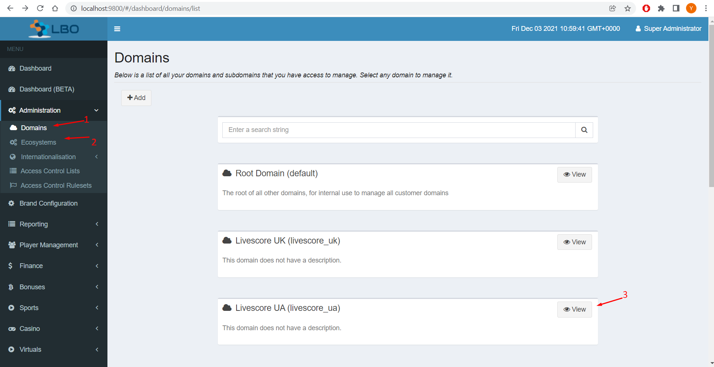
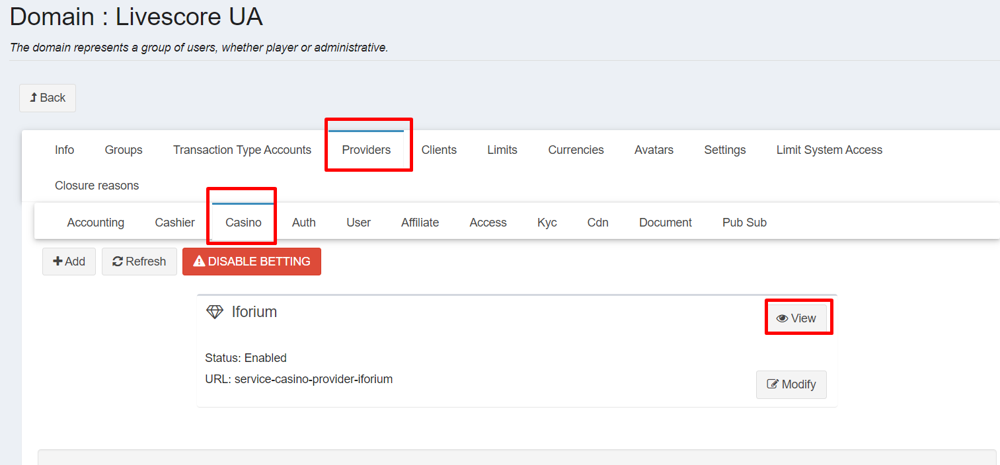
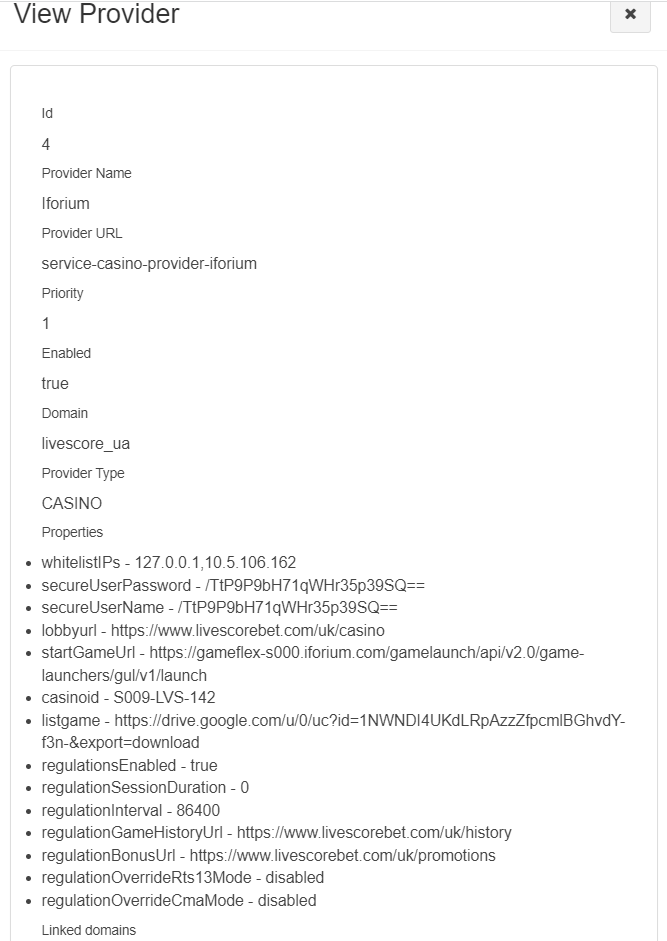

= Running the local LBO

To run a local instance of the LBO, start the  `UiNetworkAdminApplication` service from within your IDE.

You should then be able to navigate to link:http://localhost:9800/#/dashboard/home[http://localhost:9800/++#++/dashboard/home].

== Verifying the local LBO Configuration

In your local LBO:

. Click on `Administration`
. In the drop-down list select `Domains`
. Choose `Livescore_UA` domain.

[start=4]
. Click on `Providers`, then `Casino`
. Find **Iforium** and click on `View`

This will provide a list of the parameter values for the **Iforium** provider:

[start=6]
. Compare the above values with those in the link:https://lbo.lithium-develop.ls-g.net/#/dashboard/domains/domain/livescore_ua/view[`Livescore_UA`] Domain in the Development environment and ensure they all match.