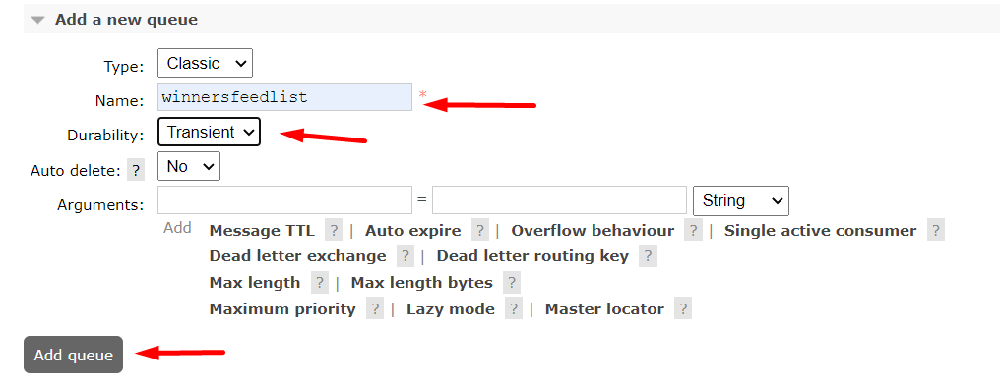

= Running Supporting Services

== Starting the LBO-SDK Host

The `lbo-sdk` host is a prerequisite for other services to run correctly.

TIP: If the `UiNetworkAdminApplication` service (the local LBO) is running, it needs to be stopped before starting the `lbo-sdk` host.

To start the `lbo-sdk` host, run following commands in the terminal.

[code,bash]
----
cd app-lithium-full/lbo-sdk
npm install
npm run host
----

== Configuring RabbitMQ queues

In order to run the ServiceCasinoApplication, the following queues must first be created in the http://localhost:15672/#/queues[Rabbitmq Admin], specifying `Durability=Transient`.

- scratchcardwinners
- winnersfeedlist

== Running Lithium Services

Additional Lithium services that need to be run are described in the link:https://playsafe.atlassian.net/wiki/spaces/LITHIUM/pages/1674936347/How+To+Setup+Lithium+Local+Development#Step-6---Run-the-Services[Wonderlabz Confluence].

Once all required services are running, run the `UiNetworkAdminApplication` and `ServiceCasinoProviderIforiumApplication` services from within your IDE.
