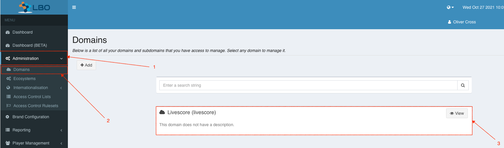
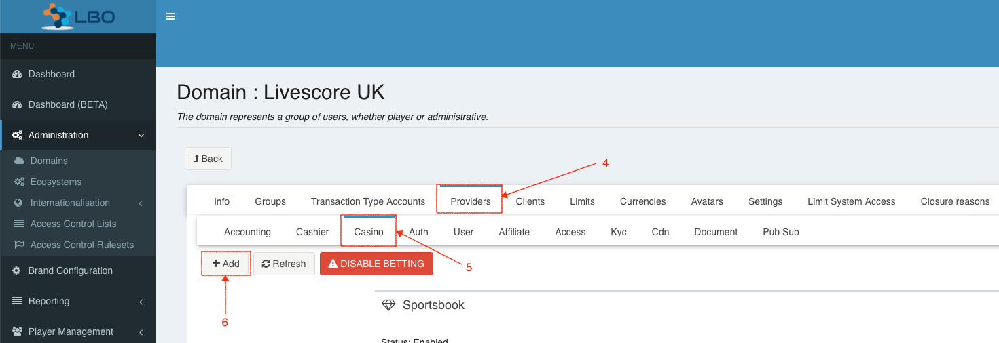
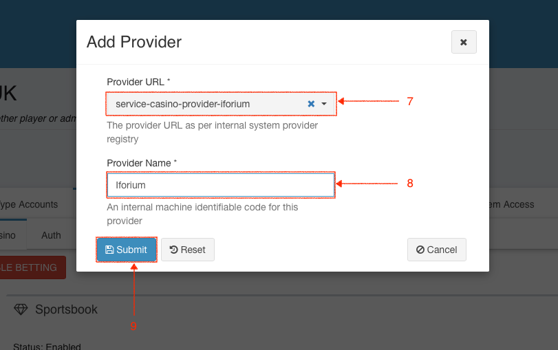
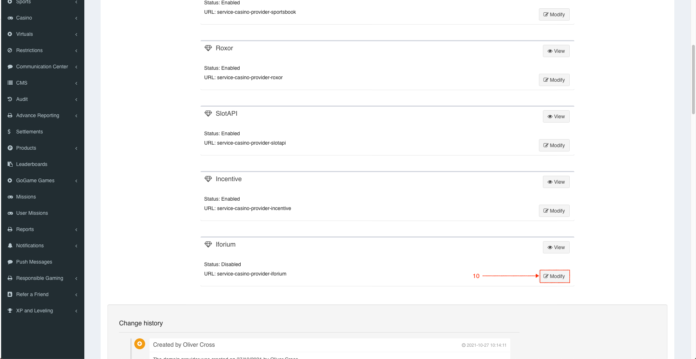
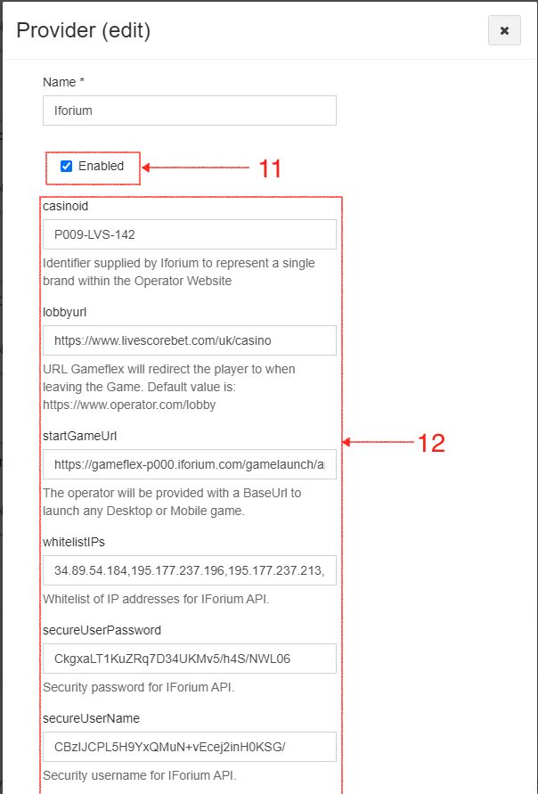
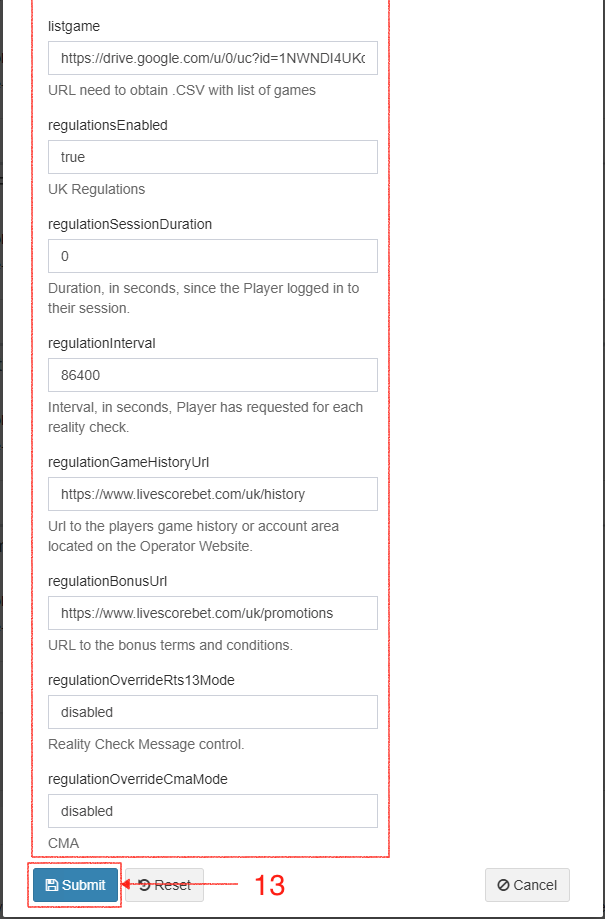

= Configuring the Iforium Casino Provider for a Domain

. Click `Administration`
. Click `Domains`
. Click `View` on _Livescore (livescore)_

[start=4]
. Click `Providers`
. Click `Casino`
. Click `Add`

[start=7]
. Select _service-casino-provider-iforium_ value for `Provider URL`
. Enter `Provider Name`
. Click `Submit`

[start=10]
. Click `Modify` for _Iforium_

[start=11]
. Select `Enable`
. Fill all fields according to the table <<_domain_config_parameters,below>>.

. Click `Submit`

== Configuration Parameters [[_domain_config_parameters]]

[options="header", cols="<.<20m,.<35,.<10,.<35e"]
|===
| Parameter| Description| Type| Comments

| casinoid
| Identifier supplied by Iforium to represent a single brand within the Operator Website
| String
| Should be `L018-LVS-142` for LiveScoreBet UK

| lobbyurl
| URL Gameflex will redirect the player to when leaving the Game.
| URL
| Should be set to `https://www.livescorebet.com/uk/casino`

| startGameUrl
| The base URL for launching Iforium games
| URL
| Should be set to `https://gameflex-s000.iforium.com/gamelaunch/api/v2.0/game-launchers/gul/v1/launch`

| whitelistIPs
| A comma-separated list of IP addresses that are permitted to access the Casino Provider's endpoints.
| IP[]
| In Production, should only contain IPs from the Iforium RGS

| secureUserPassword
| Security password for IForium API.
| String
| Will be used on all calls from Iforium

| secureUserName
| Security username for IForium API.
| String
| Will be used on all calls from Iforium

| listgame
| The URL for the list of games exported from Iforium (see <<_challenge_games_list,Games List>>)
| URL
| e.g. https://drive.google.com/uc?export=download&id=1HwGIXsggYes_JZyoXdPcdP7TbyYdmjPG

| regulationsEnabled
| The "master" switch that enables or disables all regulatory behaviour. Other regulatory parameters will only be processed if this is set to `true`.
| Boolean
| Should be set to `true`

| regulationSessionDuration
| Duration, in seconds, since the Player logged in to their session.
| Integer
| Should be set to `0`.

| regulationInterval
| Interval, in seconds, Player has requested for each reality check.
| Integer
| Should be set to `86400` (24h)

| regulationGameHistoryUrl
| Url to the players game history or account area located on the Operator Website.
| URL
| Should not be empty, but the actual URL is irrelevant, since it will not be used. Can use `https://www.livescorebet.com/uk/history`

| regulationBonusUrl
| URL to the bonus terms and conditions.
| URL
| Should not be empty, but the actual URL is irrelevant, since it will not be used. Can use `https://www.livescorebet.com/uk/promotions`

| regulationOverrideRts13Mode
| A poorly-named, custom override that turns *on* the standard RTS widgets (Session Timer and Net Position).
| String
| Should be set to `disabled`

| regulationOverrideCmaMode
| A custom override that turns *off* the standard CMA regulatory processing.
| String
| Should be set to `disabled`

|===

