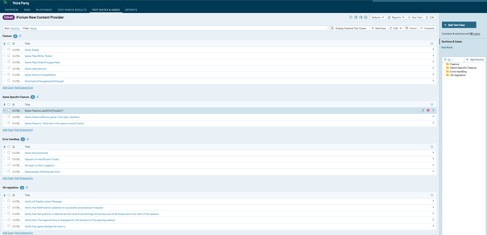

= Onboarding a new Content Provider

As an aggregator, Iforium provides content from link:https://www.iforium.com/gameflex/[165+ providers]. Whilst the integration to Iforium is generic across all those providers, idiosyncrasies often surface when incorporating a new provider for the first time.

In addition to <<_adding_a_new_game_supplier, creating a new game supplier>> and <<_refresh_provider_games,loading the new content>> in the LBO, there are a number of tests that should be run to verify behaviour before putting content from a new provider live. Usually, it iis only necessary to thoroughly test a single game from a given provider - thereafter, standard smoke tests on additional games should suffice.

NOTE: Test plans for checking a new content provider are located in the link:https://testrail.anzogroup.com/index.php?/suites/view/28480&group_by=cases:section_id&group_order=asc&display_deleted_cases=0[Anzo Testrail instance]. An export of the suite is included in the <<_testrail_suite, Appendix>>.

.Iforium TestRail Suite
