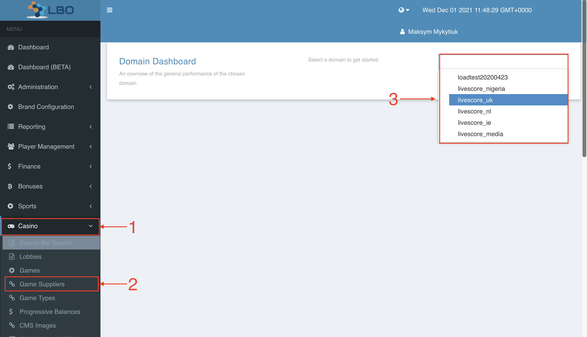
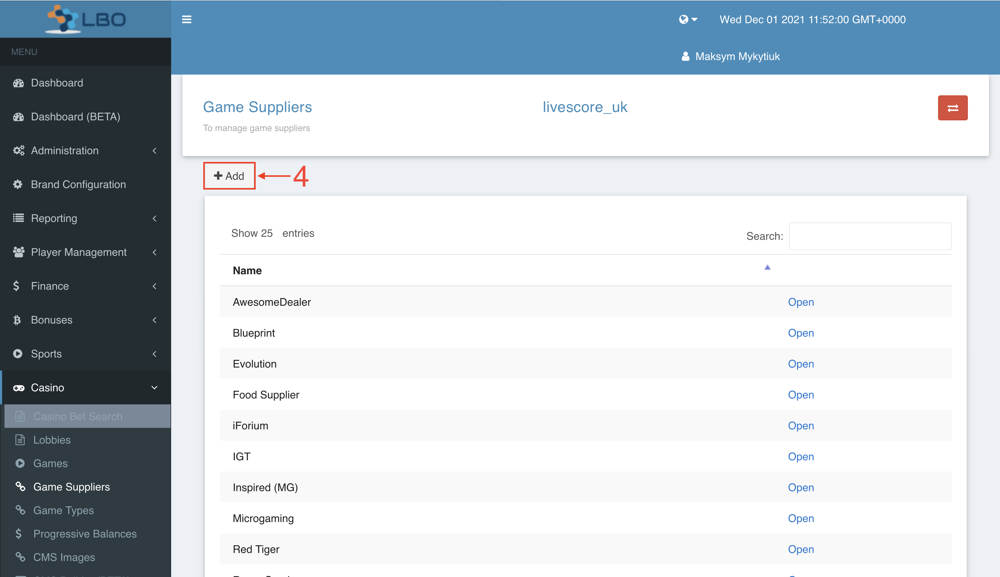
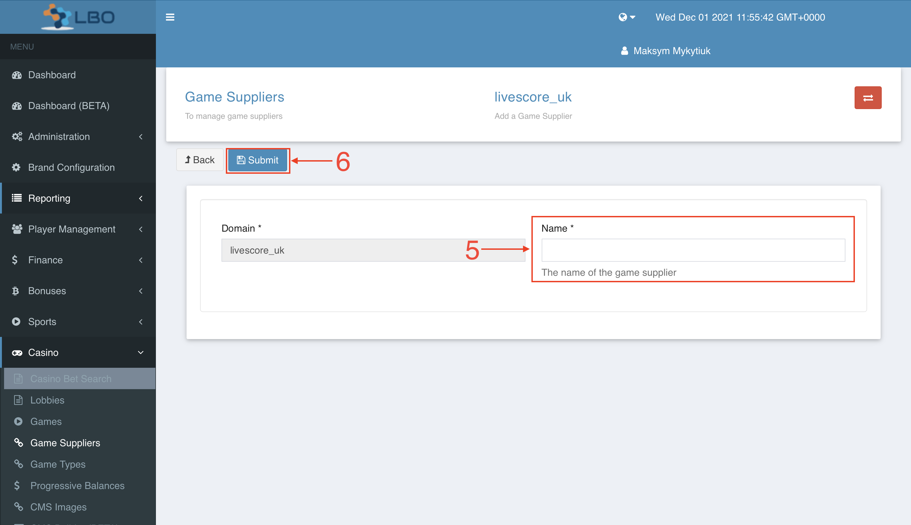

= Adding a new Game Supplier [[_adding_a_new_game_supplier]]

. Click on `Casino`
. In the drop-down list select `Game Suppliers`
. In the upper right corner, select the domain you need from the drop-down list

[start=4]
. Click on `Add` in the upper left corner

[start=5]
. Enter the name of your game supplier in the `Name` field
. Click on `Submit`

