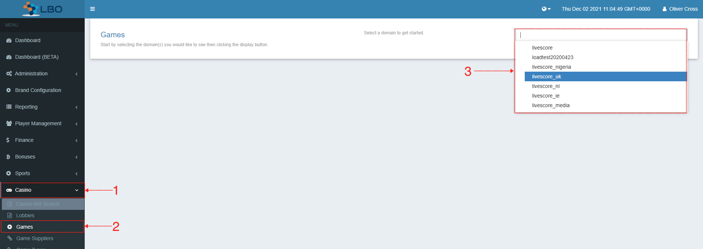
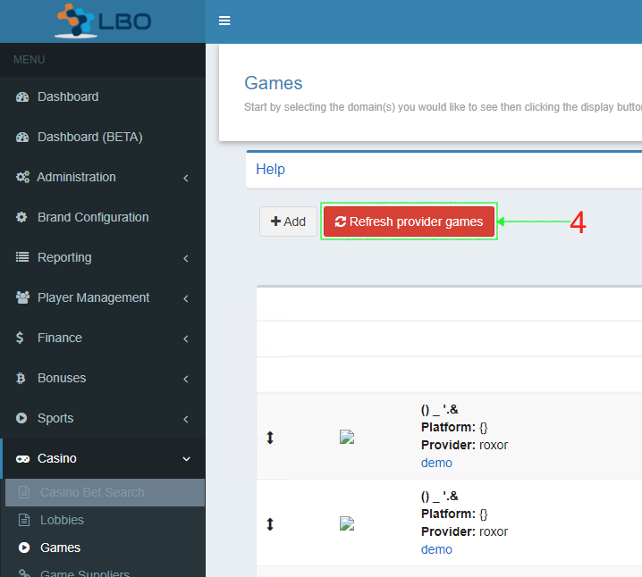

= Refreshing Provider Games [[_refresh_provider_games]]

The list of games available from Iforium is managed in the Iforium Portal and then exported to a CSV as detailed in <<_challenge_games_list,Games List>>, above. Once the CSV has been updated, it needs to be imported into the LBO as follows:

. Click on `Casino`
. In the drop-down list select `Games`
. In the upper right corner, select the domain you need from the drop-down list

[start=4]
. Click on `Refresh provider games` in the upper left corner

