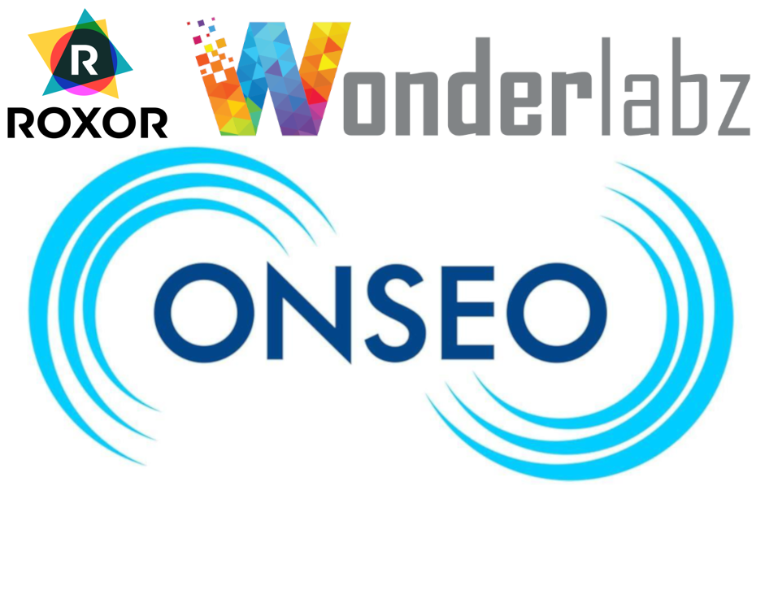

= Iforium Generic Operator Wallet API (GGO) Casino Provider: Integrating Iforium into the Lithium Platform
:doctype: book
:toc:
:toclevels: 3
//:linkcss:
:icons: font
//:icon-set: far
:title-page:
:title-logo-image: 
:source-highlighter: coderay
:figure-caption!:
:coderay-css: class
:coderay-linenums-mode: table
:chapter-label: Section
:revdate: 3rd December 2021
:revnumber: LSPLAT-261-001
:version-label: Handover Release

// -----------------------------------------------------------------------------
:leveloffset: 0
[[section-overview,Overview]]
= Overview

The Iforium Casino Provider integration to Lithium is based on the link:gameflex[GameFlex] APIs from link:https://www.iforium.com/[Iforium]. The codebase is located in Gitlab at https://gitlab.com/playsafe/lithium/app-lithium-full/-/tree/develop/service-casino/service-casino-provider-iforium[service-casino/service-casino-provider-iforium], where full details on building and testing the integration (as well as the source for this documentation) can be found.

This document organised into four broad parts:

* <<section-endpoint-mappings,"Part I: Endpoint Mappings">> - provides details of the implementation of the various API endpoints and the mapping of fields between Iforium and Lithium.
* <<section-challenges,"Part II: Specific Challenges">> - describes specific challenges that were encountered in the integration and the approaches taken to solve them.
* <<section-build,"Part III: Building and Testing">> - contains details on local development; the build pipelines; and analysis and testing resources.
* <<section-operations,"Part IV: Operational Guides">> - contains guides on working with the Iforium Casino Provider, managing the integration and extending the content base.

Additionally, <<section-resources,"Appendix: Additional Resources">> provides links to additional resources that may be of interest.

WARNING: The primary audience for this document is the development team who will be supporting and extending the implementation. As such, the entirety of the source for link:https://gitlab.com/playsafe/lithium/app-lithium-full/-/blob/develop/service-casino/service-casino-provider-iforium/docs/publish.adoc[this document] is readable directly within Gitlab (or, alternatively, within the link:https://gitlab.com/playsafe/lithium/app-lithium-full/-/blob/develop/service-casino/service-casino-provider-iforium/README.adoc[README]) where hyperlinks refer to relative or absolute links within the codebase - as opposed to in-document cross-references. When reading the generated PDF, there will be many links that do not resolve.

== Feature Scope

The current scope of the integration is focused on standard gameplay only - that is, standard wagering. It does _not_ provide support for additional features, such as Reward Spins or Jackpots. For the most part, these features are supported though parameters in the standard gameplay endpoints - those parameters have been ignored for now.

IMPORTANT: There also remains a question mark around *Virtual Lobbies*. Whilst these will play out as per normal games, there is no direct correlation between the session and the game being played, which can give rise to functional and reporting challenges. No testing has been applied in this area.

// -----------------------------------------------------------------------------
:leveloffset: 0
[[section-endpoint-mappings,Endpoint Mappings]]
= Part I: Endpoint Mappings

include::plantuml/basic-flow.puml[]

== Game Launch

:leveloffset: +2
include::game-controller-overview.adoc[]

:leveloffset: +1
include::game-controller-startgame.adoc[]

include::game-controller-listgames.adoc[]

:leveloffset: 0
=== Session Endpoints

include::plantuml/session-game-launch.puml[]

:leveloffset: +3
include::endpoint-mappings-session-createtoken.adoc[]

include::endpoint-mappings-session-redeemtoken.adoc[]

:leveloffset: -2

include::endpoint-mappings-gameplay.adoc[]

:leveloffset: -2
=== Miscellaneous

:leveloffset: +3
include::endpoint-mappings-alertwalletcallbacknotification.adoc[]

:leveloffset: -3
=== Resources

:leveloffset: +3
include::endpoint-mappings-error-mappings.adoc[]

// -----------------------------------------------------------------------------
:leveloffset: 0
[[section-challenges,Specific Challenges]]
= Part II: Specific Challenges

:leveloffset: +1
include::challenge-race-conditions.adoc[]

include::challenge-single-use-tokens.adoc[]

include::challenge-transaction-types.adoc[]

include::challenge-games-list.adoc[]

// -----------------------------------------------------------------------------
:leveloffset: 0
[[section-build, Building and Testing]]
= Part III: Building and Testing

:leveloffset: +1

include::development-build-and-deploy.adoc[]

include::spec/high-level-specs.adoc[]

include::gameflex-test-page.adoc[]

= Acceptance Tests

For Acceptance Test plans and results, please see link:https://gitlab.com/playsafe/lithium/service-casino-provider-iforium-test[service-casino-provider-iforium-test].

TIP: Details on running the tests are outlined in <<_run_acceptance_tests,Running Acceptance Tests>>, above.

= Performance Tests

For Performance Test plans and results, please see link:https://gitlab.com/playsafe/lithium/lithium-load-test-iforium-k6[lithium-load-test-iforium-k6].

= Code Quality

A Code Quality report is available on the Anzo Group link:https://sonarqube-roxor.anzogroup.com/dashboard?id=service.casino.providers%3Aservice-casino-provider-iforium[Sonarqube] instance.

= Application Security

Application Security reports are available on the Anzo Group link:https://nexusiq.anzogroup.com/assets/index.html#/applicationReport/service-casino-provider-iforium/41d63c91e6ec4baeb782d0b3d60a5f74/policy[NexusIQ] instance. A link:https://gitlab.com/playsafe/lithium/app-lithium-full/-/tree/develop/service-casino/service-casino-provider-iforium/docs/Iforium_Casino_Provider-Build-20211110-154516.pdf[snapshot report] is also included in the repository, for those who cannot access NexusIQ.

// -----------------------------------------------------------------------------
:leveloffset: 0
[[section-operations, Operational Guides]]
= Part IV: Operational Guides

== Back Office Operations

Back Office Operations are managed through the Lithium Back Office (LBO):

:leveloffset: +2
include::operations-lbo.adoc[]

include::operations-configuring-domain.adoc[]

include::operations-refresh-provider-games.adoc[]

include::operations-new-content-provider.adoc[]

:leveloffset: +1
include::operations-new-game-supplier.adoc[]

:leveloffset: 0
== Run-time Operations

:leveloffset: +2
include::operations-logging-and-monitoring.adoc[]

// -----------------------------------------------------------------------------
:leveloffset: 0
[[section-resources,Additional Resources]]
= Appendix: Additional Resources

== Iforium Documentation

* link:https://gitlab.com/playsafe/lithium/app-lithium-full/-/tree/develop/service-casino/service-casino-provider-iforium/docs/gameflex/Iforium_Op_GGO_Onboarding_Technical%20-%20LiveScore_v1.6.docx[Iforium/LiveScoreBet Technical Onboarding Document]
* link:https://gitlab.com/playsafe/lithium/app-lithium-full/-/tree/develop/service-casino/service-casino-provider-iforium/docs/gameflex/GameflexGenericOperatorWalletAPI1.6.pdf[Gameflex Generic Operator Wallet API]
* link:https://gitlab.com/playsafe/lithium/app-lithium-full/-/tree/develop/service-casino/service-casino-provider-iforium/docs/gameflex/GameflexUniversalLauncher-IntegrationGuide1.8.pdf[Gameflex Universal Launcher - Integration Guide]
* link:https://gitlab.com/playsafe/lithium/app-lithium-full/-/tree/develop/service-casino/service-casino-provider-iforium/docs/gameflex/GameflexUniversalLauncher-UK1.0.pdf[Gameflex Universal Launcher - UK]
* link:https://gitlab.com/playsafe/lithium/app-lithium-full/-/tree/develop/service-casino/service-casino-provider-iforium/docs/gameflex/GameflexGenericIntegrationRealityCheckSupplement1.1.pdf[Gameflex Generic Integration Reality Check Supplement]
* link:https://gitlab.com/playsafe/lithium/app-lithium-full/-/tree/develop/service-casino/service-casino-provider-iforium/docs/gameflex/GameflexFreeGameBonusesOperatorOverview2.14.pdf[Gameflex FreeGame Bonuses Operator- Overview]
* link:https://gitlab.com/playsafe/lithium/app-lithium-full/-/tree/develop/service-casino/service-casino-provider-iforium/docs/gameflex/GameflexGenericIntegration1.8.pdf[Gameflex Generic Integration]
* link:https://gitlab.com/playsafe/lithium/app-lithium-full/-/tree/develop/service-casino/service-casino-provider-iforium/docs/gameflex/GameflexGenericIntegrationGettingStarted1.3.pdf[Gameflex Generic Integration Getting Started]
* link:https://gitlab.com/playsafe/lithium/app-lithium-full/-/tree/develop/service-casino/service-casino-provider-iforium/docs/gameflex/IforiumCommonReferenceData1.9.pdf[Iforium Common Reference Data]

== New Content Provider Test Suite [[_testrail_suite]]

[source,xml]
--
include::testrail-third_party.xml[]
--