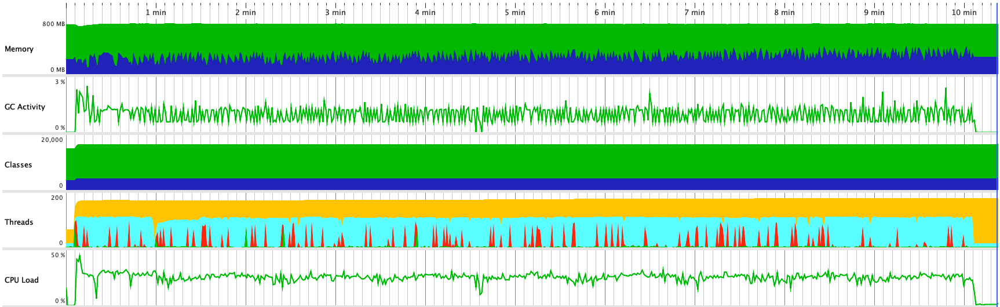

Test scenario:

- VUs=100
- Duration=10m

## Load test statistics

[Full report](./k6_run_report.txt)

```
perf_test ✓ [======================================] 100 VUs  10m0s

     █ balance

       █ balance

         ✗ is status 200
          ↳  99% — ✓ 419795 / ✗ 48
         ✗ is body errorCode 0
          ↳  99% — ✓ 419793 / ✗ 50

     checks.........................: 99.98% ✓ 839588 ✗ 98    
     data_received..................: 213 MB 353 kB/s
     data_sent......................: 123 MB 203 kB/s
     group_duration.................: avg=142.91ms min=2.25ms med=118.81ms max=30.71s   p(90)=248.79ms p(95)=306.09ms
     http_req_blocked...............: avg=836.56µs min=0s     med=2µs      max=22.22s   p(90)=3µs      p(95)=3µs     
     http_req_connecting............: avg=833.21µs min=0s     med=0s       max=22.22s   p(90)=0s       p(95)=0s      
     http_req_duration..............: avg=139.13ms min=0s     med=118.6ms  max=1.95s    p(90)=248.49ms p(95)=305.6ms 
       { expected_response:true }...: avg=139.15ms min=5.79ms med=118.61ms max=1.95s    p(90)=248.49ms p(95)=305.61ms
       { requestType:balance }......: avg=139.13ms min=0s     med=118.6ms  max=1.95s    p(90)=248.49ms p(95)=305.6ms 
     http_req_failed................: 0.01%  ✓ 48     ✗ 419795
     http_req_receiving.............: avg=102.19µs min=0s     med=45µs     max=347.88ms p(90)=102µs    p(95)=115µs   
     http_req_sending...............: avg=14.64µs  min=0s     med=12µs     max=17.28ms  p(90)=16µs     p(95)=17µs    
     http_req_tls_handshaking.......: avg=0s       min=0s     med=0s       max=0s       p(90)=0s       p(95)=0s      
     http_req_waiting...............: avg=139.02ms min=0s     med=118.5ms  max=1.95s    p(90)=248.37ms p(95)=305.5ms 
     http_reqs......................: 419843 694.39512/s
     iteration_duration.............: avg=142.92ms min=2.26ms med=118.83ms max=30.71s   p(90)=248.8ms  p(95)=306.11ms
     iterations.....................: 419843 694.39512/s
     vus............................: 1      min=1    max=100 
     vus_max........................: 100    min=100  max=100
```

## Profiling statistics



Legend for this graph:
1. Memory:
-  `Free size`
-  `Used size`
2. Classes
-  `Non-CPU profiled classes`
-  `CPU profiled classes`
3. Threads
-  `Runnable threads`
-  `Blocked threads`
-  `Threads in net I/O`
-  `Waiting threads`