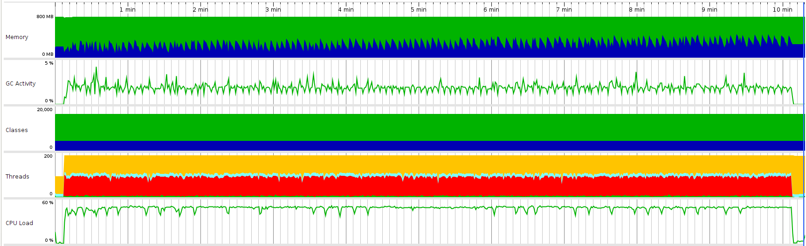

Test scenario:

- VUs=100
- Duration=10m

## Load test statistics

[Full report](./k6_run_report.txt)

```
     █ balance

       █ balance

         ✓ is status 200
         ✓ is body errorCode 0

     █ redeemToken

       █ redeemToken

         ✓ is status 200
         ✓ is body errorCode 0

     checks..........................: 100.00% ✓ 1332924     ✗ 0
     data_received...................: 337 MB  562 kB/s
     data_sent.......................: 261 MB  435 kB/s
     group_duration..................: avg=90.01ms  min=23.01ms  med=89.63ms  max=532.27ms p(90)=106.66ms p(95)=112.61ms
     http_req_blocked................: avg=7.04µs   min=677ns    med=1.73µs   max=21.39ms  p(90)=2.67µs   p(95)=3.15µs
     http_req_connecting.............: avg=3.06µs   min=0s       med=0s       max=21.26ms  p(90)=0s       p(95)=0s
     http_req_duration...............: avg=89.71ms  min=22.86ms  med=89.34ms  max=529.12ms p(90)=106.35ms p(95)=112.31ms
       { expected_response:true }....: avg=89.71ms  min=22.86ms  med=89.34ms  max=529.12ms p(90)=106.35ms p(95)=112.31ms
       { requestType:balance }.......: avg=99.79ms  min=65.6ms   med=97.67ms  max=529.12ms p(90)=111.4ms  p(95)=118.1ms
       { requestType:redeemToken }...: avg=79.64ms  min=22.86ms  med=77.87ms  max=343.86ms p(90)=89.97ms  p(95)=95.19ms
     http_req_failed.................: 0.00%   ✓ 0           ✗ 666462
     http_req_receiving..............: avg=66.65µs  min=10.5µs   med=31.38µs  max=29.47ms  p(90)=54.26µs  p(95)=132.99µs
     http_req_sending................: avg=25.89µs  min=5.18µs   med=11.83µs  max=53.05ms  p(90)=17.74µs  p(95)=25.99µs
     http_req_tls_handshaking........: avg=0s       min=0s       med=0s       max=0s       p(90)=0s       p(95)=0s
     http_req_waiting................: avg=89.62ms  min=22.83ms  med=89.24ms  max=526.85ms p(90)=106.24ms p(95)=112.21ms
     http_reqs.......................: 666462  1110.568536/s
       { requestType:balance }.......: 333231  555.284268/s
       { requestType:redeemToken }...: 333231  555.284268/s
     iteration_duration..............: avg=180.06ms min=111.22ms med=176.75ms max=787.77ms p(90)=197.61ms p(95)=211.09ms
     iterations......................: 333231  555.284268/s
     vus.............................: 100     min=100       max=100
     vus_max.........................: 100     min=100       max=100
```

## Profiling statistics



Legend for this graph:
1. Memory:
-  `Free size`
-  `Used size`
2. Classes
-  `Non-CPU profiled classes`
-  `CPU profiled classes`
3. Threads
-  `Runnable threads`
-  `Blocked threads`
-  `Threads in net I/O`
-  `Waiting threads`