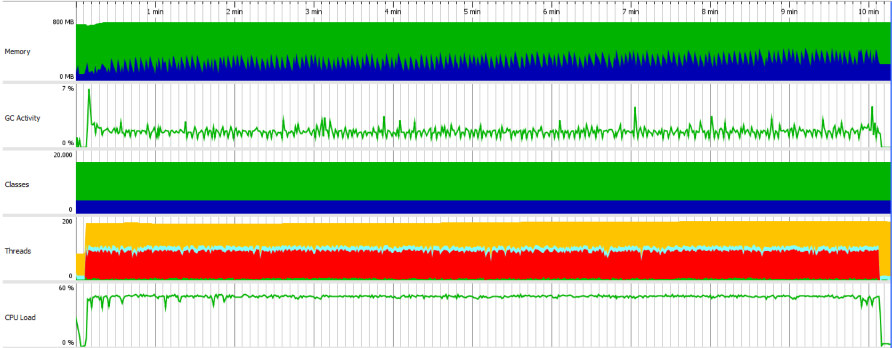

Test scenario:

- VUs=100
- Duration=10m

## Load test statistics

[Full report](./k6_run_report.txt)

```
█ balance

       █ balance

         ✓ is status 200
         ✓ is body errorCode 0

     █ redeemToken

       █ redeemToken

         ✓ is status 200
         ✓ is body errorCode 0

     █ createToken

       █ createToken

         ✓ is status 200
         ✓ is body errorCode 0

     checks..........................: 100.00% ✓ 1403394     ✗ 0     
     data_received...................: 336 MB  559 kB/s
     data_sent.......................: 274 MB  457 kB/s
     group_duration..................: avg=85.49ms  min=14.97ms  med=82.39ms max=347.75ms p(90)=103.04ms p(95)=107.85ms
     http_req_blocked................: avg=6.42µs   min=682ns    med=1.7µs   max=12.16ms  p(90)=2.54µs   p(95)=3µs     
     http_req_connecting.............: avg=2.77µs   min=0s       med=0s      max=11.67ms  p(90)=0s       p(95)=0s      
     http_req_duration...............: avg=85.21ms  min=14.82ms  med=82.09ms max=343.06ms p(90)=102.75ms p(95)=107.55ms
       { expected_response:true }....: avg=85.21ms  min=14.82ms  med=82.09ms max=343.06ms p(90)=102.75ms p(95)=107.55ms
       { requestType:balance }.......: avg=99.1ms   min=72.08ms  med=97.86ms max=343.06ms p(90)=109.62ms p(95)=114.15ms
       { requestType:createToken }...: avg=77.4ms   min=14.82ms  med=76.2ms  max=166.61ms p(90)=86.56ms  p(95)=90.52ms 
       { requestType:redeemToken }...: avg=79.13ms  min=53.97ms  med=77.9ms  max=243.27ms p(90)=88.69ms  p(95)=93.03ms 
     http_req_failed.................: 0.00%   ✓ 0           ✗ 701697
     http_req_receiving..............: avg=62.18µs  min=10.43µs  med=29.97µs max=32.23ms  p(90)=50.99µs  p(95)=109.17µs
     http_req_sending................: avg=24.83µs  min=5.13µs   med=11.56µs max=29.51ms  p(90)=17.12µs  p(95)=24.62µs 
     http_req_tls_handshaking........: avg=0s       min=0s       med=0s      max=0s       p(90)=0s       p(95)=0s      
     http_req_waiting................: avg=85.13ms  min=14.78ms  med=82ms    max=342.84ms p(90)=102.66ms p(95)=107.45ms
     http_reqs.......................: 701697  1169.163026/s
       { requestType:balance }.......: 233899  389.721009/s
       { requestType:createToken }...: 233899  389.721009/s
       { requestType:redeemToken }...: 233899  389.721009/s
     iteration_duration..............: avg=256.55ms min=167.61ms med=254.6ms max=620.06ms p(90)=273.87ms p(95)=282.15ms
     iterations......................: 233899  389.721009/s
     vus.............................: 100     min=100       max=100 
     vus_max.........................: 100     min=100       max=100 
```

## Profiling statistics



Legend for this graph:
1. Memory:
-  `Free size`
-  `Used size`
2. Classes
-  `Non-CPU profiled classes`
-  `CPU profiled classes`
3. Threads
-  `Runnable threads`
-  `Blocked threads`
-  `Threads in net I/O`
-  `Waiting threads`