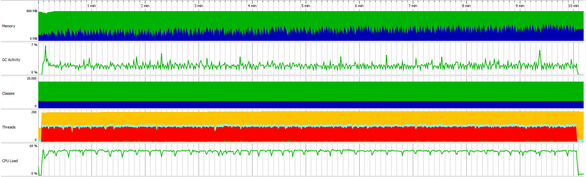

Test scenario:

- VUs=100
- Duration=10m

## Load test statistics

[Full report](k6_run_report.txt)

```
█ balance

       █ balance

         ✓ is status 200
         ✓ is body errorCode 0

     █ redeemToken

       █ redeemToken

         ✓ is status 200
         ✓ is body errorCode 0

     █ createToken

       █ createToken

         ✓ is status 200
         ✓ is body errorCode 0

     █ placeBet

       █ placeBet

         ✓ is status 200
         ✓ is body errorCode 0

     checks..........................: 100.00% ✓ 1166464    ✗ 0     
     data_received...................: 298 MB  497 kB/s
     data_sent.......................: 255 MB  424 kB/s
     group_duration..................: avg=102.87ms min=24.16ms  med=99.1ms   max=552.31ms p(90)=131.86ms p(95)=139.61ms
     http_req_blocked................: avg=7.13µs   min=739ns    med=1.78µs   max=17.06ms  p(90)=2.69µs   p(95)=3.18µs  
     http_req_connecting.............: avg=3.33µs   min=0s       med=0s       max=10.92ms  p(90)=0s       p(95)=0s      
     http_req_duration...............: avg=102.58ms min=23.99ms  med=98.81ms  max=548.85ms p(90)=131.57ms p(95)=139.29ms
       { expected_response:true }....: avg=102.58ms min=23.99ms  med=98.81ms  max=548.85ms p(90)=131.57ms p(95)=139.29ms
       { requestType:balance }.......: avg=108.79ms min=77.24ms  med=106.16ms max=548.85ms p(90)=122.59ms p(95)=129.71ms
       { requestType:createToken }...: avg=84.98ms  min=33.48ms  med=82.8ms   max=289.54ms p(90)=96.81ms  p(95)=102.76ms
       { requestType:placeBet }......: avg=129.8ms  min=23.99ms  med=127.11ms max=416.05ms p(90)=145.34ms p(95)=153.67ms
       { requestType:redeemToken }...: avg=86.74ms  min=61.99ms  med=84.57ms  max=319.36ms p(90)=98.83ms  p(95)=104.81ms
     http_req_failed.................: 0.00%   ✓ 0          ✗ 583232
     http_req_receiving..............: avg=64.88µs  min=11.13µs  med=33.94µs  max=29.47ms  p(90)=54.2µs   p(95)=103.16µs
     http_req_sending................: avg=26.5µs   min=5.45µs   med=12.63µs  max=28.9ms   p(90)=18.47µs  p(95)=26.19µs 
     http_req_tls_handshaking........: avg=0s       min=0s       med=0s       max=0s       p(90)=0s       p(95)=0s      
     http_req_waiting................: avg=102.49ms min=23.94ms  med=98.72ms  max=545.59ms p(90)=131.47ms p(95)=139.19ms
     http_reqs.......................: 583232  971.680108/s
       { requestType:balance }.......: 145808  242.920027/s
       { requestType:createToken }...: 145808  242.920027/s
       { requestType:placeBet }......: 145808  242.920027/s
       { requestType:redeemToken }...: 145808  242.920027/s
     iteration_duration..............: avg=411.58ms min=235.14ms med=402.82ms max=1.44s    p(90)=449.13ms p(95)=479.12ms
     iterations......................: 145808  242.920027/s
     vus.............................: 100     min=100      max=100 
     vus_max.........................: 100     min=100      max=100 
```

## Profiling statistics



Legend for this graph:
1. Memory:
-  `Free size`
-  `Used size`
2. Classes
-  `Non-CPU profiled classes`
-  `CPU profiled classes`
3. Threads
-  `Runnable threads`
-  `Blocked threads`
-  `Threads in net I/O`
-  `Waiting threads`