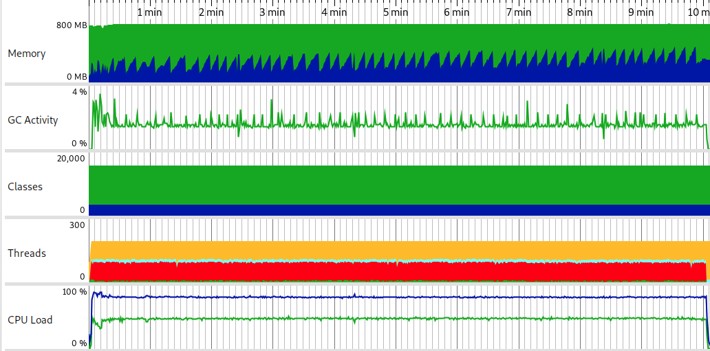

Test scenario:

- VUs=100
- Duration=10m

## Load test statistics

[Full report](k6_run_report.txt)

```
█ balance

       █ balance

         ✓ is status 200
         ✓ is body errorCode 0

     █ redeemToken

       █ redeemToken

         ✓ is status 200
         ✓ is body errorCode 0

     █ createToken

       █ createToken

         ✓ is status 200
         ✓ is body errorCode 0

     █ balance->placeBet

       █ balance

         ✓ is status 200
         ✓ is body errorCode 0

       █ placeBet

         ✓ is status 200
         ✓ is body errorCode 0

     █ placeBet->end

       █ placeBet

         ✓ is status 200
         ✓ is body errorCode 0

       █ end

         ✓ is status 200
         ✓ is body errorCode 0

     █ balance->placebet->end

       █ balance

         ✓ is status 200
         ✓ is body errorCode 0

       █ placeBet

         ✓ is status 200
         ✓ is body errorCode 0

       █ end

         ✓ is status 200
         ✓ is body errorCode 0

     checks..........................: 100.00% ✓ 785980     ✗ 0
     data_received...................: 205 MB  341 kB/s
     data_sent.......................: 180 MB  300 kB/s
     group_duration..................: avg=191.1ms  min=9.85ms  med=159.46ms max=1.02s    p(90)=346.27ms p(95)=474.36ms
     http_req_blocked................: avg=10.54µs  min=1.36µs  med=3.76µs   max=23.53ms  p(90)=5.53µs   p(95)=6.41µs
     http_req_connecting.............: avg=3.8µs    min=0s      med=0s       max=23.41ms  p(90)=0s       p(95)=0s
     http_req_duration...............: avg=152.33ms min=9.58ms  med=158.19ms max=848.02ms p(90)=181.84ms p(95)=188.65ms
       { expected_response:true }....: avg=152.33ms min=9.58ms  med=158.19ms max=848.02ms p(90)=181.84ms p(95)=188.65ms
       { requestType:balance }.......: avg=143.35ms min=69.57ms med=140.72ms max=848.02ms p(90)=155.91ms p(95)=162.47ms
       { requestType:createToken }...: avg=110.61ms min=87.13ms med=107.99ms max=395.94ms p(90)=120.92ms p(95)=126.19ms
       { requestType:end }...........: avg=172.95ms min=9.58ms  med=170.64ms max=381.3ms  p(90)=186.85ms p(95)=194.19ms
       { requestType:placeBet }......: avg=174.96ms min=37.33ms med=172.52ms max=574.39ms p(90)=188.48ms p(95)=195.27ms
       { requestType:redeemToken }...: avg=111.89ms min=86.68ms med=109.19ms max=415.82ms p(90)=123.1ms  p(95)=129.03ms
     http_req_failed.................: 0.00%   ✓ 0          ✗ 392990
     http_req_receiving..............: avg=105.05µs min=20.1µs  med=59.55µs  max=34.75ms  p(90)=103.91µs p(95)=260.17µs
     http_req_sending................: avg=37.76µs  min=9.94µs  med=23.74µs  max=23.62ms  p(90)=34.5µs   p(95)=44.25µs
     http_req_tls_handshaking........: avg=0s       min=0s      med=0s       max=0s       p(90)=0s       p(95)=0s
     http_req_waiting................: avg=152.19ms min=9.51ms  med=158.05ms max=847.64ms p(90)=181.69ms p(95)=188.5ms
     http_reqs.......................: 392990  653.816458/s
       { requestType:balance }.......: 117897  196.144937/s
       { requestType:createToken }...: 39299   65.381646/s
       { requestType:end }...........: 78598   130.763292/s
       { requestType:placeBet }......: 117897  196.144937/s
       { requestType:redeemToken }...: 39299   65.381646/s
     iteration_duration..............: avg=1.52s    min=1.17s   med=1.5s     max=4.14s    p(90)=1.57s    p(95)=1.6s
     iterations......................: 39299   65.381646/s
     vus.............................: 41      min=41       max=100
     vus_max.........................: 100     min=100      max=100
```

## Profiling statistics



Legend for this graph:
1. Memory:
-  `Free size`
-  `Used size`
2. Classes
-  `Non-CPU profiled classes`
-  `CPU profiled classes`
3. Threads
-  `Runnable threads`
-  `Blocked threads`
-  `Threads in net I/O`
-  `Waiting threads`