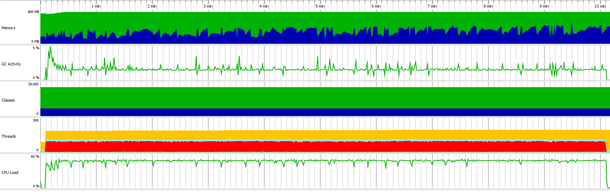

Test scenario:

- VUs=100
- Duration=10m

## Load test statistics

[Full report](k6_run_report.txt)

```
     █ balance

       █ balance

         ✓ is status 200
         ✓ is body errorCode 0

     █ redeemToken

       █ redeemToken

         ✓ is status 200
         ✓ is body errorCode 0

     █ createToken

       █ createToken

         ✓ is status 200
         ✓ is body errorCode 0

     █ balance->placeBet

       █ balance

         ✓ is status 200
         ✓ is body errorCode 0

       █ placeBet

         ✓ is status 200
         ✓ is body errorCode 0

     █ placeBet->end

       █ placeBet

         ✓ is status 200
         ✓ is body errorCode 0

       █ end

         ✓ is status 200
         ✓ is body errorCode 0

     █ balance->placeBet->end

       █ balance

         ✓ is status 200
         ✓ is body errorCode 0

       █ placeBet

         ✓ is status 200
         ✓ is body errorCode 0

       █ end

         ✓ is status 200
         ✓ is body errorCode 0

     █ placeBet->awardWinnings

       █ placeBet

         ✓ is status 200
         ✓ is body errorCode 0

       █ awardWinnings

         ✓ is status 200
         ✓ is body errorCode 0

     █ balance->placeBet->awardWinnings->end

       █ balance

         ✓ is status 200
         ✓ is body errorCode 0

       █ placeBet

         ✓ is status 200
         ✓ is body errorCode 0

       █ awardWinnings

         ✓ is status 200
         ✓ is body errorCode 0

       █ end

         ✓ is status 200
         ✓ is body errorCode 0

     █ startGame

       █ startGame

         ✓ is status 200
         ✓ is body status 0

     checks............................: 100.00% ✓ 686800     ✗ 0
     data_received.....................: 186 MB  310 kB/s
     data_sent.........................: 199 MB  330 kB/s
     group_duration....................: avg=228.9ms  min=12.97ms  med=178.49ms max=1.32s    p(90)=374.37ms p(95)=527.69ms
     http_req_blocked..................: avg=14.09µs  min=1.32µs   med=3.76µs   max=24.39ms  p(90)=5.57µs   p(95)=6.36µs
     http_req_connecting...............: avg=3.52µs   min=0s       med=0s       max=9.26ms   p(90)=0s       p(95)=0s
     http_req_duration.................: avg=174.5ms  min=12.72ms  med=172.96ms max=876.98ms p(90)=216.56ms p(95)=250.39ms
       { expected_response:true }......: avg=174.5ms  min=12.72ms  med=172.96ms max=876.98ms p(90)=216.56ms p(95)=250.39ms
       { requestType:awardWinnings }...: avg=188.41ms min=64.78ms  med=183.56ms max=490.72ms p(90)=213.58ms p(95)=230.15ms
       { requestType:balance }.........: avg=152.77ms min=116.26ms med=148.52ms max=876.98ms p(90)=170.11ms p(95)=181.27ms
       { requestType:createToken }.....: avg=117.81ms min=90.36ms  med=115.09ms max=466.19ms p(90)=131.47ms p(95)=139.36ms
       { requestType:end }.............: avg=186.54ms min=28.47ms  med=181.25ms max=570.65ms p(90)=211.63ms p(95)=226.54ms
       { requestType:placeBet }........: avg=183.32ms min=107.68ms med=178.69ms max=791.35ms p(90)=202.39ms p(95)=217.17ms
       { requestType:redeemToken }.....: avg=120.97ms min=89.2ms   med=117.78ms max=475.46ms p(90)=135.75ms p(95)=143.39ms
       { requestType:startGame }.......: avg=263.56ms min=12.72ms  med=259.75ms max=480.72ms p(90)=300.83ms p(95)=318.09ms
     http_req_failed...................: 0.00%   ✓ 0          ✗ 343400
     http_req_receiving................: avg=104.59µs min=19.99µs  med=58.91µs  max=32.95ms  p(90)=103.97µs p(95)=221.39µs
     http_req_sending..................: avg=37.62µs  min=9.55µs   med=23.37µs  max=36.74ms  p(90)=34.26µs  p(95)=43.31µs
     http_req_tls_handshaking..........: avg=0s       min=0s       med=0s       max=0s       p(90)=0s       p(95)=0s
     http_req_waiting..................: avg=174.36ms min=12.64ms  med=172.82ms max=872.59ms p(90)=216.41ms p(95)=250.28ms
     http_reqs.........................: 343400  571.002537/s
       { requestType:awardWinnings }...: 40400   67.176769/s
       { requestType:balance }.........: 80800   134.353538/s
       { requestType:createToken }.....: 20200   33.588385/s
       { requestType:end }.............: 60600   100.765154/s
       { requestType:placeBet }........: 101000  167.941923/s
       { requestType:redeemToken }.....: 20200   33.588385/s
       { requestType:startGame }.......: 20200   33.588385/s
     iteration_duration................: avg=2.97s    min=2.26s    med=2.94s    max=7.03s    p(90)=3.12s    p(95)=3.2s
     iterations........................: 20200   33.588385/s
     vus...............................: 90      min=90       max=100
     vus_max...........................: 100     min=100      max=100
```

## Profiling statistics



Legend for this graph:
1. Memory:
-  `Free size`
-  `Used size`
2. Classes
-  `Non-CPU profiled classes`
-  `CPU profiled classes`
3. Threads
-  `Runnable threads`
-  `Blocked threads`
-  `Threads in net I/O`
-  `Waiting threads`