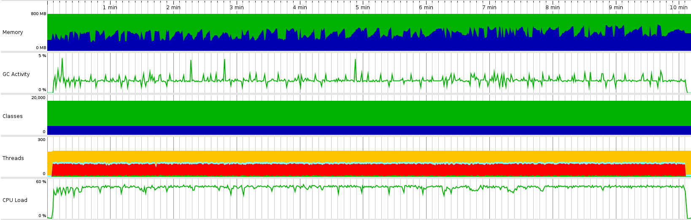

Test scenario:

- VUs=100
- Duration=10m

## Load test statistics

[Full report](k6_run_report.txt)

```
    █ balance

       █ balance

         ✓ is status 200
         ✓ is body errorCode 0

     █ redeemToken

       █ redeemToken

         ✓ is status 200
         ✓ is body errorCode 0

     █ createToken

       █ createToken

         ✓ is status 200
         ✓ is body errorCode 0

     █ balance->placeBet

       █ balance

         ✓ is status 200
         ✓ is body errorCode 0

       █ placeBet

         ✓ is status 200
         ✓ is body errorCode 0

     █ placeBet->end

       █ placeBet

         ✓ is status 200
         ✓ is body errorCode 0

       █ end

         ✓ is status 200
         ✓ is body errorCode 0

     █ balance->placeBet->end

       █ balance

         ✓ is status 200
         ✓ is body errorCode 0

       █ placeBet

         ✓ is status 200
         ✓ is body errorCode 0

       █ end

         ✓ is status 200
         ✓ is body errorCode 0

     █ placeBet->awardWinnings

       █ placeBet

         ✓ is status 200
         ✓ is body errorCode 0

       █ awardWinnings

         ✓ is status 200
         ✓ is body errorCode 0

     █ balance->placeBet->awardWinnings->end

       █ balance

         ✓ is status 200
         ✓ is body errorCode 0

       █ placeBet

         ✓ is status 200
         ✓ is body errorCode 0

       █ awardWinnings

         ✓ is status 200
         ✓ is body errorCode 0

       █ end

         ✓ is status 200
         ✓ is body errorCode 0

     █ startGame

       █ startGame

         ✓ is status 200
         ✓ is body status 0

     █ demoGame

       █ demoGame

         ✓ is status 200
         ✓ is body status 0

     checks............................: 100.00% ✓ 694800     ✗ 0     
     data_received.....................: 192 MB  319 kB/s
     data_sent.........................: 194 MB  323 kB/s
     group_duration....................: avg=222.37ms min=5.15ms  med=176.77ms max=1.13s    p(90)=373.8ms  p(95)=527.98ms
     http_req_blocked..................: avg=9.81µs   min=1.3µs   med=3.75µs   max=16.1ms   p(90)=5.57µs   p(95)=6.43µs  
     http_req_connecting...............: avg=3.14µs   min=0s      med=0s       max=10.75ms  p(90)=0s       p(95)=0s      
     http_req_duration.................: avg=172.43ms min=4.91ms  med=172.01ms max=465.56ms p(90)=216.72ms p(95)=243.16ms
       { expected_response:true }......: avg=172.43ms min=4.91ms  med=172.01ms max=465.56ms p(90)=216.72ms p(95)=243.16ms
       { requestType:awardWinnings }...: avg=184.35ms min=26.08ms med=179.56ms max=342.63ms p(90)=210.67ms p(95)=225.62ms
       { requestType:balance }.........: avg=149.06ms min=13.73ms med=146.23ms max=275.25ms p(90)=172.49ms p(95)=185.27ms
       { requestType:createToken }.....: avg=115.67ms min=89.21ms med=112.7ms  max=202.29ms p(90)=134.23ms p(95)=143.64ms
       { requestType:demoGame }........: avg=156.93ms min=4.91ms  med=156.39ms max=293.79ms p(90)=187.53ms p(95)=200.79ms
       { requestType:end }.............: avg=187.36ms min=15.74ms med=181.75ms max=372.17ms p(90)=218.62ms p(95)=234.38ms
       { requestType:placeBet }........: avg=186.37ms min=47.75ms med=181.26ms max=389.14ms p(90)=213.34ms p(95)=230.05ms
       { requestType:redeemToken }.....: avg=115.09ms min=81.39ms med=112.73ms max=215.34ms p(90)=133.49ms p(95)=142.33ms
       { requestType:startGame }.......: avg=257.21ms min=17.87ms med=255.21ms max=465.56ms p(90)=310.47ms p(95)=328.65ms
     http_req_failed...................: 0.00%   ✓ 0          ✗ 347400
     http_req_receiving................: avg=104.87µs min=19.98µs med=58.97µs  max=29.09ms  p(90)=104.81µs p(95)=215.29µs
     http_req_sending..................: avg=35.99µs  min=8.22µs  med=22.92µs  max=26.15ms  p(90)=34.23µs  p(95)=43.13µs 
     http_req_tls_handshaking..........: avg=0s       min=0s      med=0s       max=0s       p(90)=0s       p(95)=0s      
     http_req_waiting..................: avg=172.29ms min=4.81ms  med=171.88ms max=465.33ms p(90)=216.55ms p(95)=243.03ms
     http_reqs.........................: 347400  577.857179/s
       { requestType:awardWinnings }...: 38600   64.206353/s
       { requestType:balance }.........: 77200   128.412706/s
       { requestType:createToken }.....: 19300   32.103177/s
       { requestType:demoGame }........: 19300   32.103177/s
       { requestType:end }.............: 57900   96.30953/s
       { requestType:placeBet }........: 96500   160.515883/s
       { requestType:redeemToken }.....: 19300   32.103177/s
       { requestType:startGame }.......: 19300   32.103177/s
     iteration_duration................: avg=3.11s    min=2.24s   med=3.06s    max=3.98s    p(90)=3.41s    p(95)=3.52s   
     iterations........................: 19300   32.103177/s
     vus...............................: 45      min=45       max=100 
     vus_max...........................: 100     min=100      max=100 
```

## Profiling statistics



Legend for this graph:
1. Memory:
-  `Free size`
-  `Used size`
2. Classes
-  `Non-CPU profiled classes`
-  `CPU profiled classes`
3. Threads
-  `Runnable threads`
-  `Blocked threads`
-  `Threads in net I/O`
-  `Waiting threads`