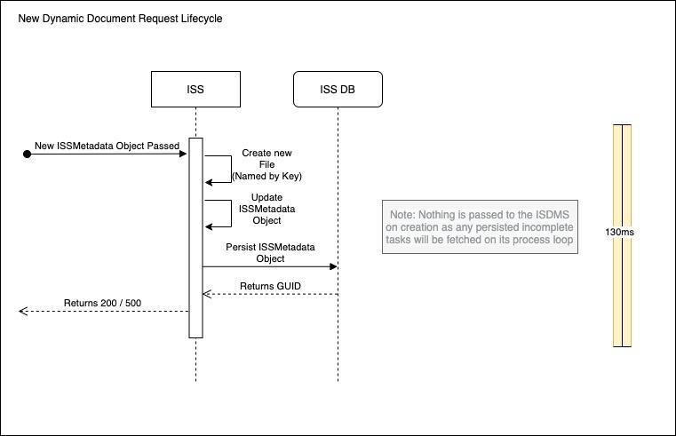

[.text-center]
LSPLAT-1 “CSV Table Export”
[.text-center]
Risk Assessment & Proposed Solution
[.text-center]
{empty}[DRAFT]

_Document Revisions_

|===
| | |

|DRAFT - 0.1
|Darren Whitfield
|13 March 2021

|DRAFT - 0.2
|Darren Whitfield
|14 March 2021

|DRAFT - 0.3
|Darren Whitfield
|14 March 2021
|===

== LSPLAT-1 Risk Assessment

The requirements of LSPLAT-1 are to allow an LBO user to download a CSV
file relating to various aspects of player information. Examples of
which would be “Player Login Events”,“Player Mail History”, “Player SMS
History”, etc.

The current solution allows a user to simply select the “Download CSV”
button on a player’s info page, which will send a request to the server
to fetch a list of all the history results, compile them to a CSV format
in memory, then return with the valid CSV file.

While this solution may work without issue on a limited number of
results, there are many risks associated with users who contain large
amounts of data to be fetched. The following is an overview of the risks
associated with a large dataset;

=== Risk: Request Timeout 🔺

There is a 30-second maximum wait time before a request times out. If a
user requests a large dataset from a player account, the request may
time out while the server is fetching and compiling the data, which
means;

* The server may continue to do work needlessly before failing to return
to a response that’s already closed.
* The user may never receive a CSV, and may restart multiple CSV requests
hoping it may work.

=== Risk: Large Database Impact 🔺

To build the CSV, a request is sent to the database to fetch all
relevant information related to the calling service, which means;

* The database performance may degrade for all other requests while
processing the large dataset.
* The database connection pool will be saturated with long-running
requests for all the CSV queries.

=== Risk: Excessive Memory Usage 🔺

Due to the service fetching all results for a player on each CSV
request, there is the potential that large amounts of data will be
pushed into memory, then compiled to the correct format to an in-memory
file, before being pushed to the response for the user.

This issue is compounded when multiple users make multiple CSV requests for multiple players, which means;

* The service’s performance may degrade in a short period of time impacting all other functions.
* The service may fail completely resulting in a termination of all other functions.

=== Risk: Direct Dependence on a Single Service 🔻

The CSV request lifecycle - from the initial HTTP request to serving the
file back to the user relies on the service hosting the information,
which means;

* There is no ability to pause / resume / stop the request on demand.
If the service fails or stops there is no easy mechanism to resume the
data fetching process.
* The service takes a potentially large performance impact once a CSV
request is started.

== LSPLAT-1 Proposed Solution; +
=== Information Storage Service (ISS) [Draft]

Our approach to resolving this issue involves creating a new standalone
Information Storage Service (ISS) dedicated to file and data storage and
management in a memory efficient manner, with the ability to securely
serve files to the original requesting user.

The Lithium Backoffice website will contain a new “My Documents” page,
which will give the user the ability to securely store and retrieve
files, make notes (and optionally attach a note to a file), and view the
status of any incomplete auto generated files.

ISS & ISDMS Overview [Draft]
[#img-iss]
.Information Storage Service

== Automatic Document Generation High-Level Overview [Draft]

When the User requests a new dynamic document - we will be using “Export
SMS History to CSV” as an example - the SMS Service will create a new
+++ISSMetadata Object+++ which contains all the information needed to
start / pause / resume the build process, including any additional data
such as file type, user defined filters and search terms. The SMS
Service then passes that object to the +++IS Service+++ to completely
hand over the lifecycle, and +
immediately returns an OK to the user.

When the OK response returns, the user will be notified that they can
view the document completion percentage and download their file in the
“My Documents” section of the website.

Once the +++IS Service+++ receives a new build task via the
+++ISSMetadata Object+++, it persists that information to +++ISS DB+++
and passes the generated GUID over to the +++IS Data Marshal Service+++.
It will then continuously listen for Start, Update, and End events to
dynamically create, edit, and serve a valid file.

*Optional* +
On the “My Documents” page, a new WebSocket connection could be opened
to the +++IS Service+++ which will allow live updates and feedback to
the user. An optional fallback to HTTP Polling requests can be used
where WebSocket cannot.

Once the +++IS Service+++ receives a new build request, it stores the
+++ISSMetadata Object+++ in the +++ISS DB+++ to create a reference GUID
and persist the data for the long running compilation process and status
updating.

The GUID is sent to the +++IS Data Marshal Service+++ to start a low
frequency data fetching loop.

In the +++IS Data Marshal Service+++, a new connection is created to a
_readonly_ database dictated by the database connection information in
the +++ISSMetadata Object+++ - which creates a long-running task to
periodically iterate through and execute the fetch-and-send process. On
every iteration the +++IS Data Marshal Service+++ fetches an incomplete
task in the +++ISS DB+++, fetches a Page of data based on the last
progress of the task, and sends the Page and the task GUID it to the
+++IS Service+++.

When the +++IS Service+++ receives the Page and GUID, it writes the Page
to a file - which it generates on the first page sent - in the format
dictated by the +++ISSMetadata Object+++. Once written and verified, a
status update gets written to the +++ISS DB+++ to match the current
progress of the task. When the last update is written, the file will be
marked as complete and the User will be able to download the document
from the “My Documents” section of the website.

*IS Service Risk Impact Table [Draft]*

|===
|*Risk* |Header 2 |*Impact*

|X-Service Fails
|No impact on the ISS lifecycle
|Low

|IS Service
|X-Service will be unable to push new requests to the IS
|Medium

|Fails
|Service, immediately alerting the User with a friendly fail message.
|

|
|The ISDMS service will be unable to post data back to the IS Service - this will merely stop the current process iteration and will discard the current Page of data without updating the progress of the Task.
|Low

|
|Users will be unable to view any Files on the My Documents page, and will be unable to upload / download any files.
|Medium

|
|Users will be unable to view any Notes on the My Documents page, and will be unable to create any new notes.
|Medium

|IS Data +
Marshal +
Service Fails
|This will pause any process loops, and all current Page information will be lost. This is a zero risk issue as the process will continue where last left off on service restart.
|Low

|File Write Fails
|The status update will only execute _after_ file write, so if to write fails the ISDMS will simply re-evaluate the current data and try the process again.
|Low

|ISS DB Fails
|The entire process will pause, and resume where it left off when the DB goes online.
|Low

|
|No new entries will be written to the DB, and no old entries updated.
|Medium

|===

=== File Storage High-Level Overview [Draft]

An extension to the +++IS Service+++ will allow the User to securely
store and retrieve any files they wish to save to the platform,
including the option to create a hierarchical folder structure. This
added functionality allows a secure connection from the “My Documents”
page to the +++IS Service+++, to read and write streams of binary data
during the download and upload process.

=== User Notes High-Level Overview [Draft]

An extension to the +++IS Service+++ will allow the User to securely
create and view any notes they wish to save to the platform, with the
ability to create standalone or “attached” notes. Attached notes are
appended to the files they’re attached to.

This added functionality allows a secure connection from the “My
Documents” page to the +++IS Service+++, to query, create, and update
all User made notes.

== ISS Lifecycle Breakdown Graphs

[#img-nddrl]
.New Dynamic Document Request Lifecycle

[#img-ddqil]
.Dynamic Data Query Iterator Lifecycle

[#img-fdwl]
.File Data Write Lifecycle

[#img-ddl]
.Document Download Lifecycle

[#img-urddl]
.User Requested Dynamic Document Lifecycle

