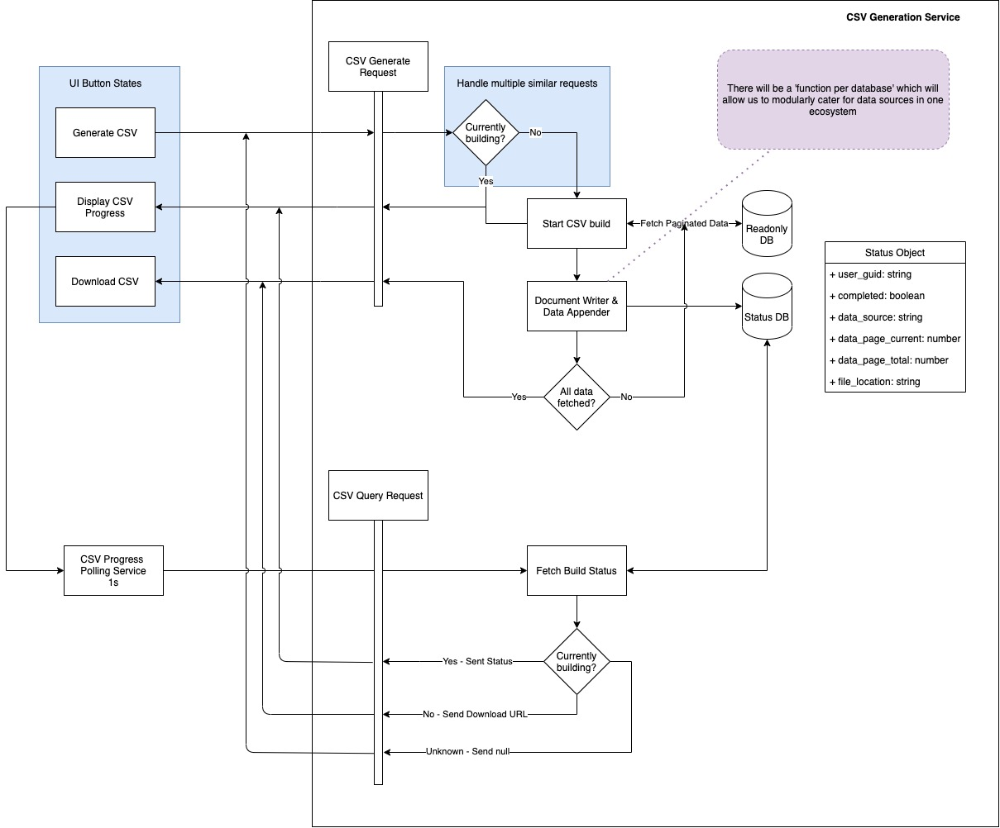
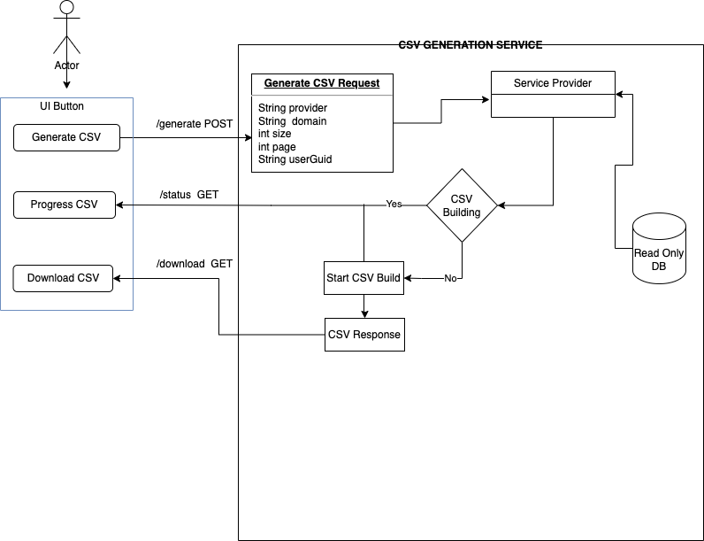

= Service Document Generation Documentation
Lajabu John <lajabu.john@wonderlabz.com>
1.0, March 4, 2022: Service Document Generation Documentation
:toc:
:icons: font
:url-quickref: https://docs.asciidoctor.org/asciidoc/latest/syntax-quick-reference/
== CSV Export Variant

'''

xref:original_ta.adoc[Original Technical Analysis]

While the parent to this card is an all-inclusive, fully redundant solution, there is a worry that it will take too much development time in relation to just generating CSV files.

The solution listed below reduces the overall complexity down to just one service which can handle all CSV generation requests. These will be the building blocks that we can expand from when migrating to the ‘full’ version of the solution.

Much of the same assumptions are applied to the solution below as we try find a middle ground between development time and a low-impact solution.

*Primary timeframe*: 2 developers @ 25 days

*Variant timeframe*: 2 developers @ 13 days

The UI button will be developed in VueJS, and its function will be to request a new document generation and dynamically change its state to reflect the progress and eventual download of the file.

As there is no two-way communication from the server, we can rely on simple 1-second polls to the service (only while in progress) to fetch status updates.

The generation service will build data to a physically stored file, which will be served to a user to download once the generation has been completed.

The data iteration loop can either execute immediately after the previous page has been fetched or on a timed CRON job for predictable periodic fetches.

__user_guid is used as a placeholder for any reference to a User - it could be replaced with a user id, a user reference object, etc.__

== Iterative Implementation

For CSV Generation and Download, we need to handle the CSV Generation and the CSV  Download, service-document-generation is the main service that has three endpoints in DocumentGenerationController that is ‘/generate' POST, ‘/status’ GET and  '/download’ GET. The diagrams below represent the above-mentioned endpoints:

=== Generate Document Request

include::plantuml/service-document-generation.generate-document.post.puml[]

=== Download Document
include::plantuml/service-document-generation.document-download.GET.puml[]

=== Get Document Status

include::plantuml/service-document-generation.document-status.GET.puml[]

=== Full Diagram
[#img-dgsfd]
.Document Generation Service

CSV Export needs to be implemented into the following player summary tabs:

* Bonus History
* Login History
* SMS History
* Accounting History
* Accounting Sportsbook History
* Sportsbook
* Incentive Games
* Casino
* Notes
* KYC