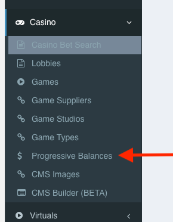
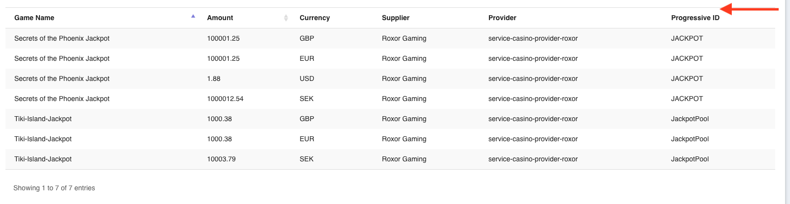

= LSPLAT-5717 PLAT-6423 ⁃ Unified jackpot feeds
Reza Khan <reza.khan@wonderlabz.com>
1.0, Aug 10, 2022:: TA - LSPLAT-5717 PLAT-6423 ⁃ Unified jackpot feeds
:sectnums:
:toc: left
:toclevels: 4
:toc-title: LSPLAT-5717 PLAT-6423
:icons: font
:url-quickref: https://docs.asciidoctor.org/asciidoc/latest/syntax-quick-reference/
:table-caption!:

WARNING: You might need to install graphviz to render the component models on IntelliJ on plantUML if not viewed on GitLab- see https://playsafe.atlassian.net/wiki/spaces/LITHIUM/pages/1674936347/How+To+Setup+Lithium+Local+Development#Noteworthy-Extensions.1[IntelliJ: PlantUML diagramming tool]

== Description
=== Jira
* https://jira.livescore.com/browse/PLAT-6423
* https://playsafe.atlassian.net/browse/LSPLAT-5717

=== Gitlab
* Branch: origin/feature/LSPLAT-5717-unified-jackpot-feeds
* MR: https://gitlab.com/playsafe/lithium/app-lithium-full/-/merge_requests/5419

=== Business
Jackpots are an important feature allowing us to offer some of the industry's leading games to our players.

Once integrated into the platform, this needs to be sent to the front end client to be used to display on individual game tiles and within custom built widgets to show players what the current jackpot levels are.

=== Approvals
|===
|Component |Reason |Comments

|Li
|
|

|FE
|Contains a new FE API
|The relevant swagger documentation needs to be added and approved by FE
|===

== Architecture
=== Background
As of today, lithium has just one progressive jackpot feed integrated for the roxor game supplier. The core functionality lives within scp-roxor. It contains a cronjob that polls the external HTTP resource every 30 seconds (interval configured) then caches the result in lithium. There is no FE API consuming the data at this point.

With https://jira.livescore.com/browse/PLAT-6423, there is a requirement to add another progressive jackpot feed for the blueprint game supplier, which is provided via scp-iforium. In addition, there is also https://jira.livescore.com/browse/PLAT-997 in planning for a progressive jackpot feed from the microgaming game supplier. In the near future, we for-see integrating progressive jackpot feeds from other game suppliers as well into lithium.

If the same methodology as the initial implementation for scp-roxor is followed, it would mean lithium ends up having numerous cronjobs across a number of casino providers for each progressive jackpot feed.

That being said, each cronjob would execute at different times. Even if it is nanoseconds apart, this would require caching of the resulting progressive jackpot feeds separately. This would require amalgamation in real-time when FE/BO/or other interested participant looks up the feed. As it is a hazelcast cache and amalgamation in java, this is not a considerable drawback.

It would however be preferable to have a unified API for adding progressive jackpot feeds, now and in the future, as well as a simple mechanism for progressive jackpot feed lookup containing data from various suppliers. This TA attempts to model such a solution.

=== Technical
The solution will:

* Contain a single cronjob in service-games
** Triggered via a configured interval (fixed delay) defaulting to 30s
** Communicate with the various casino providers where a progressive jackpot feed for a game supplier has been registered, through a standard API
*** Run in a fork join/concurrent manner so that the various calls to external resources are done in parallel
*** Have a sane timeout value configured
**** On timeout, have the appropriate metrics published to grafana for NOC visibility and monitoring, in order to identify stale progressive jackpot data
*** Return data from each game supplier's feed in a standard response API
*** Amalgamation of data stored in cache
* Contain a simple FE/BO API for lookup of the amalgamated data

TIP: For inspiration, have a look at: lithium.service.casino.client.CasinoTransactionDetailClient, lithium.service.casino.controllers.CasinoTransactionDetailController, lithium.service.casino.provider.sportsbook.system.controllers.CasinoTransactionDetailController

=== Data structure
include::../plantuml/erd/jackpot-feeds-data-structure-registered-feeds.puml[]
[red]_Figure 1. Registered progressive jackpot feed data structure_

==== Module
Progressive jackpot feeds are implemented within the casino providers (eg. service-casino-provider-roxor.) For every registered jackpot feed, the casino provider module name has to be known in order to route the feign client call to the relevant casino provider. The name of the lithium module will be held in the `module` table.

==== Game Supplier
A casino provider such as service-casino-provider-iforium may provide games from various suppliers (eg. Blueprint.) Therefore, in addition to the casino provider module name, the game supplier needs to be known for each registered jackpot feed. Game suppliers are held in the `game_supplier` table.

==== Progressive Jackpot Feed
The `progressive_jackpot_feed` table will hold registered progressive jackpot feeds per casino provider and game supplier.

==== Progressive Jackpot Game Balances
IMPORTANT: Modification made

As mentioned above, all game progressive jackpot balances lived only in hazelcast cache. A significant drawback of this can occur if for some reason cache was wiped. There is no fallback to retrieve data directly from the game suppliers feeds, and, if that is implemented, would mean a lot of requests to the game suppliers feed, which would not be very nice.

That being said, as part of this implementation, a database backing for the data will be built, with hazelcast cache on top of that. If the cache is wiped, data will be retrieved from the database. The schema is described below.

include::../plantuml/erd/jackpot-feeds-data-structure.puml[]

Notice that there are 2 separate storages for progressive jackpot balances.

progressive_jackpot_game_balance, and progressive_jackpot_balance.

The initial TA only catered for a data structure for the first. The data structure will make it easy to report on progressive jackpot balances per game.

The latter, progressive_jackpot_balance, was added to cater for some valid feedback received from FE, to avoid redundant data sent to FE.

The initial TA provided FE a list of all games and their progressive jackpot balances. This has now been revised to only send FE a list of progressive jackpot balances per progressive ID.

*In order for this to work, the lobby load response has to be modified as well.* Each game tile needs to specify a list of progressive ID's. Whenever the lobby is loaded, the list of progressive jackpots per game (from progressive_jackpot_game_balance) needs to be queried and the progressive ID's enhanced to the game tile objects, in the most efficient way.

*It should be noted that we have no guarantee of uniqueness in progressive ID's from different game suppliers, and thus, on our end we need to pad the game_supplier_id onto the progressive ID, either with a prefix or postfix.*

With the lobby data now specifying the progressive ids per game, for requests to the endpoint described in 2.6.2 below, we only need to query progressive_jackpot_balance by domain and return the filtered list to FE.

[red]_Figure 2. Progressive jackpot game balance data structure_

=== Progressive jackpot feed registration
TIP: For inspiration, have a look at: lithium.service.accounting.client.transactiontyperegister.TransactionTypeRegisterService

include::../plantuml/sequence/jackpot-feeds-registration-sequence.puml[]
[red]_Figure 3. Progressive jackpot feed registration_

SCP represents a casino provider. This could be: service-casino-provider-roxor, service-casino-provider-iforium, etc.

=== Progressive jackpot feeds update
IMPORTANT: The interval for the scheduler should be externalised in the yml file with a default of 30s.

IMPORTANT: The timeout configuration per jackpot feed to be stored in the provider properties, same place as the url for the external jackpot feed.

include::../plantuml/sequence/jackpot-feeds-update-sequence.puml[]
[red]_Figure 4. Progressive jackpot feeds update_

The sequence above models the roxor and blueprint progressive jackpot feeds. In the future, more feeds from different game suppliers will be added. When that happens, it would follow a similar pattern. All feeds will be queried in parallel.

The template design pattern is being utilised for each implementation of a game supplier's progressive jackpot feed.

TIP: For inspiration on the template design pattern, have a look at: lithium.service.cashier.services.autowithdrawal.AutoWithdrawalRuleTemplate

TIP: https://www.baeldung.com/java-template-method-pattern

=== API
include::../plantuml/class/jackpot-feeds-classes.puml[]
[red]_Figure 5. Request/Response classes_

==== System
[cols="h,5a"]
|===
| URL
| /system/jackpot-feed/progressive/{domain-name}/{game-supplier}/get

| Method
| POST

| Request
| ProgressiveJackpotFeedRequest

| Response Body
| ProgressiveJackpotFeedResponse
|===

NOTE: This system endpoint to be implemented in each provider that supplies a progressive jackpot feed, such as SCP-roxor for the roxor feed, and SCP-iforium for the Blueprint feed. Domain name is passed so that the appropriate provider properties can be looked-up. Providers are set up per player domain.

==== Frontend
IMPORTANT: Modification made

[cols="h,5a"]
|===
| URL
| /frontend/jackpot-feeds/progressive/{domain-name}/get/v1

| Method
| POST

| Request
| None

| Response Body
| ProgressiveJackpotBalanceFEResponse
|===

FE will only pass a domain name.

==== Backoffice
2 controllers, ProgressiveJackpotFeedsController and ProgressiveJackpotFeedController. The first controller will be responsible for providing the table of registered feeds per domain, and the table of progressive jackpot game balances per domain, whereas the latter will be responsible for making alterations a singular registered progressive jackpot feed, i.e, toggling of the __enabled__ property.

[cols="h,5a"]
|===
| URL
| /backoffice/jackpot-feeds/progressive/{domain-name}/registered-feeds/table

| Method
| POST

| Request
| N/A

| Response Body
| DataTableResponse<T>
|===

NOTE: This endpoint will return all registered progressive jackpot feeds for the domain

[cols="h,5a"]
|===
| URL
| /backoffice/jackpot-feeds/progressive/{domain-name}/table

| Method
| POST

| Request
| N/A

| Response Body
| DataTableResponse<T>
|===

NOTE: This endpoint will return all progressive jackpot game balances for the domain

[cols="h,5a"]
|===
| URL
| /backoffice/jackpot-feed/progressive/registered-feed/{id}/get

| Method
| POST

| Request
| N/A

| Response Body
| T
|===

[cols="h,5a"]
|===
| URL
| /backoffice/jackpot-feed/progressive/registered-feed/{id}/toggle-enabled

| Method
| POST

| Request
| T

| Response Body
| T
|===

==== LBO
* Rename the menu item "Progressive Balances" to "Progressive Jackpot Feeds"

NOTE: Motivation: This menu will now hold the configuration for all registered progressive jackpot feeds as well as the progressive jackpot game balances, by means of 2 tabs.

* When the "Progressive Jackpot Feeds" menu is clicked, a screen with a domain selector is presented.
** After selecting the domain, currently, the roxor progressive jackpot game balances are displayed.
*** This screen should be modified to include 2 tabs:
**** Configuration
***** This will contain a datatable of all registered feeds for the domain. There should be a view link that takes you to a page displaying information about the jackpot feed, and allowing it to be enabled or disabled at will.
**** Game Balances
***** This will contain progressive jackpot game balances, for all game suppliers.
****** For easy navigation, add filters for currency, game supplier, provider, etc
****** There is currently no pagination. This should be added in as per the other datatables in LBO.

* Add a new field for "Won by Amount"

