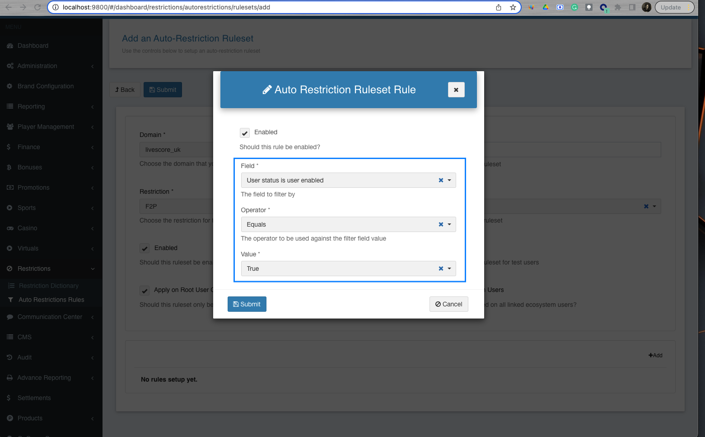
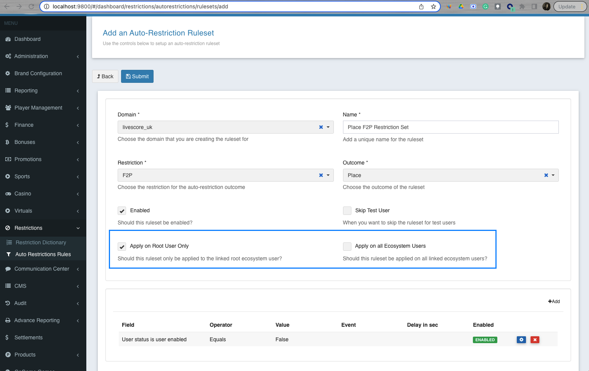

= LSPLAT-10365 PLAT-8293 - Block restricted accounts from F2P game
Irwin Herridge <irwin.herridge@wonderlabz.com>
1.0, July 20, 2022: Block restricted accounts from F2P game
:sectnums:
:toc: left
:toclevels: 4
:toc-title: Table of Contents
:icons: font
:url-quickref: https://docs.asciidoctor.org/asciidoc/latest/syntax-quick-reference/
:table-caption!:

//This is done to keep formatting aligned with gitlab
****
[verse,,]
____
link:../../readme.adoc[Home]
____
****

== Description
=== Jira
* link:https://playsafe.atlassian.net/browse/LSPLAT-10365[LSPLAT-10365]
* link:https://livescoregroup.atlassian.net/browse/PLAT-8293[PLAT-8293]

=== Gitlab
* Branch: origin/feature/LSPLAT-10365_PLAT-8293_-_Block_restricted_accounts_from_F2P_game
* MR: link:https://gitlab.com/playsafe/lithium/app-lithium-full/-/merge_requests/6123[]

=== External Dependencies
==== Swagger (To be completed *before* development starts)
* Short description of swagger changes that will be required.
* TL to facilitate timeline and communication to GW/FE for the changes.

. Swagger changes was done as part of https://livescoregroup.atlassian.net/browse/PLAT-11470[PLAT-11470]
* Two new fields was added on GET Profile API and Access Token Response, particularly to the restrictions object.
** f2pAllowed
** f2pErrorMessage

See MR diff for more info: https://gitlab.com/playsafe/lithium/ts-lithium-core-api/-/merge_requests/318

==== DWH
* Short description of any changes that would need to be communicated/discussed with DWH.
* TL to facilitate.

TIP: N/A

==== Other
* Any other external providers that might need consideration. e.g. eXtremePush/Roxor

TIP: N/A

=== Business

Block users with SE or GAMSTOP SE from playing the LSM F2P game.

We should check when the user tries to open the F2P game whether they have a linked LSB account which has restrictions on it.

If the linked account is SE, GAMSTOP SE, cooling off, blocked for fraud, blocked for RG reasons or bonus restricted, we should not allow them access to play the F2P game and serve them a message saying their account is not eligible to play the game.

== Architecture

. Create a new Auto-Restriction Field Type called "User status is user enabled" which only accepts a boolean operator with a multi-selector that would allow the user to select True and False.
* When a ruleset runs, compare the players `User.Status.isUserEnabled` with the value and operator configured on the ruleset and if rule validates true; perform the configured outcome on the players account by either placing or lifting the restriction set onto the destined players profile.

[start=2]
. Ensure to trigger auto-restriction ruleset validation against a player everytime the players status is changed.
* See `autoRestrictionTriggerStream.trigger(AutoRestrictionTriggerData.builder().userGuid(user.guid()).build());`

. Create two new fiels on the Auto-Restriction Ruleset Configuration called:
* Apply on root domain only.
** This field should only be visible whenever the auto-restriction ruleset is configured on a domain that belongs to an ecosystem, but is not a root ecosystem relationship type.
** When a ruleset executes, when placing or lifting the restriction, only place and lift it on the linked root domain user only! (e.g. Ruleset runs on an exclusive domain, but restriction gets applied on root domain only).
* Apply on all ecosystem domains.
** This field should only be visible whenever the auto-restriction ruleset is configured on a domain that belongs to an ecosystem.
** When a ruleset executes, when placing or lifting the restriction, place or lift the restriction on all linked ecosystem domain users. (e.g. Ruleset runs on exclusive domain, but restriction is loaded on root domain as well as the exclusive domain and vice versa when ruleset runs on root domain.)
* When none of the two new checkboxes above is selected, then when the ruleset executes, the restriction would be placed on the user belonging to the domain on which the auto-restriction ruleset runs on; this is the default behaviour as it works today.

