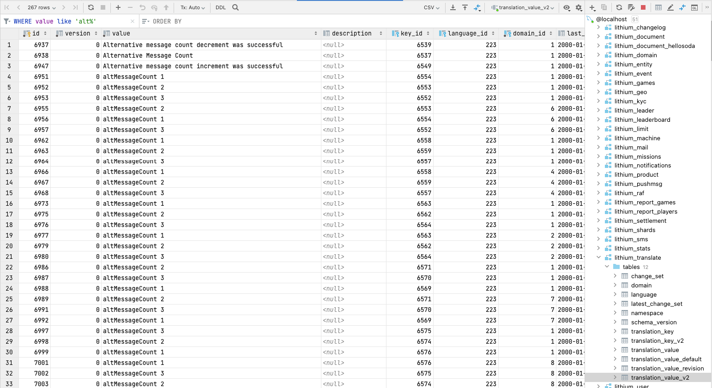
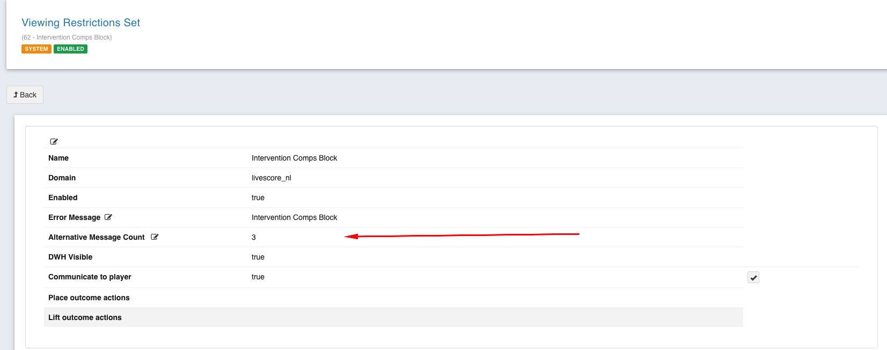

= LSPLAT-4102 PLAT-4807 ⁃ [NL] - Allow customers to exclude from Casino
Irwin Herridge <irwin.herridge@wonderlabz.com>
1.0, February 3, 2022:: TA - LSPLAT-4102 PLAT-4807 ⁃ [NL] - Allow customers to exclude from Casino
:toc: left
:toclevels: 4
:toc-title: LSPLAT-4102 PLAT-4807
:icons: font
:url-quickref: https://docs.asciidoctor.org/asciidoc/latest/syntax-quick-reference/

== Information
=== Tickets
* https://jira.livescore.com/browse/PLAT-4807
* https://playsafe.atlassian.net/browse/LSPLAT-4102

=== Dependencies
* N/A

=== MR
* https://gitlab.com/playsafe/lithium/app-lithium-full/-/merge_requests/4245
* This MR contains the branch that should be used to complete this task!

== Description (From Ticket)
=== Background
We must have the ability to automatically block the user from accessing casino. We need to be able to block them from accessing casino via the 'casino no more' restriction and allow them to block themselves for a fixed or indefinite period of time.

They will not be able to access any casino related content or pages during this time. The restriction will be lifted automatically once the time period has passed.

=== Requirements

* Must block the user from access to the casino for fixed period of time when restriction is placed on the user from LBO
* User will be able to pick a period of time they will exclude themselves from the front end for e.g. 1 day, 1 week, 2 weeks, 3 weeks, 4 weeks, 6 weeks, indefinitely (same restrictions as cool off functionality )
* A forced restriction from LBO will override any restriction the user has in place and keep it locked
* We should be able to remove the restriction from LBO as required
* The front end will need to display to the user how much longer they have left on their restriction, whether the user can turn back on their restriction or not (can remove their restriction if they set it themselves but cannot if LBO user set it for them)
** A message will be displayed to the customer when they try to toggle Casino on, explaining to them why they have been blocked from casino and that this cannot be changed for X amount of days

== Architecture

=== Overview

include::../../../docs/restrictions/plantuml/intervention-casino-no-more-usecase.puml[]
include::../../../docs/restrictions/plantuml/intervention-casino-no-more-flow.puml[]

=== Technical

==== Technical v1

.  Create two new system restrictions that will be used for blocking casino (`INTERVENTION_CASINO_BLOCK` & `PLAYER_CASINO_OPTOUT`)
* The system restrictions get added into the domain_restriction_set when service-limit starts up (see `SystemRestrictionService.createSystemRestrictions`)
* When altMessageCount is greater than 0, new translation keys are created, create the alternative translation message in the format of " `SystemRestriction.restrictionName` " + " " + " `altMessageCount#` " (See `RestrictionService#registerRestrictionErrorMessage`)
** e.g. if PLAYER_CASINO_OPTOUT is configured to have a `altMessageCount`=5, then
*** key1.value = "Intervention Casino Block 1"
*** key1.value = "Intervention Casino Block 2"
*** key1.value = "Intervention Casino Block 3"
*** key1.value = "Intervention Casino Block 4"
*** key1.value = "Intervention Casino Block 5"
*** And the default would also be created without altMessageCount i.e. keyDefault.value = "Intervention Casino Block"
* Each error message would be configured to return 1 day, 1 week, 2 weeks, 3 weeks, 4 weeks, 6 weeks and the default for indefinitely
** Depending on the sub_type, the casinoErrorMessage will be set to an alternative message whenever the "Intervention Casino Block" restriction set is added to a player

[source, java]
----
public enum SystemRestriction {
    INTERVENTION_CASINO_BLOCK("Intervention Casino Block", new String[] { RestrictionType.RESTRICTION_CASINO.code() }, true, 5),
    PLAYER_CASINO_BLOCK("Player Casino Block", new String[] { RestrictionType.RESTRICTION_CASINO.code() }, false, 0);
}
----

[start=2]
. When we went live with the Intervention Comps Block, the translations messages was created incorrectly for the altMessageCounts and makes it hard to distinguish for which restriction set it was created for (Point 1 fixes the new alternative messages for the casino block, but we still need to update the old ones to follow the same format).
* Create a flyway script that is able to update the translation values for the alternative messages that was already created on system startup (Intervention Comps Block only) to be " `SystemRestriction.restrictionName` " + " " + " `altMessageCount#` "
** You could simply replace all "altMessageCount X" with "Intervention Comps Block X" (e.g. "altMessageCount 1" -> "Intervention Comps Block 1"
** You should not worry about any values that was updated on LBO from "altMessageCount X" to "some other value", since this would mean that the value has already been updated manually; therefore you would only change the ones that still contains "altMessageCount X" as a value

[start=3]
. `UserRestrictionService#checkAccess`
* Add a new `casinoSystemPlaced` boolean flag on our `Access` response object
** This flag will allow us to restrict a player from opting back into casino whenever a casino block has been loaded from an casino intervention (i.e. `INTERVENTION_CASINO_BLOCK`)

[source, java]
----
public class Access {
    ...
    @Builder.Default
    private boolean casinoAllowed = true;
    @Builder.Default
    private boolean casinoSystemPlaced = false;
    private String casinoErrorMessage;
    ...
}
----

[start=4]
. Player initiated Casino-no-more block
* Create a new frontend player casino no more endpoint that may be called to restrict a player from seeing any Casino related content on the frontend; also when placed, all casino functionality should be disabled for the player.
** GET `/service-limit/frontend/player/casino-no-more` (Create swagger first and have it shared with GW team)
*** Player Bearer token to be used to resolve the players GUID
*** This endpoint will be used to Place/Lift the `SystemRestriction.PLAYER_CASINO_BLOCK` restriction set on a players account
*** If a Casino block already exist and is system placed (`access.casinoSystemPlaced=true`), then the player should be restricted from toggling their Casino Block off since the system placed restriction can only be removed from an auto-restriction rule on LBO or as a result of a CS Agent manually lifting the system paced restriction from the players account.
*** Should also support subType (request parameter), should business decide to allow the player to restrict themselves from casino for a period of time
**** We should therefore support business to allow them to increment the alt message count on LBO as we did with Intervention Comps Block, even for restrictions that was not setup originally with any altMessageCount

[start=5]
. Backoffice/DWH initiated Casino-no-more block (Intervention)
* The following subordinate types (`subType`) will be allowed when placing an `INTERVENTION_CASINO_BLOCK` onto a player account, whether it is loaded from LBO or via DWH (Please also update swagger documentation to clearly show the different sub types for the `INTERVENTION_CASINO_BLOCK`)
** Indefinite
*** No auto restriction rule will be setup for this one
*** Need to ensure that when subType=null, that we send the default error message on CheckAccess)
** 1 - 1 Day
** 2 - 1 Week
** 3 - 2 Weeks
** 4 - 3 Weeks
** 5 - 4 Weeks
** 6 - 6 Weeks
* When placed from LBO, ensure that the user is forced to select one of the subordinate types

include::../../service-limit/docs/plantuml/sequence/external/set-dwh-restrictions.puml[]

include::../../service-limit/docs/plantuml/sequence/lbo.player-info.responsible-gambling.add-restriction.puml[]

[start=6]
. Configuring your auto-restriction rules per subordinate type
* Depending on business requirements, an auto-restriction rule will be setup per subordinate type to allow for the automatic lifting of a domain restriction set from a player's account depending on the number of days the restriction has been active and the subordinate type that was placed along with the restriction

include::../../service-limit/docs/plantuml/sequence/lbo.lift-intervention.auto-restriction-configuration.puml[]

[start=7]
. Providing time and period on `access.casinoErrorMessage`
* We need to show the date a restriction has been loaded onto a player's account and also show for how long the restriction will be active, therefore
** When translating the error message when building up the access object on the checkAccess call, pass in the `user_restriction_set.created_on` date as an argument on the `MessageSource` method which would allow for replacing argument tags on the translation values
*** For example, if the translationValue="A Casino restriction has been placed on your account on {0} for 1 week." then when translated with your first argument as created on date, then the translation result should look like translationValue="A Casino restriction has been placed on your account on DD-MM-YYYY HH:MM for 1 week."

[start=8]
. Auto Restriction Jobs (new + optimizations)
* `AutoRestrictionJob` -> Rename to `DaysSinceRegistrationAutoRestrictionJob`
** Re-add the check back into this job that would only run this job where a AutoRestrictionRuleField.DAYS_SINCE_REGISTRATION rule has been found to be configured on a particular domain. (This job is user intensive and by now running the job for each user on every domain means that we need to iterate through each and every user on Lithium every 9 hours)
* `InterventionCompsAutoRestrictionJob` (new job)
** Since we have now moved our rule set check from the `DaysSinceRegistrationAutoRestrictionJob`, we now need a new job that would only run on domains where a rule set has been configured to LIFT/PLACE a SystemRestriction.INTERVENTION_COMPS_BLOCK domain restriction set
*** If a rule set has been configured to LIFT a SystemRestriction.INTERVENTION_COMPS_BLOCK, first find all the users who already have a INTERVENTION_COMPS_BLOCK placed on their account and only run the ruleset checks on those users.
*** Only run rule sets for when a LIFT SystemRestriction.INTERVENTION_CASINO_BLOCK rule needs to be checked
* `InterventionCasinoAutoRestrictionJob` (new job)
** As with the `InterventionCompsAutoRestrictionJob`, follow a similar path where you would only run the job on domins where a rule set has been created to LIFT a SystemRestriction.INTERVENTION_CASINO_BLOCK; then only run the job for users who currently has a INTERVENTION_CASINO_BLOCK loaded onto their account.
** Only run rule sets for when a LIFT a SystemRestriction.INTERVENTION_CASINO_BLOCK rule needs to be checked

==== Technical v1.2

. Documentation bug fix on v1 where `SystemRestriction.PLAYER_CASINO_BLOCK` was created as `("Player Casino Opt-Out", new String[] { RestrictionType.RESTRICTION_CASINO.code() }, false, 0, false);`
* (1) The restrictionName was incorrectly specified as "Player Casino Opt-Out" instead of "Player Casino Block" - Need to create flyway script that is able to update the restrictionName to correspond with the enum name
* (2) We need to support sub types for the `PLAYER_CASINO_BLOCK` - specify `SystemRestriction.PLAYER_CASINO_BLOCK` as `("Player Casino Block", new String[] { RestrictionType.RESTRICTION_CASINO.code() }, false, 5, false);`

. LBO -> Restriction Dictionary -> Open restriction - As with the "Intervention Comps Block", on LBO, all restrictions to support the Alternative Message Count setting.
* As default, all restrictions are created without the alt message count; but the UI does not cater for adding altMessageCount's and the setting is only displayed currently for the "Intervention Comps Block" restriction set.
** Ensure that this setting is displayed for all restriction sets, and would allow us to increase the number from 0 to 1+, allowing the creation of translation keys and values that can be returned on the checkAccess.*errorMessage when restriction is active with sub type.

[start=3]
. From v1, the casino-no-more endpoint allowed a player to LIFT/PLACE the `SystemRestriction.PLAYER_CASINO_BLOCK` restriction from their account.
** Create a new domain setting called `ALLOW_LIFTING_PLAYER_CASINO_BLOCK` with a default set to false. e.g. `DomainSettings.ALLOW_LIFTING_PLAYER_CASINO_BLOCK("allow_lifting_player_casino_block", "false");`
*** This will now ensure that the casino-no-more endpoint restricts a player from lifting their PLAYER_CASINO_BLOCK restriction when it was placed; therefore needing to contact Customer Support have the restriction lifted, unless placed with a subType that would automatically lift the restriction in the event that a auto-restriction rule was setup for this. Should a sub type not have been set, the placement of restriction will remain active indefinitely.

include::../../service-limit/docs/plantuml/sequence/player-initiated.casino-block.puml[]

=== Out of scope (Iteration 2)

Link to ticket: https://jira.livescore.com/browse/PLAT-5659

. Introduce a new field on a restriction set (domain_restriction_set.system_placed), which would be used to indicate whether a restriction set is system placed or not.
* Have two enums for auto created restriction sets on service-limit startup, one for system placed (SystemRestrictions) and a new for PlayerPlaced.
** Currently should a new domain restriction set be created for a casino or comps blocks and an LBO user adds it to a player from LBO, then the player would still be able to toggle themselves back into promotions or casino
** Due to the the compsSystemPlaced and casinoSystemPlaced being controlled by the use of  a restrictionName, being able to store the flag on the domain restriction set would allow us to control all systemPlaced restrictions better, as we would be able to check if there was any system placed restriction added onto a player and then have the player restricted from lifting should one be found.

. AutoRestrictionJob Optimizations
* We need to revisit the auto-restriction jobs and find a better way to trigger the ruleset checks periodically only for players that would have a better chance of hitting an auto-restriction ruleset.
** Please see MR for this TA for more discussion around the AutoRestrictionJobs: https://gitlab.com/playsafe/lithium/app-lithium-full/-/merge_requests/4245
. Revisit the subType and active_to
* Revisit the subType and find a way to rather have DWH/LBO use the number of days instead/in-addition of a subType, this would allow for showing the activeTo since we could expire the restriction after activeTo date, and then have a job run every day to delete the expired restrictions from the userRestrictionSet
** Note that we still need to be able to support different error messages based on the subType

. We need to look into edge cases where an intervention message may be sent for Comps blocks more than once from DWH (changing the active_from date) whilst there are still unread intervention message.
* Currently there would be a new intervention message added to the players inbox while there are still having the previous one unread. Possibly we might need a new status on the inbox items to indicate that it was replaced by a new one while the old one was unread.
. Need to relook `CasinoBlockSubordinateType` enum that has hardcoded days. Possibility to address it as a domain setting as was done with the cool-off-periods-in-days
. As per a meeting with Matt, the player initiated casino blocks will remain active for as long as the user keeps the block active (not toggling it off). Although we have built in the casino-no-more endpoint to accept subTypes that would allow us to configure auto-restriction rules which will then allow us to automatically remove the player initiated restriction after a number of days.

=== References

TA -> https://playsafe.atlassian.net/wiki/spaces/LITHIUM/pages/2609807361/ACCEPTED+LSPLAT-3984+PLAT-4693+LSPLAT-3665+PLAT-4382+Promotions+NL+-+Force+Bonus+Toggle+Off+for+Certain+Customers+Restricting+Promotions+for+Opt+Out+Users[ Promotions NL - Force Bonus Toggle Off for Certain Customers & Restricting Promotions for Opt Out Users]