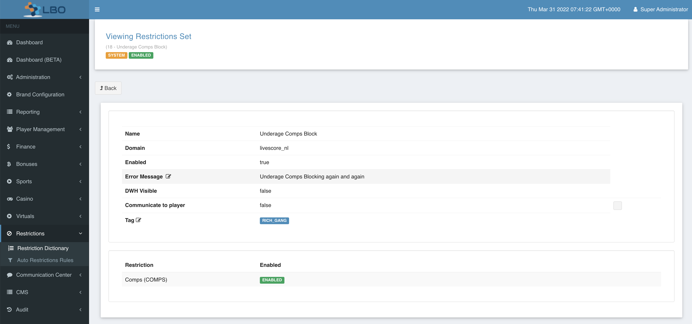
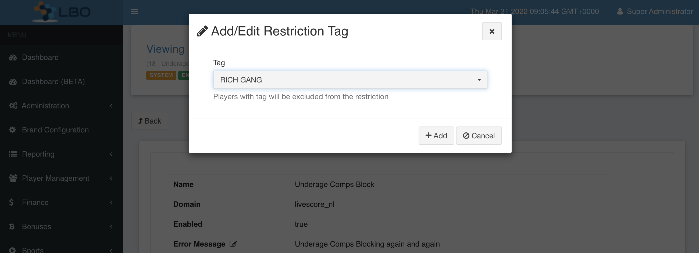

= LSPLAT-4562 PLAT-5244 ⁃ [Promo][NL] - Exclude Customers from Intervention indefinitely
Rivalani Hlengani <rivalani.hlengani@wonderlabz.com>
1.0, March 22, 2022:: TA - LSPLAT-4562 PLAT-5244 ⁃ [Promo][NL] - Exclude Customers from Intervention indefinitely
:toc: left
:toclevels: 4
:toc-title: LSPLAT-4562 PLAT-5244
:icons: font
:url-quickref: https://docs.asciidoctor.org/asciidoc/latest/syntax-quick-reference/

== Information
=== Tickets
* https://jira.livescore.com/browse/PLAT-5244
* https://playsafe.atlassian.net/browse/LSPLAT-4562

=== Dependencies
* N/A

== Description (From Ticket)
=== Background
Following the launch in NL, we are going to look at improving the Intervention process for our higher spending customers.

The current implementation means that for our higher spending customers, they face the possibility of triggering an intervention quite often, and it will be up to our operators to remove that Promotions block in Lithium on a case by case basis.

We would to remove this pain for the higher spending customers by removing them from the possibility of triggering an intervention.

Therefore, the requirement here is that we can flag up these customers in Lithium and ignore any intervention triggers received for these users. We would also have the ability to unflag them which would make them again available for intervention.

We would need to feed this information into DWH to ensure that coms via XP are inline with what the customer is experiencing.

=== Ticket Requirements

Lithium needs to indefinitely exclude customers who are known to be high spenders from triggering the INTERVENTION_COMPS_BLOCK system restriction. High spending customers should be flagged and the results should be visible to DWH

== Architecture
=== Overview

To support this new requirement we are going to allow domain restriction sets to taggable, this means that some domain restriction sets will have a tag assigned to them so that if the same tag is applied on the user then the restriction will not be placed on the user.

=== Technical

. Update the domain_restriction_set database table

** You are required to add a new migration script that will add the *_exclude_tag_id_* column to *_lithium_limit.domain_restriction_set_* table and make it nullable. if this tag is specified, then players with this tag will not have this restriction applied to their account.

** On the restriction dictionary, add a single selection control that will allow for a selection of a single tag when updating any domain restriction set. (For the purpose of this TA, it's meant for INTERVENTION_COMPS_BLOCK)

[start=2]
. On LBO -> Player Management -> Player -> Responsible Gaming

* Ensure that the all the restrictions that have the same tags as the player do not appear on the dropdown when apply a restriction

[start=3]
. Now we need to update the DWH set endpoint to throw an exception whenever a intervention comps restriction is set on a player who has the same tag as the same as tag as the domain restriction set.

include::../plantuml/sequence/LSPLAT-4562-dwh-restriction-set-flow.puml[]

include::../plantuml/sequence/LSPLAT-4562-dwh-restriction-set.puml[]

=== Swagger
Make changes to the following endpoints to reflect the changes that will be introduced by the requirements on this ticket. Swagger changes go in first so that we can unblock other teams

* {{gateway}}/service-limit/external/restriction/v1/set - add a response to indicate the error message that will be thrown when a player has been excluded from intervention comps restriction

