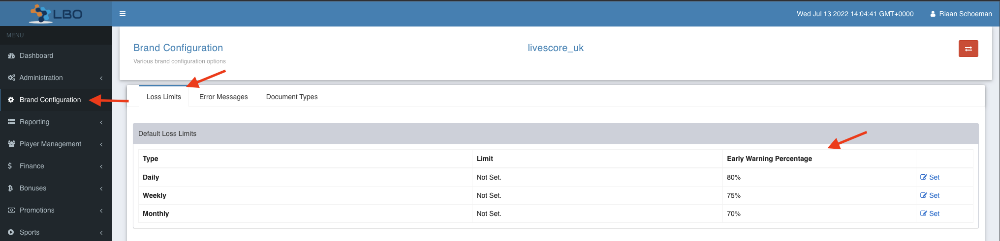
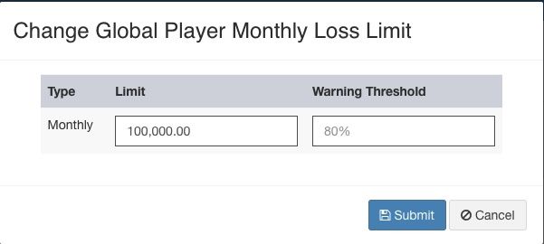
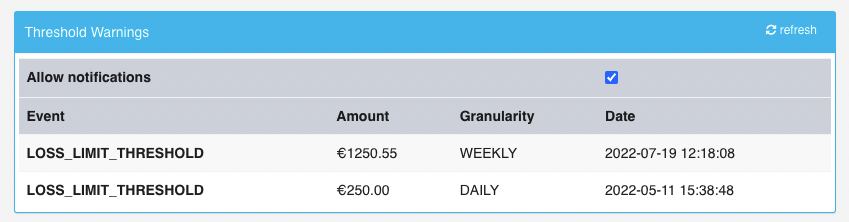
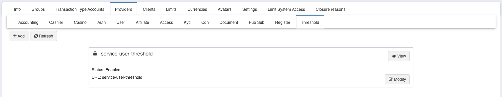
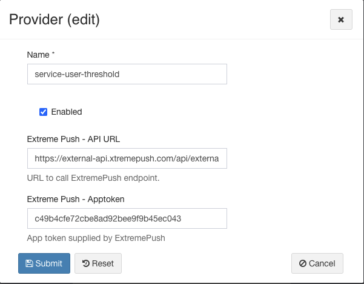

= Loss Limit Percentage Event Trigger
Riaan Schoeman <riaan.schoeman@wonderlabz.com>
1.0, July 13, 2022: PPE
:sectnums:
:toc: left
:toclevels: 4
:toc-title: PPE - Loss Limit Percentage Event Trigger
:icons: font
:url-quickref: https://docs.asciidoctor.org/asciidoc/latest/syntax-quick-reference/
:table-caption!:

//:stylesheet: css/asciidoctor.css
//:stylesheet: css/material-blue.css

:threshold-sourcedir: ../../../service-user/service-user-threshold/src/main/java

//This is done to keep formatting aligned with gitlab
****
[verse,,]
____
link:../readme.adoc[Home]
____
****

== Description
=== Jira
* link:https://playsafe.atlassian.net/browse/LSPLAT-6807[LSPLAT-6807]
* link:https://jira.livescore.com/browse/PLAT-7487[PLAT-7487]

=== Gitlab
* Branch: origin/feature/LSPLAT-6807_PLAT-7487-Loss_Limit_Percentage_Event_Trigger
* MR: link:https://gitlab.com/playsafe/lithium/app-lithium-full/-/merge_requests/5271[]

=== Business

==== New Event/Trigger

New event trigger in Lithium when client reaches a set % of their Loss Limit. (Initial use case 80%)

Initially we are looking to track 80% however require a solution which will allow us to add additional % to track or adjust without losing historic data.

This will be calculated real time and include open bets (existing percentage in Lithium display includes open bets)

This event trigger will run in line with the Loss Limit time periods.

Any trigger event should be logged and reportable.

==== Event Trigger Reporting

History of event triggers hit should be available in the Responsible Gambling Tab detailing Event type (% of Limit Reached), Loss Limit, Loss Limit Time Period (Daily, Weekly, Monthly), Date/Time % was reached (Mockup attached)

We require a real time report which can be exported from Lithium directly, this report should include the following fields;

* Player Name
* Account ID
* Loss Limit (Weekly)
* Loss Limit (Monthly)
* Date/Time % Hit
* Loss Limit Used (Weekly)
* Loss Limit Used (Monthly)

This event trigger should be able to be used to allow the Account Management / Player Protection teams to contact clients who are close to hitting their Loss Limits. i.e case created in Jira. Jira currently pulls this information from Data Warehouse.

This event trigger should also be available to prompt an in platform message (popup/ rich inbox) warning players they are close to hitting their Loss Limits. (Further event not in scope of this EPIC)

== Architecture
.Overview
[verse]
Everytime a transaction is processed, as part of the flow, we do summaries on accounts for the various granularities.
In this task we will be adding a message onto rabbit to send out a summary of the summaries done. Included with this will be a nett loss for the player for that granularity.
service-user-threshold (new service) will receive those events/messages and compare it to the saved thresholds for a specific type.
If this is the first time that the threshold has been breached for that granularity and the player is marked to receive these warnings (default is true), then a message will be sent to the player inbox, and a record for historical reporting will be saved.
Along with saving this historical record, the set limits and limits used will also be saved.

=== Flow/Sequence

[plantuml, format="png", id="sequence1"]
----
!define p(name, alias) participant "name" as alias << (L,#AAFFCC) >>
!define q(name, alias) queue "name" as alias << (L,#AAFFCC) >>
!define pn(name, alias) participant "name" as alias << (L,#FFAAAA) >>

pn("service-user-threshold", sut)
p("service-user", su)
p("service-accounting", sa)
p("service-limit", sl)
q("rabbit", r)

sa --> r: CompletedSummaryAccountTransactionTypeEvent?
note right
  Newly created event, in the same way we did
  CompletedTransactionEvent, these will send
  summaries for specific Transaction Types as
  registered. (e.g. SPORTS_BET + CASINO_BET / *_BET ))
  Includes net-loss for player
end note

sut <-- r:
----
* Use the event above to do a lookup of configured thresholds.
** See `lithium.service.user.threshold.services.CompletedSummaryAccountTransactionTypeProcessor`
** Code:
+
[source,java,linenums,indent=0]
----
include::{threshold-sourcedir}/lithium/service/user/threshold/services/CompletedSummaryAccountTransactionTypeProcessor.java[lines=13..33]
----

** if player record does not exist locally, create record, with call to svc-user to retrieve age information
*** Remember that this record needs to be updated whenever a player age is modified.
*** Default for `notifications` will be `true` when created. Can be modified from player responsible gaming screen.
** if transaction type is *_BET, check for `LOSS_LIMIT_THRESHOLD` records for that domain
*** if age group record found, that overrides any domain default threshold set.
** if event data received is over the configured threshold for that granularity, create a `player_threshold_history` record linking back to the revision.

* When a record in `player_threshold_history` is created:
** a notification needs to be sent to player inbox if `notifications` is true.
*** If multiple breaches are triggered within the same period/granularity, only ONE notification to be sent to player. Next notification only happens in the next period for that granularity.
** Please read through the notification inbox changes from link:https://gitlab.com/playsafe/lithium/app-lithium-full/-/blob/4596df60a3958121ee4c2d8dff44b8a344e0f991/docs/bonus-framework/TA/LSPLAT-6782-PLAT-7462%E2%81%83Bonus_popup_message.adoc#user-content-notification-changes[LSPLAT-6782-PLAT-7462]
*** a new `NotificationType` to be sent on startup, in this case, svc-user-threshold will register a notification type of "THRESHOLD_WARNING" with service-notifications.
*** code example:
+
[source,java,linenums,indent=0]
----
List<InboxMessagePlaceholderReplacement> phReplacements = new ArrayList<>();
phReplacements.add(InboxMessagePlaceholderReplacement.builder().key("%percentage%").value(thresholdRevision.getPercentage()).build());
phReplacements.add(InboxMessagePlaceholderReplacement.builder().key("%amount%").value(thresholdRevision.getAmount()).build()); //Format amount
phReplacements.add(InboxMessagePlaceholderReplacement.builder().key("%type%").value(thresholdRevision.getType().getName()).build()); //Translate to FE friendly value
phReplacements.add(InboxMessagePlaceholderReplacement.builder().key("%granularity%").value(thresholdRevision.getGranularity()).build()); //Translate to FE friendly value
phReplacements.add(InboxMessagePlaceholderReplacement.builder().key("%threshold_date%").value(thresholdRevision.getThresholdHitDate()).build()); //Format date

notificationStream.process(UserNotification.builder()
.userGuid(playerGuid)
.notificationName("loss.limit.threshold." + threshold.getId()) // name from type table + threshold id
.phReplacements(phReplacements)
.cta(false)
.build());
----

=== Database
* We need a few new tables to store the set thresholds and historical information.

+
[plantuml, format="png", id="erd1"]
----
' uncomment the line below if you're using computer with a retina display
'skinparam dpi 300
skinparam linetype ortho
!define T(name,desc) class name as "desc" << (T,#FFAAAA) >>
' we use bold for primary key
' green color for unique
' and underscore for not_null
!define pk(x) <b>x</b>
!define fk(x) <color:purple><i>x</i></color>
!define unique(x) <color:green>x</color>
!define nn(x) <u>x</u>
' other tags available:
' <i></i>
' <back:COLOR></color>, where color is a color name or html color code
' (#FFAACC)
' see: http://plantuml.com/classes.html#More
'hide methods
'hide stereotypes

' entities

package "Config" {
    T(type, "type") {
      pk(id) bigint(20) <<generated>>
      --
      version: int(11)
      nn(unique(name)): varchar(255)
    }
    note bottom of type
      This will store the identifiers for
      the types of thresholds that can be
      set. e.g.
      * DEPOSIT_LIMIT_THRESHOLD
      * LOSS_LIMIT_THRESHOLD
    end note

    T(u, "user") {
      pk(id) bigint(20) <<generated>>
      --
      version: int(11)
      nn(unique(guid)): varchar(255)
      test_account: bit(1)
      dobYear: int(11)
      dobMonth: int(11)
      dobDay: int(11)
      notifications: bit(1)
      fk(domain_id): bigint(20)
    }
    note left of u
      if this is a user record being created
      for a player, go back to svc-user to
      retrieve the DOB. If player DOB is updated
      svc-user-threshold needs to be updated.
    end note

    T(d, "domain") {
      pk(id) bigint(20) <<generated>>
      --
      version: int(11)
      nn(unique(name)): varchar(255)
    }

    T(t, "threshold\nIndicates which revision is currently used") {
      pk(id): bigint(20) <<generated>>
      --
      version: int(11)
      fk(current_id): bigint(20)
      fk(edit_id): bigint(20)
    }

    T(tr, "threshold_revision\n") {
      pk(id): bigint(20) <<generated>>
      --
      version: int(11)
      percentage: decimal(19,2)
      amount: decimal(19,2)
      granularity: varchar(255)
      created_date: timestamp
      modified_date: timestamp
      fk(created_by_id): bigint(20)
      fk(modified_by_id): bigint(20)
      fk(type_id): bigint(20)
      fk(domain_id): bigint(20)
    }
    note right of tr
      If domain/age related limits are updated,
      a call to svc-user-threshold needs to be
      made to update the revision.
      Once a revision is marked current, it can
      never be updated, any change requires
      creating a new revision. And setting that
      revision as current.
    end note

    T(ag, "threshold_age_group\nAge group information") {
      pk(id): bigint(20) <<generated>>
      --
      version: int(11)
      age_max: int(11)
      age_min: int(11)
      fk(threshold_revision_id): bigint(20)
    }
    note bottom of ag
      These are for identifying age related thresholds.
      When retrieving a list of thresholds, it needs to
      be by current for type+domain.
      If age group record present, that takes precedence
      over a default threshold record.
    end note
}
package "History" {
  T(pth, "player_threshold_history\n") {
    pk(id): bigint(20) <<generated>>
    --
    version: int(11)
'    granularity: varchar(255)
    threshold_hit_date: timestamp
    amount: decimal(19,2)
    daily_limit: decimal(19,2)
    weekly_limit: decimal(19,2)
    monthly_limit: decimal(19,2)
    daily_limit_used: decimal(19,2)
    weekly_limit_used: decimal(19,2)
    monthly_limit_used: decimal(19,2)
    fk(user_id): bigint(20)
    fk(threshold_revision_id): bigint(20)
  }
}

' relationships

u -- d : ""
t --* tr
tr -- d : ""
tr -- type : ""
tr -- ag : ""
tr -- u : ""
'----------
pth -- u
pth -- tr

----

* Example Data:

.domain
[format="csv"]
[%header,cols=2]
|======
id,name
1,livescore_uk
|======

.type
[format="csv"]
[%header,cols=2]
|======
id,name
1,LOSS_LIMIT_THRESHOLD
2,DEPOSIT_LIMIT_THRESHOLD
|======

.threshold
[format="csv"]
[%header,cols=5*]
|======
id,current_id,edit_id,type_id,domain_id
1,1,2,1,1
2,3,null,1,1
3,4,null,1,1
4,5,null,1,1
|======

.threshold_revision
[format="csv"]
[%header,cols=8*]
|======
id,percentage,amount,granularity,created_date,modified_date,created_by_id,modified_by_id
1,80.0,1500.00,GRANULARITY_DAY,today(),today(),1,1
2,75.0,1350.00,GRANULARITY_DAY,today(),today(),1,1
3,70.0,13050.00,GRANULARITY_WEEK,today(),today(),1,1
4,60.0,1200.00,GRANULARITY_WEEK,today(),today(),1,1
5,65.0,1350.00,GRANULARITY_WEEK,today(),today(),1,1
|======

.threshold_age_group
[format="csv"]
[%header,cols=4*]
|======
id,age_max,age_min,threshold_revision_id
1,18,24,4
2,25,30,5
|======

=== LBO
* We need a place to configure the trigger percentages. Please alter the screen in the image below to look like:
+

+
** "Early Warning Percentage" -> Warning Threshold

+

* On the player "Responsible Gaming" tab:
+

=== Extreme Push

* External documentation:  https://docs.xtremepush.com/reference/event-hit-event
* We need to add this new service as a provider under the domain configuration pages.
** Add a new tab called "Threshold":
+

** Modifying the provider:
+

* This will be used to save the required properties for the api call to extremepush.
* API call to ExtrememPush will for now be built into svc-user-threshold, untill such time that there are more integrations done with XP, then we will split from svc-user-threshold.
* This call to XP should be made everytime a message is sent to the player inbox.
* Example Data:
+
[format="csv"]
[%header,cols=5]
|======
apptoken,user_id,event,value,user_attributes
retrieved from config above,livescore_uk/12345,LOSS_LIMIT_THRESHOLD,1250.75,
|======