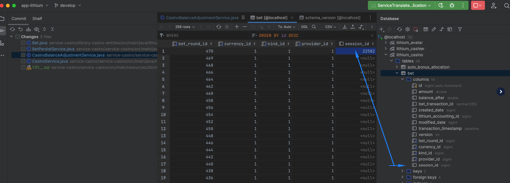

= LSPLAT-10251 PLAT-11354 - As an insights team, to be able to join each casino sportsbook cashier transaction to login_event
Irwin Herridge <irwin.herridge@wonderlabz.com>
1.0, January 9, 2023: LSPLAT-10251 PLAT-11354 - As a insights team, to be able to join each casino sportsbook cashier transaction to login_event
:sectnums:
:toc: left
:toclevels: 4
:toc-title: Table of contents
:icons: font
:url-quickref: https://docs.asciidoctor.org/asciidoc/latest/syntax-quick-reference/
:table-caption!:

:erd-include: ../includes/erd.puml
:seq-include: ../includes/sequence.puml

:svc-user-sourcedir: ../../service-user/service-user/src/main/java

//This is done to keep formatting aligned with gitlab
****
[verse,,]
____
link:../../readme.adoc[Home]
____
****

== Description
=== Jira
* link:https://playsafe.atlassian.net/browse/LSPLAT-10251[LSPLAT-10251]
* link:https://livescoregroup.atlassian.net/browse/PLAT-11354[PLAT-11354]

=== Gitlab
* Branch: origin/feature/LSPLAT-10251_PLAT-11354_session_id_tie_back_on_all_cashier_casino_sportsbook_transactions
* MR: link:https://gitlab.com/playsafe/lithium/app-lithium-full/-/merge_requests/6168[]

=== External Dependencies
==== Swagger (To be completed *before* development starts)
* Short description of swagger changes that will be required.
* TL to facilitate timeline and communication to GW/FE for the changes.

N/A

==== DWH
* Short description of any changes that would need to be communicated/discussed with DWH.
* TL to facilitate.

See Architecture for references on how to link transactions back to `login_event`/`session_id`

==== Other
* Any other external providers that might need consideration. e.g. eXtremePush/Roxor

N/A

=== Business

As a sportsbook/casino and finance data team

We need to be able to join back every transaction, sports bet, casino bet, deposit, withdrawal etc. back to the session

== Architecture

The following outlines how to map the players session back to the actual transaction for sports bet, casino bet, deposit and withdrawals.

Note that the session_id has already been implemented for Sportsbook Bet and Cashier, and it is only Casino Bet that is outstanding in this work package.

Note that the session ID was already persisted as part of the accounting transactiosn label values; but as a result this was not performant for DWH to extract the device information for each sport, casino or cashier transactions in their respective data store tables. Therefore, to allow for a more performant DWH, it is neccesary to also store the session ID on each of the casino, sportsbook or cashier DB schemas.

=== Cashier

For each withdrawal and deposit, the session ID is being stored as part of `lithium_cashier.transaction.session_id`

=== Sports Bet

For each Sports Bet, the session ID is being stored as part of `lithium_casino_sportsbook.reservation.session_id`

=== Casino Bet

This is the only gap that was found on Lithium where the session ID was not being persissted except for the actual accounting transaction.

* Add a new column to `lithium_casino.bet` called `session_id`
* You will see that the session_id is already being passed on the balance adjust, and you will need to now ensure that the session_id is persisted along with the `bet` that is being created on `lithium_casino`.
** All casino bets from the various casino providers will also create a bet record on `lithium_casino`; and therefore no need to store on the providers also (except for sportsbook that is already implemented on the provider itself. It might be split out into its own service in the future.)

TIP: the code to implement the session ID for Casino Bet has also been provided as part of this TA, it is the developers responsibility to test and provide a demo on submission of this MR containing this TA. See image below that was done as sanity check on the code provided

