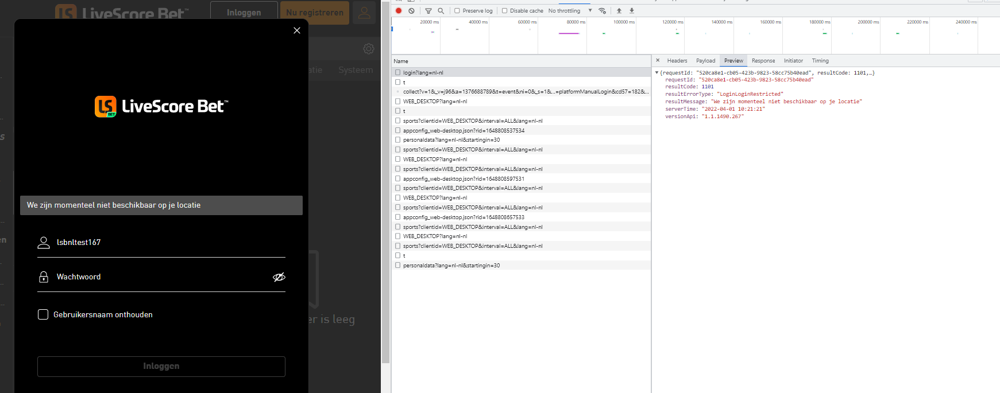

= LSPLAT-5387 PLAT-6094 ⁃ whitelisted players unable to login on livescore_nl domain
Irwin Herridge <irwin.herridge@wonderlabz.com>
1.0, June 6, 2022:: TA - LSPLAT-5387 PLAT-6094 ⁃ whitelisted players unable to login on livescore_nl domain
:toc: left
:toclevels: 4
:toc-title: LSPLAT-5387 PLAT-6094
:icons: font
:url-quickref: https://docs.asciidoctor.org/asciidoc/latest/syntax-quick-reference/

== Information
=== Tickets
* https://jira.livescore.com/browse/PLAT-6094
* https://playsafe.atlassian.net/browse/LSPLAT-5387

=== Dependencies
* N/A

=== MR
* https://gitlab.com/playsafe/lithium/app-lithium-full/-/merge_requests/4959
* This MR contains the branch that should be used to complete this task!

== Description (From Ticket)

It seems there is sportsbook GW logic that is preventing the lithium access control rules from effectively handling whitelisted players to bypass geolocation restrictions.

Please investigate and discuss with the relevant teams how login whitelisting can be achieved in consistent way (i.e. lithium should lead other components).

User for reference:

lsbnltest167/123123

== Architecture

=== Background

[cols="3,8a"]
|===
|Login Access Rule Type |Responsibility

|Pre Login Access Control Rules
|The primary responsibility of a pre-login access control ruleset is to allow for pre user validation checks to be performed on users who have not yet been identified as valid and authenticated lithium users yet.

These pre-login access rule checks excludes any kind of external provider rules and is therefore limited to only performing Access Control Rule sets that performs Access Control List checks that does not require any user checks, such as with those requiring:

* IP checks,
* Geolocation checks based on the IP the user logs in from,
* Device checks based on the User Agent to derive the Browser and OS used by the player

Important to take note here is that no external provider checks to be performed in the current state of pre-login access rule checks, or before we have authenticated the user prior to external provider rule checks; due to the nature of ddos attacks that we have experienced before (PLAT-5075) where access rules were being invoked excessively resulting in the degradation of service-access finally causing logins to fail even for valid players.

Prior to this ticket, `ListType.PLAYER_LIST` and `ListType.DUPLICATE_CHECK` would not work on pre-login access rules due to the user not being resolved on pre-login access rules; as a result of this TA, any `ListType.PLAYER_LIST` rules will now be allowed to be used on pre-login access rules, and should therefore no longer fail to execute.

|Post Login Access Control Rules
|Other than pre-login access rule checks, with post login access rule checks all pre-login rules can be performed as well as any rules that requires a user to have been authenticated prior to performing post login access rules which includes:

* Internal Access Control List rules
* External Access Provider rules

It is therefore recommended to strip out any Internal Access Control List rule checks from our Post Login Access Ruleset configurations that does not require any user validations; therefore excluding any geolocation, device and IP checks from post login access ruleset configurations.

|===

=== Technical

. In order for us not to add any additional resource constraints on domains that does not include any access control ruleset checks to validate whether a player has been whitelisted to log in to a particular domain; *a few minor changes is needed to be made to rather have a player guid resolved as and when a PLAYER_LIST access control list ruleset is being performed*.
* As part of `UserProviderController#preLoginCheck`, pre-build a userGuid by making use of the domainName and username/email/cellphoneNumber that was provided as part of the login request parameters to be build as domainName/uniqueIdentifier.
** Take note that we will later need to split the pre-built userGuid and have a userGuid lookup done on it that would try and resolve the proper userGuid (e.g. domainName/userId since ID GUID strategy is used) as we would in our login flow by checking the username combination which could be in the form of domainName/username or domainName/email or domainName/cellphoneNumber
* Modify `UserProviderController#preLoginCheck` to have your pre-built userGuid now passed in on the `accessService.checkAuthorization` method call that goes to service-access. This will allow us with access to the userGuid that was provided from the `preLoginCheck` when we get to the part where we do `AuthorizationService#doInternalAuthorization` as part of the access ruleset execution flow.
* Now all we need to do is have the proper userGuid resolved whenever a `ListType.PLAYER_LIST` internal access control list rule is being executed before checking whether the userGuid is found as a value on the actual access control list.
** Create a new service-user system endpoint that can be called from service-access to try and resolve a user by domainName/username and then domainName/email and then domainName/cellphoneNumber. It should make use of `UserService#findByUsernameThenEmailThenCell`
*** Should the user not be resolved from your system endpoint, then you will use the `authorizationRequest.getUserGuid()` that was passed in originally to see if it is found on the access control list (*This will ensure that this rule can be used on both pre- and post-login access control rules*)
*** else, make use of the resolved userGuid instead of `authorizationRequest.getUserGuid()` that was passed in on `accessService.checkAuthorization`

