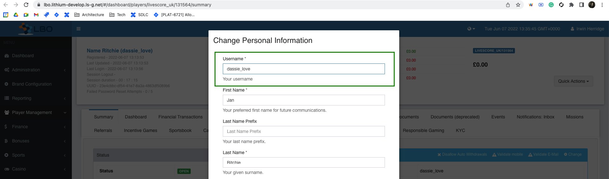

= LSPLAT-5562 PLAT-6269 ⁃ [LBO] Allow user to change username
Irwin Herridge <irwin.herridge@wonderlabz.com>
1.0, June 7, 2022:: TA - LSPLAT-5562 PLAT-6269 ⁃ [LBO] Allow user to change username
:toc: left
:toclevels: 4
:toc-title: LSPLAT-5562 PLAT-6269
:icons: font
:url-quickref: https://docs.asciidoctor.org/asciidoc/latest/syntax-quick-reference/

== Information
=== Tickets
* https://jira.livescore.com/browse/PLAT-6269
* https://playsafe.atlassian.net/browse/LSPLAT-5562

=== Dependencies
* N/A

=== MR
* https://gitlab.com/playsafe/lithium/app-lithium-full/-/merge_requests/4973
* This MR contains the branch that should be used to complete this task!

== Description (From Ticket)
=== Business

Cannot change the username on the account from LBO but can change all other PI.

Want to give the ability for select users to change a user's username within LBO from the change personal information page

==== Technical

* Add username field to the change personal information page
* Add username to the top of the field
* Grey out the box/make it not selectable to LBO users without permission (how does it look now?)
* When making a change and when hitting save, LBO must do a uniqueness check against the ecosystem to check if other account has this username to not create duplicates

== Architecture

=== Background

As input into this Architecture, one must fist understand how the ecosystem sync functions.

There are two mechanics that allows us to keep personal information synced between two registered users on lithium_user described as follows:
|===
|Order of Sync |Sync Type

|email
|The email address of a player is the primary unique ecosystem identifier within an ecosystem and any player who tries to register with an email that already exist within an ecosystem should not be allowed to have their account created.

|`UserLinkTypes.CROSS_DOMAIN_LINK`
|As a secondary link, whenever a player is registered within an ecosystem either via the UUID betting user registration or automatic media user registration, a CROSS_DOMAIN_LINK user link is added to both betting and media users that may be used in the event to maintain syncing where the ecosystem link is broken due to the player changing their email on one of the ecosystem linked accounts. This link therefore ensures that the email change is also affected and that the primary syncing mechanism remains in tack.
|===

It is therefore critical that all new ecosystem domains need to be added to an ecosystem first before any user registrations, to avoid any inconsistencies in the ecosystem; such as having multiple betting domains registed for the same user withing the same ecosystem.

Our registration flow has built in uniqueness checks as follows:

|===
|Status Code |Description

|431
|The player already has an account in the ecosystem and should log in using their existing credentials.

|432
|The player already has an account in the ecosystem and has an account on another mutually exclusive domain.
|===

Not having a new domain added to the ecosystem before registering users would simply by-pass the uniqueness checks mentioned above; and as part of a future state of adding nigeria to the ecosystem would require some staging area to be built that would allow us to flag any user who violates these ecosystem rules before allowing a domain to be added into an ecosystem.

=== Overview

As a result of the script that was used to pre-create NL test users on livescore_nl; the ecosystem was unfortunately not yet activated on livescore_nl or in other words, livescore_nl was not included initially as part of the same ecosystem configuration in which UK and IE brands are configured for. Therefore, as a result, the ecosystem uniqueness checks was bypassed and was not picked up during the NL test account creation and are now causing some form of frastration to our test comminity who now have multiple betting domains essentially inside the same ecosystem.

Therefore, as mitigation we will need to solve this in two steps:

. Split the multi-betting domain users within the same ecosystem into distinct unique ecosystem users (email change) based on the ecosystem unique identifier being their email address.
. Allow for a new special role to be created that can be assigned to admin users who will be allowed to update usernames on request.
* Note that usernames may also not be duplicated within any particular domain (Status 431), and therefore will need to include checks within an ecosystem on username change that would not allow a username on media user for one betting domain to be the same for another media user on a different betting domain

We could essentially do step 1 before the functionality for step 2 has been built, and have a communication send to the test comminity to not use their username for login until we have built a username change function and instead make use of the email for login which is the recommended form of user log in to an ecosystem.

=== Technical

==== Step 1

. In order to fix this, accounts that was created prior to NL being added to the livescore_ecosystem will need to be identified and have their emails changed to include aliases such as +NL or +UK, etc. e.g. from irwin.herridge@wonderlabz.com for NL account to be irwin.herridge+NL@wonderlabz.com.
[source,sql]
SELECT COUNT(u.email), u.email
         FROM user as u
         INNER JOIN domain d on u.domain_id = d.id
WHERE d.name != 'livescore_media'
AND (d.name = 'livescore_uk' OR d.name = 'livescore_nl' OR d.name = 'livescore_ie')
GROUP BY u.email
HAVING COUNT(u.email) > 1
ORDER BY COUNT(u.email) DESC; #Should be around 104 test users found

* This will ensure that our ecosystem syncing no longer syncs from the one betting domain user to the other betting domain user; therefore breaking the link on email syncing, and since these users was registerd outside the ecosystem (before it was added to the ecosystem), they would not have the secondary CROSS_DOMAIN_LINK which gets automatically linked on auto-media registration whilst registering a betting domain user.

==== Step 2

* Add username to the top of the field on _LBO -> Player Info -> Change Personal Information_ that is only updatable whenever a new role called `PLAYER_USERNAME_EDIT` is added onto a CS user's profile.
** Grey out the box/make it not selectable to LBO users without permission
** Add a new role under "Player Operations". See `UserModuleInfo#UserModuleInfo`

    addRole(Role.builder().category(playerCategory).name("Player Username Update").role("PLAYER_USERNAME_EDIT").description("Edit Player Username").build());

* When making a username change and when hitting save, LBO must do a uniqueness check against the ecosystem to check if other account has this username to not create duplicates. See `SignupService#ecosystemPreRegistrationValidation` or more specifically `userService.isUniqueUsername with domainOnly=false`

* As a safeguard to changing the username in the event that Lithium has been configured with a `UserGuidStrategy.USERNAME`; disallow any username updates on _LBO -> Player Info -> Change Personal Information_
** Provide an appropriate exception message from the backend whenever a user tries to update the username whilst the UserGuid strategy is in configured for username instead of id. e.g. "Username changes is not permitted due to a username userGuid Strategy being configured on your lithium instance, please contact your system administrator."

* In addition to the safegaurd being put in place to avoid username changes where the guid strategy is set to username, please also update our default from `UserGuidStrategy.USERNAME` to `UserGuidStrategy.ID` in `LithiumServiceApplication` (Line 201)

    GUID_STRATEGY = env.getProperty("lithium.services.user.guid-strategy", UserGuidStrategy.class, UserGuidStrategy.ID);

IMPORTANT:  As a result of making this change, all local developer environments will be slightly affected since they would have started up their local environments in username userGuid strategy mode. Therefore, as part of your request to merge your code changes into the develop branch, a communication needs to be sent out to all devs to take note of this change. Their environment will not be greatly affected except mostly for historical references to the user by userGuid from other microservices; e.g. your accounting history, casino history, limits, etc.

=== Technical Debt

. Create a technical debt ticket to have the username userGuid strategy completely removed from our Lithium systems.

