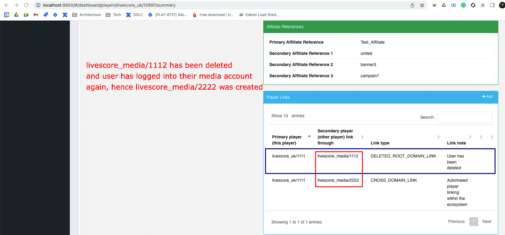

= LSPLAT-6028 PLAT-6736 ⁃ Allow FE user to delete their LSM account
Irwin Herridge <irwin.herridge@wonderlabz.com>
1.0, July 5, 2022:: TA - LSPLAT-6028 PLAT-6736 ⁃ Allow FE user to delete their LSM account
:toc: left
:toclevels: 4
:toc-title: LSPLAT-6028 PLAT-6736
:icons: font
:url-quickref: https://docs.asciidoctor.org/asciidoc/latest/syntax-quick-reference/

== Information
=== Tickets
* https://jira.livescore.com/browse/PLAT-6736
* https://playsafe.atlassian.net/browse/LSPLAT-6028

=== Dependencies
* N/A

=== MR
* TBA
* This MR contains the branch that should be used to complete this task!

== Description (From Ticket)

=== Business

iOS's guidelines indicate we need to add ability for user to delete their account from the front end.
We have account closure but don't let LSM users delete account.
We don't let LSM users decouple their linked LSM and LSB account to remove the one they don't want.
LSM user can create an account with the same details as before after account deletion.
Logical

==== Phase 1

An LSM user can go into account settings and select account delete.
a user will be immediately logged out and the login token deleted
Their account is unlinked from their LSB account if applicable
Their LSM account deleted from the DB including email, marketing preference and any other details
Acceptance criteria

A user must be able to easily access an account deletion option from LSM
A user must be logged out immediately
A user must be told their account has been deleted (FE message/email)
User details must be deleted ASAP
Linked LSM/LSB accounts must be decoupled
Account deletion has a confirmation, so it is not done by accident

=== iOS guidelines

As a reminder, apps that support account creation must let users initiate deletion of their account within the app starting June 30, 2022.

https://developer.apple.com/news/?id=12m75xbj#:~:text=The%20account%20deletion%20option%20should,disable%20or%20deactivate%20an%20account.

The account deletion option should be easy to find in your app.
It’s insufficient to only provide the ability to temporarily disable or deactivate an account. People should be able to delete the account along with their personal data.
Apps in highly-regulated industries may provide additional customer service flows to confirm and facilitate the account deletion process.

Doc with questions for legal and other stakeholders

https://docs.google.com/document/d/15Hryg9vQk2Sntq6sJzZ-KnZT0xmL1vX4eTLcFCGqoYg/edit#

== Architecture

=== Background

As input into this Architecture, one must first understand a few ecosystem definitions and how the ecosystem sync function works.

Ecosystem Relationship Types
|===
|Type | Business lingual | Usage

| ECOSYSTEM_ROOT
| Media domain
| Only one root domain may exist within an ecosystem configuration.

For any user registered on a mutually exclusive domain, a corresponding root user will be auto-registered and have personal information kept in sync between all users linked to each other within the same ecosystem.

The "media" user is mainly used to drive marketing and cross sales to the "betting" domain

| ECOSYSTEM_MUTUALLY_EXCLUSIVE
| Betting domain
| Only one mutually exclusive user may be registered within an ecosystem due to regulatory and compliance requirements.

| ECOSYSTEM_MEMBER
| Non-betting domain
| not in use today - TD to enable

|===

Two mechanics allow us to keep personal information synced between two registered users on lithium_user described as follows:
|===
|Level| Order of Sync |Sync Type

|1
|email
|The email address of a player is the primary unique ecosystem identifier within an ecosystem and any player who tries to register with an email that already exists within an ecosystem should not be allowed to have their account created.

|2
|`UserLinkTypes.CROSS_DOMAIN_LINK`
|As a secondary link, whenever a player is registered within an ecosystem either via the UUID betting user registration or automatic media user registration, a CROSS_DOMAIN_LINK user link is added to both betting and media users that may be used in the event to maintain syncing where the ecosystem link is broken due to the player changing their email on one of their ecosystem linked accounts. This link, therefore, ensures that the email change is also affected and that the primary syncing mechanism remains in tack.
|===

=== Technical

Now we will add one more link type called `UserLinkTypes.DELETED_ROOT_DOMAIN_LINK` to decouple a root from an exclusive domain relationship type.

`UserLinkTypes`:
[source,java]
  DELETED_ROOT_DOMAIN_LINK("DELETED_ROOT_DOMAIN_LINK", false, "Users who have deleted their root ecosystem domain user")

==== Delete Root User Flow

Endpoint to be used for delete: `/service-user/frontend/profile/delete` and may be done on `FrontendUserProfileDeleteController`

* token is used to resolve user
* only root domain users are allowed to be removed within an ecosystem

[plantuml]
----
@startuml
actor frontend
participant lithium

autonumber

frontend --> lithium++: login to root ecosystem user account
lithium -->> frontend--: token

|||

frontend --> lithium++: request to delete media account
alt user belongs to a root domain ecosystem relationship type
 lithium -> lithium: Log user out
 alt exclusive domain user exists
  lithium -> lithium: Remove CROSS_DOMAIN_LINK from the root user and its secondary exclusive domain user (inverse also)
  note right of lithium: User should now be delinked from Ecosystem level 2 syncing.
  lithium -> lithium: Add DELETED_ROOT_DOMAIN_LINK to root user and secondary exclusive domain user that was associated with the CROSS_DOMAIN_LINK before
 else only root domain user exist
  lithium -> lithium: Add DELETED_ROOT_DOMAIN_LINK to the root user and leave the secondary user on link null as it is not associated with any exclusive user.
 end
  lithium -> lithium: Remove all personal information from the user
  note right of lithium: The ecosystem sync will not sync when the users' email is changed to null as a result of delinking on ecosystem level 1 syncing.
 lithium -> lithium: Opt media player out of all comms and send account change pub-sub with PubSubEventType.ACCOUNT_DELETED
 lithium -> lithium: Send link change pub-sub message to DWH with new UserLinkType.DELETED_ROOT_DOMAIN_LINK
 lithium -> lithium: Trigger delete account email template to be sent out to the user
end

...<<Response codes>>...

alt Status code 200: OK
 lithium -->> frontend: message: User account has been successfully deleted | translated via error dictionary under "My Account"
else Status code 403: FORBIDDEN
 lithum -->> frontend: message: User delete is only allowed on root domains | translated via error dictionary under "My Account"
else Status code 500: INTERNAL SERVER ERROR
 lithum -->> frontend: message: Your account was not deleted due to an internal server error, please try again | translated via error dictionary under "My Account"
end
@enduml
----

==== Login

[plantuml]
----
@startuml
actor frontend
participant lithium

autonumber

frontend --> lithium++: login to root ecosystem user account
alt domain is a root ecosystem relationship type AND credentials match the exclusive user credentials AND user does not exist on root domain
 |||
 lithium -->> lithium++: auto root registration
 lithium -->> lithium--: implicit login
 |||
end
lithium -->> frontend--: user token

...<<Response codes>>...
alt Status code 200: OK
 lithium -->> frontend: media token is returned
else Status code 403: FORBIDDEN
 lithum -->> frontend: message: Invalid username or password. | translated via error dictionary under "Login"
 note right of lithium: Whenever a user tries to log into a root domain and the credentials are not matched with the exclusive users' credentials, then the root user will not be created)
@enduml
----

===== Pre-condition:
* Root domain user has never been registered before, or
* Root domain user has been deleted before (exclusive domain has DELETED_ROOT_DOMAIN_LINK active)

====== Post-condition:
* Root domain user token is returned on successful login
** If the root domain user does not exist, a new root user is created

WARNING: If the root domain user was deleted before, a new root user must be created on login; therefore when viewing the exclusive user, both a CROSS_DOMAIN_LINK to the new root domain user and one or many DELETED_ROOT_DOMAIN_LINK will exist to the old root domain user(s)

IMPORTANT: Whenever a user tries to log into a root domain and the credentials are not matched with the exclusive users' credentials, then the root user will not be created

==== Viewing deleted root domain users

Viewing and searching of deleted root domain users should not be allowed; the only place where you may be able to see if there were any previously deleted root users will be under the *LBO -> Personal Info -> Player Links Section*

IMPORTANT: As with the CROSS_DOMAIN_LINK, DELETED_ROOT_DOMAIN_LINK should also not be allowed to be removed from LBO.

==== Adding a timestamp on user_link table

* Finally, add a new `timestamp` column on the `user_link` table with a `@PrePersist` entity method on `UserLink` that will update the timestamp to the execution date whenever a user_link is created or updated.

==== Sending a pub sub-message to DWH on account deletion

On account deletion a UserLinkType.DELETED_ROOT_DOMAIN_LINK will be added onto the root ecosystem domain user and as part of this, a user link pub sub-message will be sent to DWH which may be used to initiate the removal of all personal information from their side.

On removal of the user's personal information from the user, we also need to opt the root user's marketing preferences out and have a new PubSubEventType.ACCOUNT_DELETED pub-sub account change message sent to DWH; which would automatically have the user details updated to nulls.

DWH also has access to cloud SQL and may query the lithium_user.user_link table for any root deletion links being added to a root account.
