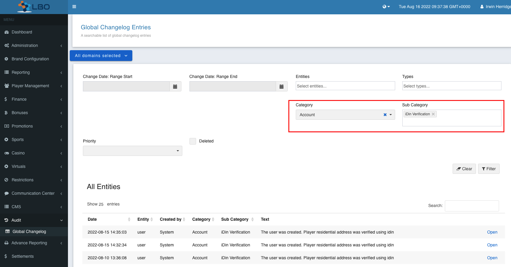
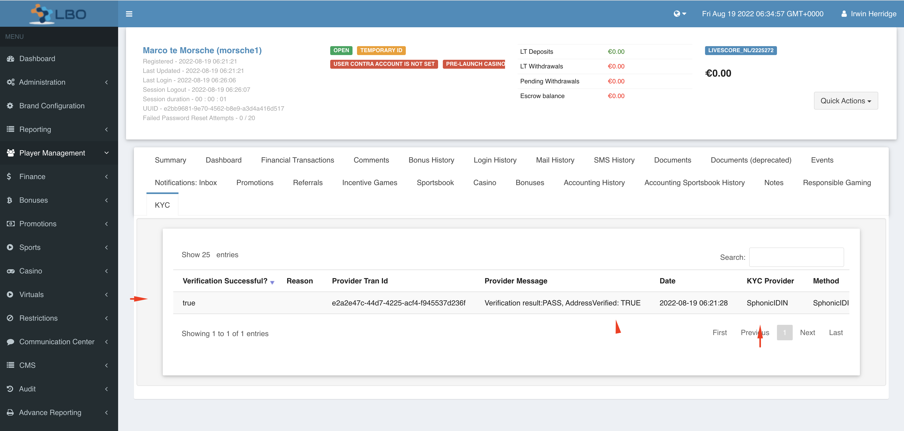

= iDin Refactoring: Remove tightly coupled iDin flows from service-user
Irwin Herridge <irwin.herridge@wonderlabz.com>
2.0, August 11 , 2022: LSPLAT-6307 PLAT-7076
:sectnums:
:toc: left
:toclevels: 4
:toc-title: Table of Contents
:icons: font
:url-quickref: https://docs.asciidoctor.org/asciidoc/latest/syntax-quick-reference/
:table-caption!:

//This is done to keep formatting aligned with gitlab
****
[verse,,]
____
link:../../readme.adoc[Home]
____
****

== Description
=== Jira
* link:https://playsafe.atlassian.net/browse/LSPLAT-6307[LSPLAT-6307]
* link:https://jira.livescore.com/browse/PLAT-7076[PLAT-7076]

=== Gitlab
* Branch: origin/feature/LSPLAT-6307_iDin_refactor
* MR: link:https://gitlab.com/playsafe/lithium/app-lithium-full/-/merge_requests/TBA[]
* Dependencies: MR: link:https://gitlab.com/playsafe/lithium/app-lithium-full/-/merge_requests/5443[]

=== External Dependencies
==== Swagger
IMPORTANT: To be completed *before* development starts

TIP: TL to facilitate timeline and communication to GW/FE for the changes.

. POST `/service-user/players/{domainName}/register/incomplete/v1`
** URI (path) change
*** OLD path name: `/service-user/players/{domainName}/register/incomplete/v1` (Create GW ticket to move to new endpoint path; backwards compatibility to be supported until this ticket is resolved. therefore two endpoints will exist)
*** *NEW* path name: `/service-user/*frontend*/players/{domainName}/register/incomplete/v1`
** Create a new IncompleteUserBasic that only shows fields currently being used on incomplete user flow
*** iDin Incomplete User Registration - Stage 1
[source,json]
----
{
    "stage": 1,
    "additionalData": {
        "iDinReturnUrl": "{{returnUrl}}",
        "playerIpAddress": "{{playerIpAddress}}"
    }
}
----
*** iDin Incomplete User Registration - Stage 2
[source,json]
----
{
    "stage": 2,
    "additionalData": {
        "iDinApplicantHash": "{{iDinApplicantHash}}"
    }
}
----

==== DWH
TIP: TL to facilitate timeline and communication to DWH for the changes.

* On iDin address verification update, an ACCOUNT_UPDATE pub-sub message will be triggered indicating that the addressVerified flag has been updated
* On final registration, when the user was address verified by IDIN, the KYC table will be updated with the players address that was provided from IDIN with KYC Provider type indicating that the address was verified by IDIN. This is useful for the insights team to draw stats from the number of registrations following IDIN amongst others.

==== Other
* Any other external providers that might need consideration. e.g. eXtremePush/Roxor

=== Business

Technical debt from PLAT-4383

Currently, our registration flow on service-user has been tightly coupled with service-user-provider-sphonic-idin and will need to relook at how best to separate the flow by use of checking if a user is registering from an incomplete user journey and then call out to the provider by use of checking which provider has been configured on the domain the user tries to register at.

Acceptance criteria:

* service-user should not be aware of service-user-provider-sphonic-idin. Instead, it should have generic flows that rather look at which provider has been configured, calling endpoints on the provider.
* Changelogs should be more generic, and we should not tightly couple idin to our normal registration flow.

Both Incomplete User Flow & User Registration Flow needs to be re-looked at and have the plantuml updated accordingly

== Architecture

=== Register with iDin Sequence Diagram (end-to-end)

include::../plantuml/overview.service-user-provider-sphonic-idin-step1.puml[]

include::../plantuml/overview.service-user-provider-sphonic-idin-step2.puml[]

include::../plantuml/overview.service-user-provider-sphonic-idin-step3.puml[]

include::../plantuml/overview.service-user-provider-sphonic-idin-step4.puml[]

=== Remove tight coupling on iDinApplicantHash from registration endpoint

IMPORTANT: Backwards compatibility needs to be supported on Lithium with regard to the property name called iDinApplicantHash as future registration providers could have different applicantHash'es. We should instead resolve a label where the PlayerBasic.additionalData.key.lowercase.contains applicantHash e.g. `playerBasic.getAdditionalData().keySet().stream().filter(key -> key.toLowerCase().contains("applicantHash".toLowerCase())).findFirst().orElse(null)`

This will remove the tight coupling on service user for incomplete user flow lookups

=== Create new IncompleteUserBasic object

Update swagger request object for incomplete user flow (see swagger changes in 1.3.1)

The PlayerBasic is confusing the subject for frontend api implementors on incomplete user flow, as it is convoluted with the final registration endpoint fields. (When we need to expand on the Incomplete User flow, then those implementations can extend on the allowed request fields)

* Change the ingress on /register/incomplete/v1 to make use of the new IncompleteUserBasic as per swagger changes mentioned in 1.3.1.2

=== Post Incomplete User Registration steps

Lessons learned from the current implementation of iDin on the account creation journey is not being able to easily identify whether a player has been address verified via iDin unless you view the players notes or by use of the global changelog.

The following section will look at decoupling the IDIN address verified checks from service-user and have it done from service-user-provider-sphonic-idin and have a record inserted into the KYC table on LBO to have insights easily track the number of IDIN registered players. Instead of checking whether an incomplete user has had an address saved and associated to it, a better way would be to set an address_verified flag on the idin applicant which can be queried as part of a post incomplete user step to mark a user as address verified along with the kyc table entry and changelog note.

===== lithium_user ERD

include::../plantuml/lithium-user-erd.puml[]

===== lithium_user_pr_sphonic_idin ERD

include::../../service-user-provider-sphonic-idin/docs/plantuml/sphonic-idin-erd.puml[]

. Add a new `address_verified` column to the `lithium_user_pr_sphonic_idin.user` table with default *false*, that needs to be updated to *true* whenever the `SphonicResponse.data.addressData` contains a `houseNumber`, `street`, `city`, `postalCode` and a `countryCode` (These fields can be made configurable via a provider settings comma seperated e.g. DomainSettings.IDIN_MIN_ADDRESS_VERIFIED_REQUIRED_FIELDS = "houseNumber, street, city, countryCode" if needed, but not required as part of this architecture).

. Remove SignupService#isAddressVerified
* All users will first be registered as `lithium_user.user.address_verified` = false with later checks downstream to update `address_verified` by use of post registration steps that requires the user to have been created already.
* Instead of convoluting the to-be-removed `SignupService#isAddressVerified` method with preconditions on whether an incomplete user flow has been completed or not; instead call the `SignupService#incompleteUserRegistrationChecks` (see TA on PLAT-7130) which will internally call SignupService#getIncompleteUser, then
** instead of hardcoding the idin stage checks into service-user, rather create a new system endpoint that will be called to the configured register provider to check if incomplete user flow has been completed or not, and then throw the Status463IncompleteUserRegistrationException when stage 2 has not been completed, ensuring that "incomplete" incomplete users are not able to register unless "completed" the incomplete user flow (_in short: the configured provider needs to drive the steps that is performed by the incomplete user flows_)
** POST `/{module-name}/system/validate-pre-registration` where in this instance module-name is service-user-provider-sphonic-idin

Request body:
[source,json]
----
{
  "applicantHash": "**applicantHash**",
  "userGuid": "domainName/id"
}
----
Response body:
[source,json]
----
{
  "registrationAllowed": "false",
  "lastStageCompleted": 1
}
----
Response body:
[source,json]
----
{
  "registrationAllowed": "true",
  "lastStageCompleted": 2
}
----

[start=3]
. Extend on the new system endpoint that was created as part of https://gitlab.com/playsafe/lithium/app-lithium-full/-/merge_requests/5443[LSPLAT-6361 PLAT-7130] which is being called from within SignupService#postRegistrationIncompleteUser (to-be implemented on PLAT-7130)
* POST `/service-user-provider-sphonic-idin/system/do-post-registration-steps`
** Request body:
[source,json]
----
{
  "applicantHash": "**applicantHash**",
  "userId": 1234,
  "userGuid": "livescore_nl/1234"
}
----

* On ingress of the `/do-post-registration-steps` endpoint, retrieve the applicantHash and check internally if the incomplete user flow has been completed (reusing service method created for `/validate-pre-registration` in step 2),
* If the pre-registration steps has not been completed (registrationAllowed=false) throw  a Status463IncompleteUserRegistrationException
* If registrationAllowed, then do the following:
** Check if user.address_verified = true
*** If the address was verified by idin; call a new system endpoint discribed next, that will be used to update the address verified flag on `lithium_user.user.address_verified`.
**** POST `/service-user/system/user/set-address-verified`
***** Request body: (_Note the request object also has the changelog details abstracted_)
[source,json]
----
{
  "userGuid": "domainName/id",
  "category": "ACCOUNT",
  "subCategory": "IDIN_VERIFICATION",
  "comment": "Changelog comment"
}
----

[start=4]
. After updating the address verified flag on service-user for address verified users, also do an async call to service-kyc to persist the verified address data and provider used to verify the address that may be used by the insights team to get stats on players following the IDIN register flow vs those that was not verified on IDIN.
* POST `/service-kyc/system/result/save`

TIP: Schedule a session with ePayments team if needed to discuss proper data mapping to this system endpoint

[start=5]
. Finally, doing the stage 2 Sphonic response changelog note that should be implemented in https://gitlab.com/playsafe/lithium/app-lithium-full/-/merge_requests/5443[LSPLAT-6361 PLAT-7130] (hence the dependency on this MR)

=== Address JPA cascading issue on delete incomplete user flow

See comment here: `IncompleteUserService#delete`

`// FIXME: JPA cascading seem to be causing a problem during deletion, so the code below needs to be relooked at and allow deletion through id`

* Moving forward, the applicantHash will be the true identifier for all incomplete user flows; therefore deleting by id can be removed. We should anyhow not be deleting with cascading enabled. All foreign reference deletions should be handled in code.
