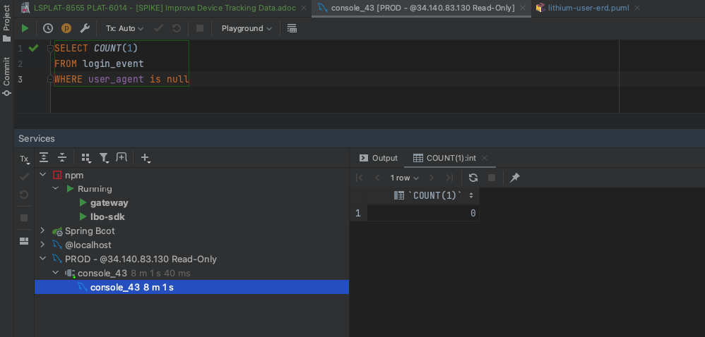

= LSPLAT-8555 PLAT-6014 - [SPIKE] Improve Device Tracking Data
Irwin Herridge <irwin.herridge@wonderlabz.com>
1.0, November 2, 2022: [SPIKE] Improve Device Tracking Data
:sectnums:
:toc: left
:toclevels: 4
:toc-title: Table of contents
:icons: font
:url-quickref: https://docs.asciidoctor.org/asciidoc/latest/syntax-quick-reference/
:table-caption!:

//This is done to keep formatting aligned with gitlab
****
[verse,,]
____
link:../../readme.adoc[Home]
____
****

== Description
=== Jira
* link:https://playsafe.atlassian.net/browse/LSPLAT-8555[LSPLAT-8555]
* link:https://jira.livescore.com/browse/PLAT-6014[PLAT-6014]

=== Gitlab
* Branch: origin/feature/LSPLAT-8555-6014-awesome_new_feauture
* MR: link:https://gitlab.com/playsafe/lithium/app-lithium-full/-/merge_requests/TBA[]

=== External Dependencies
==== Swagger (To be completed *before* development starts)
* Short description of swagger changes that will be required.
* TL to facilitate timeline and communication to GW/FE for the changes.

TIP: N/A - No swagger changes needed as part of this ticket

==== DWH
* Short description of any changes that would need to be communicated/discussed with DWH.
* TL to facilitate.

TIP: See data structure on Option 2 (Section 2.5.2)

==== Other
* Any other external providers that might need consideration. e.g. eXtremePush/Roxor

TIP: N/A - No external providers impacted by this ticket.

==== MR Dependencies

. https://gitlab.com/playsafe/lithium/app-lithium-full/-/merge_requests/5892
* A migration job to migrate the user_agent from the first login_event for all successfull signup_events

=== Business

We need to be able to join back every transaction, sports bet, casino bet, deposit, withdrawal etc back with the following device information:

*Must have*

. Device Platform - native app vs desktop vs mobile web
. OS - to be able to split native app by ios/android
. Browser - if mobile web/desktop what browser are they using

*Nice to have*

. App version - if on native app what app version are they using
. Browser version - what version of the browser are they using?
. Device name - what is the device? iphon8/9/10, samsung s10 etc

Stopping us from being able to track device convergence journeys, properly report on regulatory tax reasons in NG

PS still seeing some issues with ACME device on login data for LSBNG brand

Also include pubsub changes temporarily made on https://jira.livescore.com/browse/PLAT-7763

== Technical Spike Analysis

=== Spike goals

The main reason for this Spike on the User Agent is to understand the following:

. Whether there is any quick wins that we can have implemented that would eleviate the conern raised by DWH that some device tracking information are missing on some user agents used on registration.
* Due to the current user-agent-utils being outdated and at EOL (End of Life)
. How best to reduce the size of the `login_event` table by possily normalizing the current data that is duplicating the browser and os names on each and every row entry.
. See if we could improve our new device tracking information to allow insights to properly track convergence journeys and properly report on regulatory tax reasons in NG.
* Nice to have would be to have the historical signup_events re-avaluated if the current data allows for it.
. Look at how best to structure our user-agent implementation to allow for future replacement of a paid library; and even being able to run the libraries in parralel
. To be able to log the app version that is being used on native apps as part of the user-agent

TIP: See last section on Spike for Summary

=== Upgrading the User Agent Library

==== Target State Conceptual Component Decomposition

.User Agent Conceptual Architecture
[plantuml]
----
@startuml
'https://plantuml.com/component-diagram


skinparam componentStyle uml1

    package "Lithium" {
        component [svc-useragent] #lightblue
        component [svc-useragent-provider-internal] #lightblue
        component [svc-useragent-provider-external1] #yellow

        [server-oauth2] -(0- [svc-user]
        [svc-user] -(0- [svc-useragent]
        [svc-useragent] -(0- [svc-useragent-provider-internal]
        [svc-useragent] -(0- [svc-useragent-provider-external1]
    }

note right of [frontend]
  FE will need to send the User-Agent header as part
  of the login and account creation API's to Lithium.
end note
[frontend] -(0- [server-oauth2]
note right of [server-oauth2]: login API
[frontend] -(0- [svc-user]
note right of [svc-user]: account creation API

@enduml
----

TIP: Legend: lightblue block = in scope for v1 upgrade & yellow = out of scope v2 paid user-agent library as an external service provider solution.

==== As-is User Agent library (End of Life)

Our current implementation makes use of https://www.bitwalker.eu/software/user-agent-utils[user-agent-utils] which is on EOL (End of Life) and DWH has expressed that some device tracking information is not always populated on the account changes pub sub messages and this can also be seen in the `signup_event` and `login_event` table.

An immidiate upgrade from `v1.20` to `v1.21` is available with only needing to update the version on the library which might help with some user agents not being detected; but cannot garauntee that all device tracking information will be available as the library is still on EOL.

In its current form, the user-agent-utils library is only able to provide us with the `OS` and `Browser` used, and we still would need to rely on the `providerAuthClient` derived from the clients basic authorization to identify which platform was used for registration and logins.

==== To-be Internal User Agent library

As a recommended library from user-agent-utils is to upgrade to using Browscap (See https://github.com/browscap/browscap/wiki/Using-Browscap[browscap wiki])

Source implementation: https://github.com/blueconic/browscap-java[browscap-java]
[source,xml]
----
<dependency>
    <groupId>com.blueconic</groupId>
    <artifactId>browscap-java</artifactId>
    <version>1.3.13</version>
</dependency>
----

===== Two options available regarding the User-Agent library upgrade:
- We can extract the browscap library into its own singleton service on svc-user with caching, or
- extract the library into its own signleton service running as a new microservice with
feign clients and client side caching

WARNING: Note that we need to run the library as a singleton, to avoid out-of-memmory issues, and
we also need to cache the User-Agent responses as querying the browscap will add to our response
times on login and registrations.

==== To-be External User Agent Library (paid)

We should design our user-agent implementation to allow for both an internal and external provider library, where the default would be to make use of an internal library to derive the user-agent; which we could then make use of as a baseline to validate any external user-agent libraries, possiby exposed as a paid service.

=== Normalizing the User-Agent datatables

In our current design, all user agent data is being stored as text strings on the
`lithium_user.login_events` and `lithium_user.signup_events` tables; which results in many
duplicated text values stored over hundreds of throusands of records.

---

Using browscap, can provide us with the browser, browserType, browserMajorVersion, deviceType, platform and platformVersion.

IMPORTANT: findOrCreate methods on browser, browserType, browserMajorVersion, deviceType, platform, platformVersion and userAgent needs to be created as part of the UserAgentService to reduce duplicationn on data.

=== Testing out browscap

[source,java]
----
package lithium.service.access.client;

import com.blueconic.browscap.Capabilities;
import com.blueconic.browscap.ParseException;
import com.blueconic.browscap.UserAgentParser;
import java.io.IOException;
import org.springframework.stereotype.Component;

@Component
public class UserAgentService {

  final UserAgentParser parser = new com.blueconic.browscap.UserAgentService().loadParser();

  public UserAgentService() throws IOException, ParseException {
  }

  public Capabilities parseUserAgent(String userAgent) {
    return parser.parse(userAgent);
  }
}
----

[source,java]
----
final Capabilities capabilities = userAgentService.parseUserAgent(userAgentString);
final String browser = capabilities.getBrowser();
final String browserType = capabilities.getBrowserType();
final String browserMajorVersion = capabilities.getBrowserMajorVersion();
final String deviceType = capabilities.getDeviceType();
final String platform = capabilities.getPlatform();
final String platformVersion = capabilities.getPlatformVersion();
----

.Example (capabilities.toString();)
[source]
----
CapabilitiesImpl [
    myValues= {
        BROWSER=Chrome,
        BROWSER_TYPE=Browser,
        BROWSER_MAJOR_VERSION=106,
        PLATFORM=macOS,
        PLATFORM_VERSION=10.15,
        DEVICE_TYPE=Desktop
    }
]
----

=== Proposed new ERD based on the new device tracking information

TIP: Not all ``login_event``'s and ``signup_event``'s will be linked to a user; only successful account creation and logins will be linked to a user.

Note that this ticket would need to be done in two steps:

. Adding the new normalised columns alongside the current device tracking columns on both `login_event` and `signup_event`
* This would include a migration job that would populate the new columns on both the `login_event` and `signup_event` by using the user_agent that is available. If the signup_event does not have the user_agent string available, then the browser and platform needs to be created from the data that is available on the signup_event.browser and signup_event.os columns.
. Remove the old columns after validating that the migration was done successfully and whether browscap is producing expected results.

WARNING: It might also be worthwhile to run the user-agent-utils and browscap in parralel on step 1; to assist in validating browscap (including a version bump on user-agent-utils from 1.20 to 1.21); which would allow for a easy switch back without loosing the state that we are currently in... i.e. having the old and new solution executed side by side, where each are also persisiting to their own db columns.

==== Option 1

Each login event and signup event will be linked to a new `user_agent` table and the `user_agent` table will have foreign keys on a new `platform` and `browser` table, that would store unique browser and platforms. Each user-agent should have a unique constraint on the user_agent string, browser_id and platform_id also, but browsers and platforms can be linked to many user_agents.

The downfall on this approach is that we will need to have a `user_agent` for each and every browser/platform that is not available currently on `signup_event` table prior to 18 October 2022.

.ERD Option 1
[plantuml]
----
@startuml
'https://plantuml.com/class-diagram

skinparam linetype ortho
!define T(name,desc) class name as "desc" << (T,#FFAAAA) >>

!define pk(x) <b>x</b>
!define fk(x) <color:purple><i>x</i></color>
!define unique(x) <color:green>x</color>
!define nn(x) <u>x</u>

T(user, "user\n Contains some users") {
  pk(id) bigint <<generated>>
  --
  fk(current_id): bigint
  fk(current_collection_data_rev_id): bigint
  fk(domain_id): bigint
  fk(postal_address_id): bigint
  fk(residential_address_id):  bigint
  fk(status_id): bigint
  fk(status_reason_id): bigint
  fk(last_login_id): bigint
  fk(user_api_token_id): bigint
'  TODO: Check if verifiation status has a table associated to it
  fk(verification_status): bigint
  --
  nn(unique(guid)): varchar(100)
  nn(created_date): datetime
  nn(updated_date): datetime
  nn(username): varchar(35)
  nn(test_account): bit default b'0'
  nn(deleted): bit
  external_username: varchar(35)
  email: varchar(255)
  deleted_email: varchar(255)
  cellphone_number: varchar(255)
  deleted_cellphone_number: varchar(255)
  telephone_number: varchar(255)
  deleted_telephone_number: varchar(255)
  first_name: varchar(35)
  last_name_prefix: varchar(255)
  last_name: varchar(35)
  gender: varchar(10)
  dob_year: int
  dob_month: int
  dob_day: int
  country_code: varchar(255)
  place_of_birth: varchar(255)
  social_security_number: varchar(15)
  timezone: varchar(255)
  comments: longtext
  password_plaintext: varchar(255)
  password_hash: varchar(255)
  password_updated: datetime
  password_updated_by: varchar(255)
  referrer_guid: varchar(255)
  age_verified: bit default b'0'
  address_verified: bit default b'0'
  email_validated: bit default b'0'
  cellphone_validated: bit default b'0'
  email_opt_out: bit default b'0'
  sms_opt_out: bit default b'0'
  call_opt_out: bit default b'0'
  post_opt_out: bit default b'0'
  promotions_opt_out: bit default b'0'
  push_opt_out: bit default b'0'
  leaderboard_opt_out: bit default b'0'
  comms_opt_in_complete: bit default b'0'
  excessive_failed_login_block: bit
  auto_withdrawal_allowed: bit
  failed_reset_count: int
  welcome_email_sent: bit default b'0'
  welcome_sms_sent: bit default b'0'
  has_self_excluded: bit
  bonus_code: varchar(20)
  protection_of_customer_funds_version: varchar(35)
  terms_and_conditions_version: varchar(35)
  version: int
}

T(domain, "domain\n Domains registered in the system") {
  pk(id) bigint <<generated>>
  --
  nn(unique(name)): varchar(255)
  version: int
}

T(login_event, "login_event\n Used to store login event details") {
    pk(id): bigint <<generated>>
    --
    fk(user_id): bigint
    fk(domain_id): bigint
    fk(user_agent_id): bigint
    --
    date: datetime(3)
    nn(ip_address): varchar(255)
    provider_auth_client: varchar(255)
    city: varchar(255)
    state: varchar(255)
    country: varchar(255)
    country_code: varchar(5)
    os: varchar(255)
    browser: varchar(255)
    user_agent: varchar(1000)
    internal: bit
    provider_name: varchar(255)
    provider_url: varchar(255)
    error_code: int
    logout: datetime(3)
    duration: bigint
    session_key: varchar(255)
    last_activity: datetime
    comment: varchar(255)
    nn(successful): bit
}

T(signup_event, "signup_event\n Used to store signup event details") {
    pk(id): bigint <<generated>>
    --
    fk(nn(domain_id)): bigint
    fk(user_id): bigint
    fk(user_agent_id): bigint
    --
    nn(date): datetime
    nn(ip_address): varchar(255)
    provider_auth_client: varchar(255)
    user_agent: varchar(1000)
    browser: varchar(255)
    os: varchar(255)
    city: varchar(255)
    state: varchar(255)
    country: varchar(255)
    country_code: varchar(5)
    comment: varchar(255)
    nn(successful): bit
}

T(user_agent , "user_agent\nUsed to store all user agent device info") #lightblue {
  pk(id): bigint <<generated>>
  --
  fk(platform_id): bigint
  fk(browser_id): bigint
  --
  nn(unique(user_agent)): varchar(1000)
  --
  constraint(user_agent)
}

T(platform, "platform\n Used to store all platforms") #lightblue {
  pk(id): bigint <<generated>>
  --
  platform: varchar(255)
  platform_major_version: varchar(20)
  device_type: varchar(255)
  app_name: varchar(255)
  app_version: varchar(255)
  --
  constraint(platform, platform_major_version, device_type, app_name, app_version)
}

T(browser, "browser\n Used to store all browsers") #lightblue {
  pk(id): bigint <<generated>>
  --
  browser: varchar(255)
  browser_type: varchar(255)
  browser_major_version: varchar(20)
  --
  constraint(browser, browser_type, browser_major_version)
}

user }o--|| domain
user |o--o{ login_event
user |o--o| signup_event
login_event |o--|| user_agent
signup_event |o--|| user_agent
user_agent |o--|| platform
user_agent |o--|| browser

@enduml
----

TIP: The app_name and app_version on platform table can also be extracted into its own table

==== Option 2 (Recommended)

Now that we have a better understanding of the data (_see section 3_), we will need to find a data model that supports historical data not being present on the `signup_event` table.

As part of PLAT-7912 (Custom sign up email LSM), a migration job will be executed which would migrate all user_agent strings from the first login_event if not already available on the signup_event table for a successful registration. (Note that this can only be done for successful registrations; the delta would still have nulls in the signup_event.user_agent column)

And since `login_event` and `signup_event` is similar in structure, the same structure can be adopted accross the two tables with a common goal being, to persist the data that is available without having a hard constraint of a signup_event having a user-agent also.

.ERD OPTION 2
[plantuml]
----
@startuml
'https://plantuml.com/class-diagram

skinparam linetype ortho
!define T(name,desc) class name as "desc" << (T,#FFAAAA) >>

!define pk(x) <b>x</b>
!define fk(x) <color:purple><i>x</i></color>
!define unique(x) <color:green>x</color>
!define nn(x) <u>x</u>

T(user, "user\n Contains some users") {
  pk(id) bigint <<generated>>
  --
  fk(current_id): bigint
  fk(current_collection_data_rev_id): bigint
  fk(domain_id): bigint
  fk(postal_address_id): bigint
  fk(residential_address_id):  bigint
  fk(status_id): bigint
  fk(status_reason_id): bigint
  fk(last_login_id): bigint
  fk(user_api_token_id): bigint
'  TODO: Check if verifiation status has a table associated to it
  fk(verification_status): bigint
  --
  nn(unique(guid)): varchar(100)
  nn(created_date): datetime
  nn(updated_date): datetime
  nn(username): varchar(35)
  nn(test_account): bit default b'0'
  nn(deleted): bit
  external_username: varchar(35)
  email: varchar(255)
  deleted_email: varchar(255)
  cellphone_number: varchar(255)
  deleted_cellphone_number: varchar(255)
  telephone_number: varchar(255)
  deleted_telephone_number: varchar(255)
  first_name: varchar(35)
  last_name_prefix: varchar(255)
  last_name: varchar(35)
  gender: varchar(10)
  dob_year: int
  dob_month: int
  dob_day: int
  country_code: varchar(255)
  place_of_birth: varchar(255)
  social_security_number: varchar(15)
  timezone: varchar(255)
  comments: longtext
  password_plaintext: varchar(255)
  password_hash: varchar(255)
  password_updated: datetime
  password_updated_by: varchar(255)
  referrer_guid: varchar(255)
  age_verified: bit default b'0'
  address_verified: bit default b'0'
  email_validated: bit default b'0'
  cellphone_validated: bit default b'0'
  email_opt_out: bit default b'0'
  sms_opt_out: bit default b'0'
  call_opt_out: bit default b'0'
  post_opt_out: bit default b'0'
  promotions_opt_out: bit default b'0'
  push_opt_out: bit default b'0'
  leaderboard_opt_out: bit default b'0'
  comms_opt_in_complete: bit default b'0'
  excessive_failed_login_block: bit
  auto_withdrawal_allowed: bit
  failed_reset_count: int
  welcome_email_sent: bit default b'0'
  welcome_sms_sent: bit default b'0'
  has_self_excluded: bit
  bonus_code: varchar(20)
  protection_of_customer_funds_version: varchar(35)
  terms_and_conditions_version: varchar(35)
  version: int
}

T(domain, "domain\n Domains registered in the system") {
  pk(id) bigint <<generated>>
  --
  nn(unique(name)): varchar(255)
  version: int
}

T(login_event, "login_event\n Used to store login event details") {
    pk(id): bigint <<generated>>
    --
    fk(user_id): bigint
    fk(domain_id): bigint
    fk(user_agent_id): bigint
    fk(browser_id): bigint
    fk(platform_id): bigint
    --
    date: datetime(3)
    nn(ip_address): varchar(255)
    provider_auth_client: varchar(255)
    city: varchar(255)
    state: varchar(255)
    country: varchar(255)
    country_code: varchar(5)
    os: varchar(255)
    browser: varchar(255)
    user_agent: varchar(1000)
    internal: bit
    provider_name: varchar(255)
    provider_url: varchar(255)
    error_code: int
    logout: datetime(3)
    duration: bigint
    session_key: varchar(255)
    last_activity: datetime
    comment: varchar(255)
    nn(successful): bit
}

T(signup_event, "signup_event\n Used to store signup event details") {
    pk(id): bigint <<generated>>
    --
    fk(nn(domain_id)): bigint
    fk(user_id): bigint
    fk(user_agent_id): bigint
    fk(browser_id): bigint
    fk(platform_id): bigint
    --
    nn(date): datetime
    nn(ip_address): varchar(255)
    provider_auth_client: varchar(255)
    user_agent: varchar(1000)
    browser: varchar(255)
    os: varchar(255)
    city: varchar(255)
    state: varchar(255)
    country: varchar(255)
    country_code: varchar(5)
    comment: varchar(255)
    nn(successful): bit
}

note right of user_agent
  Should a user_agent be resolved properly
  from a user-agent string, then the platform
  and browser must also be linked via foreign keys.

  If the user-agent string is not resolved, then the
  user agent still needs to be stored with the failed=true.
end note

T(user_agent, "user_agent\nUsed to store all user agent device info") #lightblue {
  pk(id): bigint <<generated>>
  --
  platform_id: bigint (nullable)
  browser_id: bigint (nullable)
  --
  nn(unique(user_agent)): varchar(1000)
  failed: bit default 0
  --
  constraint(user_agent)
}

T(platform, "platform\n Used to store all platforms") #lightblue {
  pk(id): bigint <<generated>>
  --
  platform: varchar(255)
  platform_major_version: varchar(20)
  device_type: varchar(255)
  app_name: varchar(255)
  app_version: varchar(255)
  --
  constraint(platform, platform_major_version, device_type, app_name, app_version)
}

T(browser, "browser\n Used to store all browsers") #lightblue {
  pk(id): bigint <<generated>>
  --
  browser: varchar(255)
  browser_type: varchar(255)
  browser_major_version: varchar(20)
  --
  constraint(browser, browser_type, browser_major_version)
}

user }o--|| domain
user |o--o{ login_event
user |o--o| signup_event
login_event |o--|| user_agent
login_event |o--|| platform
login_event |o--|| browser
signup_event |o--|| user_agent
signup_event |o--|| platform
signup_event |o--|| browser
user_agent |o--|| platform
user_agent |o--|| browser

@enduml
----

TIP: The app_name and app_version on platform table can also be extracted into its own table

== Understanding the AS-IS data

With regard to our `login_event` table, all login events has logged the user agent string that was passed in on login which would allow us to reproduce a higher quality set of device tracking information after implemeting a more up-to-date user agent library; *by simply re-evaluating the user-agent and storing the full set of data with it*.

On the other hand, on `signup_event` table, our signup events have not been logging the user agent as part of the account creation API (_it was only added recently on 18 Oct 2022_), and therefore a  call was made to migrate the existing data as best effort into the new data structures, and we could agree that some new device tracking fields that was not previously available would only be available from the 18th of October moving forward. Although, a migration job will be migrating all user-agent's for successful registrations by migrating the players first login_event's user_agent to the signup_event.

IMPORTANT: For signup_event, the full set of browser, platform and device data will not be available due to the limitation on signup_event table for not logging the user-agent on unsuccessful registrations. We will migrate what we have, and leave null what is not available.

With regard to also storing the native app_version; looking at login_event's and signup_event's that was done using the ios or android provider_auth_clients, you will see that at the end of the user-agent string, the app_version is available after the "inApp" tag.

You could query the following to have a look at a players user-agent from a native app login

[source,mysql]
```
SELECT *
FROM login_event
WHERE provider_auth_client in('livescore_nigeria/ios', 'livescore_uk/ios', 'livescore_ie/ios', 'livescore_nl/ios');

SELECT *
FROM login_event
WHERE provider_auth_client in('livescore_nigeria/android', 'livescore_uk/android', 'livescore_ie/android', 'livescore_nl/android');
```

For example, looking at the following user-agent string:
`Mozilla/5.0 (iPhone; CPU iPhone OS 15_0 like Mac OS X) AppleWebKit/605.1.15 (KHTML, like Gecko) Mobile/15E148 inApp LiveScoreBetNG/2.18`

If the string has the tag "inApp" in it, then following it will be the app_name and app_version seperated by "/"

=== login_event

==== user_agent

As can be seen from the query output below, there are zero user_agents that was not persisted on the login_event's table; therefore the migration should be easy enough to have the user_agent re-avaluated with the new browscap library.



We can also have some error logging done or an error table created for failed migration user_agents, to allow us to have a LBO function to manually add these User Agent records; which could then be used in addition to our libraries to identify these unknown user_agents by having a fallback on our internal user_agent table.

Therefore, on 2.5.2 Option 2 ERD, note the additional relationships being added between user-agent to platform and browser with a flag on user-agent to mark failed user-agents. If this failed user-agents are high, then we would need to make a call whether this browscap is the right library, or whether moving forward we would also extend on the browscap to add our own resolutions (which could include our user-agent table to help browscap identify future user-agents)

=== signup_event

IMPORTANT: user_agent has only been added to the `signup_event` table recently (18th of October 2022); and therefore we would not be able to rerun `browscap` for those user agents to have the new normalised tables populated with the most recent user agent data. Hence, some fancy footwork will need to be put in place to migrate the old browser and os data gracefully

Looking at the *browsers* below:

. We could probably use pattern matching to identify which `BROWSER` was used, and store the `BROWSER_MAJOR_VERSION` if it is postpended with a number, and possibly `DEVICE_TYPE` if specified in browser field (we could also possibly use provider_auth_client to derive the device_type.
. Or we could look at a combination of `signup_event.browser` and `signup_event.os` and find a matching `login_event.user_agent` where (`signup_event.browser` == `login_event.browser` && `signup_event.os` == `login_event.os`)

WARNING: Note that the takeaway from this investigation is that historical data on signup_events will not be 100% accurate and some incomplete on device type, but it will be close enough.

==== Distinct Browsers and their OS's

[%header]
|===
|signup_event.browser |signup_event.os

|Unknown |Unknown
|Chrome 8 |Mac OS X
|Chrome 8 |Windows 10
|Firefox 7 |Mac OS X
|Chrome Mobile |Android Mobile
|Opera Mini |Unknown
|Chrome 8 |Android Mobile
|Chrome Mobile |Android 1.x
|Opera Mini |Android
|Chrome Mobile |Mac OS X (iPhone)
|Safari 4 |Android Mobile
|Microsoft Edge |Windows 10
|Safari |Mac OS X
|Chrome 8 |Windows 8.1
|Safari 4 |Android 6.x
|Safari 4 |Android 5.x
|Firefox 7 |Windows 7
|Chrome |Android
|Opera Mobile |Android Mobile
|Chrome Mobile |Android 6.x
|Chrome 8 |Windows 8
|Chrome |Android 5.x Tablet
|Firefox Mobile |Android 6.x
|Chrome Mobile |Android 5.x
|Chrome Mobile |Android 4.x
|Chrome 8 |Android 6.x
|Mobile Safari |Mac OS X (iPhone)
|Firefox 7 |Windows 8.1
|Chrome 8 |Windows 7
|Firefox |Windows XP
|IE Mobile 11 |Windows Phone 8.1
|Firefox Mobile (iOS) |Mac OS X (iPhone)
|Chrome 8 |Android 5.x Tablet
|Opera Mobile |Android 4.x
|Firefox 7 |Windows 10
|Chrome |Android 4.x Tablet
|Chrome 8 |Android 5.x
|Chrome Mobile |Mac OS X (iPad)
|Firefox Mobile |Android Mobile
|Apple WebKit |Mac OS X (iPhone)
|Chrome 8 |Android 1.x
|Firefox |Android 5.x Tablet
|Chrome 8 |Android 4.x
|Safari 4 |Android 1.x
|Firefox |Windows Vista
|Firefox |Windows 7
|Firefox Mobile |Android 5.x
|Chrome 8 |Android 6.x Tablet
|Firefox Mobile |Android 4.x
|Safari 4 |Android 5.x Tablet
|Chrome 8 |Android 4.x Tablet
|Opera |Android 4.x Tablet
|Chrome 8 |Linux
|Opera |Linux
|Firefox 7 |Windows 8
|Opera Mobile |Android 1.x
|Opera Mini |BlackBerryOS
|Chrome 8 |Android
|Opera Mobile |Android 6.x
|Microsoft Edge Mobile |Windows 10 Mobile
|Opera Mobile |Android 5.x
|Firefox Mobile |Unknown mobile
|Mobile Safari |Mac OS X (iPad)
|Safari 4 |Android
|Chrome |Chrome OS
|Chrome |Windows 7
|Mobile Safari |Android Mobile
|Safari 6 |Android 6.x
|Chrome |Windows 8.1
|Chrome |Linux
|Opera |Windows 7
|Safari 4 |Android 6.x Tablet
|Firefox |Android 4.x Tablet
|Chrome 51 |Android 5.x Tablet
|Chrome |Android 6.x Tablet
|Chrome |Windows 10
|Chrome |Windows XP
|Firefox 47 |Windows 8.1
|Opera Mini |Mac OS X (iPhone)
|Firefox 47 |Windows 7
|Opera Mini |Windows
|Mobile Safari |Android 2.x
|Microsoft Edge 12 |Windows 10
|Firefox |Android Tablet
|Microsoft Edge Mobile 14 |Windows 10 Mobile
|Firefox Mobile |Android 1.x
|Opera |Android 5.x Tablet
|Opera |Windows 10
|Chrome 51 |Windows 10
|Opera |Android
|Internet Explorer 11 |Windows 8
|Chrome 49 |Windows Vista
|Chrome 41 |Windows 7
|Mobile Safari |Android 6.x
|Unknown |Windows 7
|Firefox 48 |Windows 7
|Opera |Android 6.x Tablet
|Firefox 7 |Windows XP
|Internet Explorer 6 |Windows XP
|Firefox 47 |Windows 8
|Microsoft Edge Mobile 13 |Windows 10 Mobile
|Chrome 8 |Chrome OS
|Firefox |Windows 8
|Firefox 8 |Windows 7
|Chrome 8 |Android Tablet
|Firefox |Linux
|Chrome 49 |Windows XP
|Chrome 49 |Mac OS X
|Firefox 8 |Windows 10
|Firefox 48 |Windows XP
|Firefox 48 |Mac OS X
|Firefox 8 |Windows 8
|Chrome 51 |Android 6.x Tablet
|Firefox 8 |Windows 8.1
|Internet Explorer 11 |Windows 7
|Chrome Mobile |Mac OS X
|BlackBerry |Android Mobile
|Chrome |Android 1.x
|Firefox 8 |Mac OS X
|Mobile Safari |Android 4.x
|Firefox 45 |Windows 7
|Chrome 51 |Linux
|Mobile Safari |Android 5.x
|Chrome 8 |Windows XP
|Firefox 8 |Linux
|Chrome 51 |Windows 7
|Vivaldi |Windows 10
|Chrome 49 |Chrome OS
|Mobile Safari |Symbian OS
|Chrome Mobile |iOS 6 (iPhone)
|Firefox 48 |Android 5.x Tablet
|Microsoft Edge 14 |Windows 10
|Firefox 46 |Windows 8.1
|Chrome 49 |Windows 7
|Chrome 49 |Android 6.x Tablet
|Microsoft Edge 13 |Windows 10
|Chrome |Windows 8
|Chrome 49 |Android 5.x Tablet
|Firefox |Windows 8.1
|Firefox 8 |Ubuntu
|Mobile Safari |iOS 5 (iPhone)
|Vivaldi |Windows 8.1
|Chrome 9 |Chrome OS
|Firefox |Windows 10
|Chrome 9 |Mac OS X
|Firefox |Ubuntu
|Chrome |Android Tablet
|Chrome |Mac OS X
|Apple WebKit |Mac OS X (iPad)
|Mozilla |Sony Playstation
|Chrome 9 |Linux
|Chrome 9 |Windows 10
|Chrome 9 |Windows 7
|Firefox |Mac OS X
|Chrome 9 |Windows 8
|Firefox 7 |Windows Vista
|Firefox 7 |Linux
|Firefox 8 |Windows XP
|Chrome 9 |Android Mobile
|Mozilla |Mac OS X (iPhone)
|Unknown |Mac OS X (iPhone)
|Chrome 9 |Windows 8.1
|Chrome 9 |Android 1.x
|Chrome 9 |Android 5.x
|Chrome 9 |Android
|Safari 7 |Mac OS X
|Chrome 9 |Android 6.x Tablet
|Apple WebKit |Mac OS X
|Mobile Safari |iOS 7 (iPad)
|Chrome 9 |Android 5.x Tablet
|Unknown |Android
|Firefox 9 |Windows 10
|Chrome 9 |Android 6.x
|Mobile Safari |Mac OS X
|Firefox 9 |Windows 8.1
|Firefox 9 |Windows 7
|Microsoft Edge Mobile |Android 1.x
|Chrome |Ubuntu
|Safari |Sony Playstation
|Opera |Android 1.x
|Firefox 9 |Mac OS X
|Firefox 9 |Ubuntu
|Firefox 9 |Linux
|Firefox 9 |Windows 2000
|Chrome |Android Mobile
|Firefox 9 |Windows 8
|Mozilla |Mac OS X (iPad)
|Chrome 9 |Android Tablet
|Firefox 8 |Android 1.x
|Internet Explorer 7 |Windows Vista
|Safari |Mac OS X (iPad)
|Chrome 37 |Windows 7
|Chrome |Windows 10 Mobile
|Internet Explorer |Android
|Safari 4 |Android 4.x
|Safari 8 |Mac OS X
|Downloading Tool |Unknown
|Safari 5 |Android 4.x Tablet
|Firefox 9 |Windows XP
|Chrome Mobile |iOS 9 (iPhone)
|Chrome 9 |Android 4.x
|Mobile Safari |iOS 4 (iPhone)
|Firefox 8 |Windows Vista
|Safari |Linux
|Safari 5 |Windows 7
|IE Mobile 7 |Windows Mobile
|IE Mobile 11 |Windows 10 Mobile
|Chrome Mobile |iOS 8.1 (iPhone)
|Chrome 48 |Windows 8.1
|Chrome 10 |Windows 10
|Internet Explorer 7 |Windows XP
|Firefox 10 |Windows 10
|Opera |Windows 8.1
|Mobile Safari |iOS 9 (iPhone)
|Chrome 37 |Linux
|Safari 9 |Mac OS X
|Chrome 10 |Chrome OS
|Chrome 10 |Android 1.x
|Chrome 47 |Windows 10
|Internet Explorer 7 |Windows 7
|Opera |Mac OS X
|Chrome 9 |Ubuntu
|Chrome 10 |Windows 7
|Chrome 9 |Windows
|Chrome 10 |Mac OS X
|Chrome 10 |Ubuntu
|Chrome 10 |Linux
|Chrome 10 |Android Mobile
|Chrome 10 |Windows 8.1
|Chrome 10 |Android
|Chrome 10 |Windows 8
|Firefox 10 |Windows 7
|Mobile Safari |iOS 8 (iPhone)
|Chrome 10 |Android 6.x Tablet
|Opera 28 |Linux
|Chrome 10 |Android 6.x
|Firefox 9 |Windows Vista
|Chrome 10 |Android Tablet
|Firefox |Unknown
|Firefox 7 |Ubuntu
|Chrome 10 |Android 5.x Tablet
|Firefox 10 |Windows 8
|Firefox 10 |Windows 8.1
|Firefox 10 |Linux
|Firefox 10 |Mac OS X
|Chrome 10 |Windows
|Firefox 10 |Ubuntu
|Firefox 10 |Windows XP
|Chrome 10 |Windows Vista
|Unknown |Android 1.x
|Firefox 10 |Windows Vista
|Microsoft Edge |Android 1.x

|===

=== Migration Job (Out of scope - Will be delivered as part of LSPLAT-7230 PLAT-7912 ⁃ Custom sign up email LSM)

. Create a new migration job that can be triggered by use of a backoffice endpoint that can only be run by a ADMIN user
* `POST` `{gateway}/service-user/backoffice/migration-job?jobName=PROVIDER_AUTH_CLIENT&pageSize=1000`
. Create a new table called `migration_runner` with the following field's (`id`, `job_name`, `running`)
* The job name will be `PROVIDER_AUTH_CLIENT`
** When triggering the migration job, find the first record in the `migration_runner` table by `job_name`; if found,
*** check if `running`=false: then allow job to run, whereby you would also need to update running=true (this will ensure that we can only run the job once at a time)
*** if the job has a `running`=true, do not allow the job to run.
** when the job is complete, update `running`=false
. We will be using a new way to control whether a migration job may run or not by use of a domain setting that can be added and removed easily on LBO without requiring configs and restarts.
* As part of your migration job ingress, check whether a domain setting called `allow_provider_auth_client_signup_event_migration_job` is present on the default domain with any value;
** if present on the domain, allow the migration job to run
** if not present on the domain, disallow the migration job to run
. When the migration job runs, iterate through all signup_events (pagenated with page size as API request parameter with default 100)
* For each signup event found:
** try and resolve both the `signup_event.provider_auth_client` and `signup_event.user_agent` from the relevant `login_event`
*** Update the user's `signup_event.provider_auth_client` and `signup_event.user_agent` from the user's first successful `login_event, and if it does not exist, then
*** Check if the user is within an ecosystem; then try and resolve it from the first successful linked user's `login_event`, and if it does not exist, then
*** leave the relevant field as null
** In addition to each signup event found, also:
*** Resolve the `country_code` from the `country` field from svc-geo using the `country` table, if you are unable to resolve, leave as null

== Spike Outcome

In closure of this Spike, the following has been agreed with PO and Architecture as next steps following this spike outcome:

. Short-term solution is to upgrade our existing UserAgentUtils Library that is also on EOL (End of Life) whist a TA is done to address medium to long term goal.
* Ticket to drive this: https://livescoregroup.atlassian.net/browse/PLAT-11350[PLAT-11350 - Bump User-Agent-Utils library version from 1.20 to 1.21]

. Medium to long-term solution is to implement a new internal provider implementation (see diagram in section 2.2.1 for reference [blue component blocks])
* Ticket to drive this: https://livescoregroup.atlassian.net/browse/PLAT-11351[PLAT-11351 - Create new service-useragent microservice with browscap as the new default internal provider device tracking library]
** TA to be done first

. Out Long term solution is to have a paid external provider or library implemented which would allow us with far more device tracking fields on which insights can be produced; nonetheless, it should also provide us with accurate device tracking data, and support to have changes made in the event that we are able to identify discripancies on the parsing of user-agents.
* Ticket to drive this: https://livescoregroup.atlassian.net/browse/PLAT-11352[PLAT-11352 - SPIKE to investigate possible paid user-agent device tracking libraries that can be implemented as one of our external service-useragent providers]
** Spike to be done first where we will be comparing external provider capabilities, cost, NFR's, etc. which would be input into procurement of such a external paid service provider

. In support to assist DWH in being able to efficiently track sessions to sportsbook/casino finance data, without needing to tie it back to the accounting transaction
* Ticket to drive this: https://livescoregroup.atlassian.net/browse/PLAT-11354[PLAT-11354 - As a finance data team, we need to be able to join back every transaction, sports bet, casino bet, deposit, withdrawal etc back to the session from login/signup events without needing to query the accounting transactions data]


