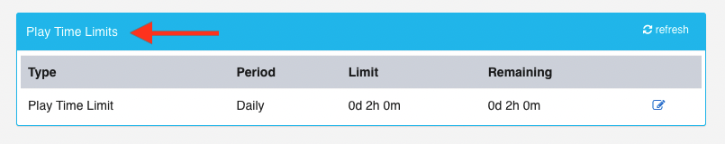

= LSPLAT-5758 PLAT-6462 ⁃ Create full history table of all player play time limits
Reza Khan <reza.khan@wonderlabz.com>
1.0, June 27, 2022:: TA - LSPLAT-5758 PLAT-6462 ⁃ Create full history table of all player play time limits
:sectnums:
:toc: left
:toclevels: 4
:toc-title: LSPLAT-5758 PLAT-6462
:icons: font
:url-quickref: https://docs.asciidoctor.org/asciidoc/latest/syntax-quick-reference/

WARNING: You might need to install graphviz to render the component models on IntelliJ on plantUML if not viewed on GitLab- see https://playsafe.atlassian.net/wiki/spaces/LITHIUM/pages/1674936347/How+To+Setup+Lithium+Local+Development#Noteworthy-Extensions.1[IntelliJ: PlantUML diagramming tool]

== Description
=== Jira
* https://jira.livescore.com/browse/PLAT-6462
* https://playsafe.atlassian.net/browse/LSPLAT-5758

=== Gitlab
* Branch: origin/feature/LSPLAT-5758-playtime-limits-history
* MR: https://gitlab.com/playsafe/lithium/app-lithium-full/-/merge_requests/5203

=== Business
We currently use the table lithium_user.player_play_time_limit to get if a player has a play time limit existing or pending. However we want to have a full audit of when a player changes their limits. This will allow insights to analyse the usage of the limit change functionality and whether we need to make any changes to the existing setup.

The question I am looking to answer is how many people are historically hitting their time limits in NL? E.g - Only 7% of users have ever hit their time limits or 10% of users hit their time limit in the last x days / weeks / months.

Nb. An additional requirement came in during a planning meeting for PLAT-6462 that indicated business would like to be able to query, down to the exact times, when players have reached 100% of their playtime limit.

=== Approvals
|===
|Component |Reason |Comments

|Li
|
|

|FE
|Contains FE API changes
|The relevant swagger documentation needs to be updated and approved by FE

|DWH
|Contains data structure changes as well as changes to pub-sub message definition
|These structural changes need to be approved by DWH
|===

== Architecture
=== Background
TIP: Study the current design and implementation of player playtime limits. At the very least, a working knowledge of the existing implementation will be extremely beneficial.

TIP: _Granularity_ refers to the interval in which data is accumulated for. Player playtime limits will support intervals of day, week, and month.

TIP: A _period_ is a span of time covering a specific start and end date.

LSPLAT-5758 PLAT-6462 gives us an opportunity to rectify a few flaws in the current design of player playtime limits. At the same time, the approach that will be taken will provide histories of a player's playtime limit configuration changes and usage per period, in an effective design that will be efficient for both writing into, and running queries against.

.Most notable flaws:
* A player's playtime limit configuration and the tracking of usage is contained within the same record.
** This necessitates resetting any usage at the end of the granularity period.
*** Thereby erasing history.
* A player's playtime limit configuration and the tracking of time used is stored in minutes.
** Player usage won't be tracked unless it is equal to or over 60 seconds.

This task attempts to fix those flaws as well as simplify the design and implementation. The first step is to create a robust version of the database schema (v2.) The next section will describe the data structure.

=== Data structure
The current playtime limit data structure will have to remain in place until such time as we have migrated all data to the new structure. Due to this, it will have to be done in a separate release. The migration of existing data to the new data structure will be explained in a separate section below.

IMPORTANT: Technical debt task to be created for removal of v1 data structure.

include::../plantuml/erd/player-playtime-limit-v2-data-structure.puml[]
[red]_Figure 1. Playtime limits v2 data structure_

==== Configuration
A player's playtime limit configuration will be setup in `player_playtime_limit_v2_config`. `current_config_revision_id` and `pending_config_revision_id` hold references to revisions.

==== Revisions
Every time there is a change, first, a new revision will be written to `player_playtime_limit_v2_config_revision`. The revisions will serve as a means to provide historical data on player playtime limit configuration changes.

==== Pending
In accordance with regulatory requirements, if the allocated playtime is increased, there should be a cool off period before it becomes effective. Therefore, any requested change to increase allocated playtime is placed in a pending state until cool off has elapsed.

==== Entries
In order to keep historical data on player's playtime limit usage, an entry for every period based on the applicable granularity needs to be created. While such period is open, playtime will accumulate on that record.

WARNING: A caveat of this is that a lot more data will be created. But it is necessary for providing historical data.

NOTE: Out of scope for this task: a mechanism to clean up data older than the applicable data retention period.

==== Period
Every entry will be related to a specific period covering a granularity.

TIP: PeriodService implementaion: https://gitlab.com/playsafe/lithium/app-lithium-full/-/blob/develop/service-accounting/service-accounting-domain-summary/src/main/java/lithium/service/accounting/domain/summary/services/PeriodService.java

TIP: Example usage of PeriodService to create a period record: https://gitlab.com/playsafe/lithium/app-lithium-full/-/blob/develop/service-accounting/service-accounting-domain-summary/src/main/java/lithium/service/accounting/domain/summary/services/SharedDataService.java#L47.

==== Granularity
There is a Granularity enum located in library-common/src/main/java/lithium/service/client/objects/Granularity.java. Use this enum to populate the `granularity` table using the "find or create" (by type) mechanic on service-user startup.

=== Active Sessions Metadata
`user_active_sessions_metadata` is in place already and was added as a means to rectify a situation whereby multiple active sessions contributed towards a player's playtime limit time used, regardless of whether these sessions ran in a parallel time frame. As a quick mitigation, a count of active sessions was tracked, and, on the first session, `playtime_limit_last_updated` set to `now`. `playtime_limit_last_updated` is then used in the calculation of time used, and updated to `now` each time the calculation is done and `player_playtime_limit_v2_entry.seconds_accumulated` increased. When all active sessions reach 0, `playtime_limit_last_updated` is cleared out and awaits the next login. This logic is still relevant and necessary.

===== Login
include::../plantuml/sequence/player-playtime-limit-v2-login-sequence.puml[]
[red]_Figure 2. User active session count is incremented and playtime limit last updated timestamp set to the time now on first session_

===== Logout
include::../plantuml/sequence/player-playtime-limit-v2-logout-sequence.puml[]
[red]_Figure 3. Player playtime limit entry is updated, user active session count is decremented, and playtime limit last updated timestamp set to null if active session count is 0_

===== Session Inactivity Timeout
The logic from figure 3, indicated in steps 6 to 9 is triggered from the session inactivity cronjob as well.

===== Playtime Limit Last Updated
Figure 6 describes the usage of this timestamp better.

=== API
==== PlaytimeLimitsV2Service
Add PlaytimeLimitsV2Service to hold methods that will be used from all API endpoints and/or services that need to interact with playtime limits v2. When completed, and all references to the existing PlayTimeLimitService has been removed, it can be deleted.

===== setPlayerConfiguration
Most of this logic is contained in lithium.service.user.services.PlayTimeLimitsService.setPlayTimeLimitForUser. Let's try to simplify the implementation.

This method will be called from 3 places. A frontend endpoint, a backend endpoint called via LBO, and the registration service.

This method should run within a transaction, rollback and be retried with sane backoff configuration on error.

include::../plantuml/activity/player-playtime-limit-v2-set-player-configuration.puml[]
[red]_Figure 4. Basic description of the flow for setting or updating the player playtime limit configuration_

===== getPlayerConfiguration
Find and return the player's playtime limit configuration, which includes current and pending revisions.

===== updateAndGetPlayerEntry
Most of this logic exists on lithium.service.user.services.PlayTimeLimitsService.updatePlayTimeLimitForUser. Let's try to simplify the implementation.

There will need to be an overloaded updateAndGetPlayerEntry method. One without a transactional, and one with. updateAndGetPlayerEntry outside of transaction should find the player configuration, and if exists, find or create the period. The reason being that if we were to rollback the player period entry, we do not want to rollback the period which is shared across multiple period entries for different users.

include::../plantuml/activity/player-playtime-limit-v2-update-and-get-player-entry.puml[]
[red]_Figure 5. Basic description of the flow for updating the player playtime limit entry, first locating the configuration, and if exists, find or create of the period before calling transactional updateAndGetPlayerEntry_

include::../plantuml/activity/player-playtime-limit-v2-update-and-get-player-entry-transactional.puml[]
[red]_Figure 6. Transactional updateAndGetPlayerEntry_

===== isAllowedToPlay (transactional)
Locate the player configuration, call updateAndGetPlayerEntry, check the current configuration and compare seconds allocated vs. seconds accumulated to determine if the player is allowed to play.

===== migrateV1Data

include::../plantuml/activity/player-playtime-limit-v2-migrate-v1-data.puml[]
[red]_Figure 7. v1 data migration flow_

===== migrateV1PlayerConfiguration
This method will be used to migrate the v1 player configuration. Keep in mind, it may be active or pending. If `active`, and the v1 data has minutes used, the v2 playtime limit entry for the period needs to be created and seconds accumulated updated. If `seconds_accumulated` >= `seconds_allocated`, then  `limit_reached_at` to be set to `now`. If `pending`, then remember to calculate the `effective_from` date using the v1 record `created_date` value and the domain cool off period.

===== Other
Feel free to add additional methods that help structure code better.

==== PendingPlayTimeLimitCleanupJob
This job will have to be modified. It currently locates all playtime limit pending records (using the `type` field: pending.) This has been removed in favour of storing a `pending_config_revision_id` in player configurations that references a revision, containing an `effective_from` timestamp.

The job will now need to locate all configurations with a `pending_config_revision_id` that is not null where the `effective_from` timestamp in the revision has elapsed. Then move the  `pending_config_revision_id` to `current_config_revision_id` and clear the pending revision reference.

==== PlayerPlayTimeLimitResetJob
This can be removed.

==== Frontend
* Delete FrontendUserPlayTimeLimitController

===== FrontendPlaytimeLimitV2Controller
|===
|Description |Request Method |Endpoint |Execution

|Set or modify the player playtime limit configuration
|POST
|/frontend/playtime-limit/v2/configuration/set
|PlaytimeLimitsV2Service.setPlayerConfiguration(..)

|Get the current player playtime limit configuration
|POST
|/frontend/playtime-limit/v2/configuration/get
|PlaytimeLimitsV2Service.getPlayerConfiguration(..)

|Get the active player playtime limit entry
|POST
|/frontend/playtime-limit/v2/active-entry/get
|PlaytimeLimitsV2Service.updateAndGetPlayerEntry(..)
|===

==== System
* Delete SystemPlayTimeLimitAdHocResetController
* Delete SystemPlayTimeLimitController

===== SystemPlaytimeLimitV2Controller
|===
|Description |Request Method |Endpoint |Execution

|Determine if the player is allowed to play
|POST
|/system/playtime-limit/v2/is-allowed-to-play
|PlaytimeLimitsV2Service.isAllowedToPlay(..)

|Get player playtime limit configuration
|POST
|/system/playtime-limit/v2/configuration/get
|PlaytimeLimitsV2Service.getPlayerConfiguration(..)

|Get player playtime limit active entry
|POST
|/system/playtime-limit/v2/active-entry/get
|PlaytimeLimitsV2Service.updateAndGetPlayerEntry(..)

|===

==== Backoffice
* Delete UserPlayTimeLimitController

===== BackofficePlaytimeLimitV2Controller
|===
|Description |Request Method |Endpoint |Execution

|Set or modify the player playtime limit configuration
|POST
|/backoffice/playtime-limit/v2/configuration/set
|PlaytimeLimitsV2Service.setPlayerConfiguration(..)

|Get the current player playtime limit configuration
|POST
|/backoffice/playtime-limit/v2/configuration/get
|PlaytimeLimitsV2Service.getPlayerConfiguration(..)

|Get the active player playtime limit entry
|POST
|/backoffice/playtime-limit/v2/active-entry/get
|PlaytimeLimitsV2Service.updateAndGetPlayerEntry(..)

|Used to initiate the v1 data migration
|POST
|/backoffice/playtime-limit/v2/migrate-v1-data
|PlaytimeLimitsV2Service.migrateV1Data(..)
|===

=== LBO
The existing playtime limit UI on the backoffice will need to be modified to cater for the structural changes made to the data representation, as well as sourcing the data using the revised /backoffice endpoints.

=== Refactoring
==== Configuration
The playtime limits feature is enabled via configuration. Some domains make use of it, while others do not. During the initial implementation, a domain setting was used to determine if the domain makes use of the feature: playtime_limit_service. However, with https://jira.livescore.com/browse/PLAT-4478, some refactoring was done to replace usage of the domain setting in favour of a property set on the domain entity. There are however still some references in code using the domain setting, so both configuration settings need to be maintained. As part of this task, remove the remaining references to the domain setting and replace with a check on the applicable domain property.

==== Pub-sub message structure
The pub-sub message structure may have to change to represent the structural data changes made. Any changes should be noted and communicated to DWH.

==== Authentication token
The `limitSummary` on the token response body may need to change to represent the structural data changes made. Any changes should be noted, swagger documentation updated, and communicated to FE.

==== Dead code
Remember to remove code that is no longer being referenced.

=== Data Migration
After the release, playtime limits v2 is not yet ready to use. While the system is still down, migration of the v1 data to the new v2 data structure will take place.

include::../plantuml/sequence/player_playtime_limit_v2-v1-data-migration.puml[]
[red]_Figure 8. v1 data migration_
