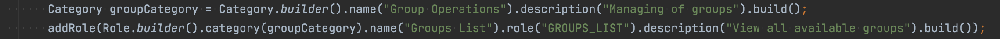
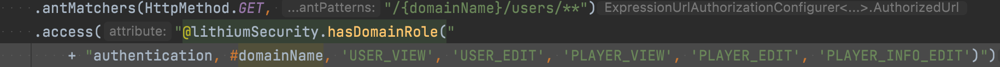
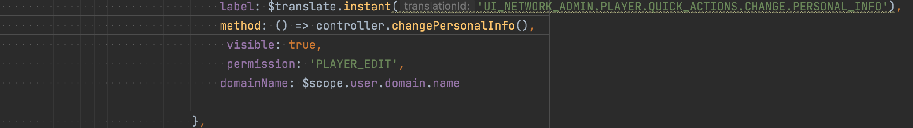
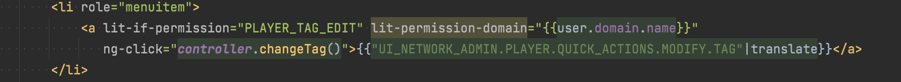

= ui-network-admin

:sectnums:
:toc: left
:toclevels: 4
:toc-title: Backoffice
:icons: font
:url-quickref: https://docs.asciidoctor.org/asciidoc/latest/syntax-quick-reference/

//:stylesheet: css/asciidoctor.css
//:stylesheet: css/material-blue.css

//This is done to keep formatting aligned with gitlab
****
[verse,,]
____
link:../readme.adoc[Home]
____
****

This document will guide the reader on their journey into the wonderful world of the backoffice and guide them in the requirements for feature development when this module is involved.

.Short Definition
[NOTE]
The backoffice is also known as UNA or LBO and served as the primary mechanism through which Lithium is interacted with from a operations perspective.

== General
* The control mechanisms that are needed by most of the operations have limited segregation requirements.
* In Lithium there is a need to limit the number of rolls for a user since there are currently some limitations on the size of the JWT token which will only be circumvented in the future.
* Visibility is the managed by having an XXX_VIEW role.
* Modification is managed by having an XXX_EDIT role.
* Deletion is managed with the same role as modification unless there is a very specific usecase for having a dedicated XXX_DELETE role.

== Security
* During feature development there is a need to control the audience that will have access to certain menu items or feature visualisations or modifications.
* The general rule applies that all of these feature development and menu items should have the appropriate category and rights allocated to them.
* In terms of the backend, the control mechanism is located in the module root and has a naming structure XxxModuleInfo.java

* Example:

  service-user/service-user/src/main/java/lithium/service/user/UserModuleInfo.java

* There are categories that serve as containers for roles. These should be defined in the XxxModuleInfo.java and will serve as the security control mechanism.

* After defining the roles, there should be a relevant security hole punched in the resource server. This is also done in the XxxModuleInfo.java file. Without this, the endpoint will not be available to the JWT token that will try to access the resource.

* In The backoffice module, the following file will be where state management takes place but the real magic happens in the controller script files that angular uses.

  ui-network-admin/src/main/resources/static/scripts/app-config-states.js

  ui-network-admin/src/main/resources/static/scripts/directives/player/quick-actions/quick-actions.js

* In addition to the controller scripts, there are also visibility controls that can be added to the html files and should be done for an improved user experience. `lit-if-permission and lit-permission-domain`

  ui-network-admin/src/main/resources/static/scripts/directives/player/quick-actions/quick-actions.html

